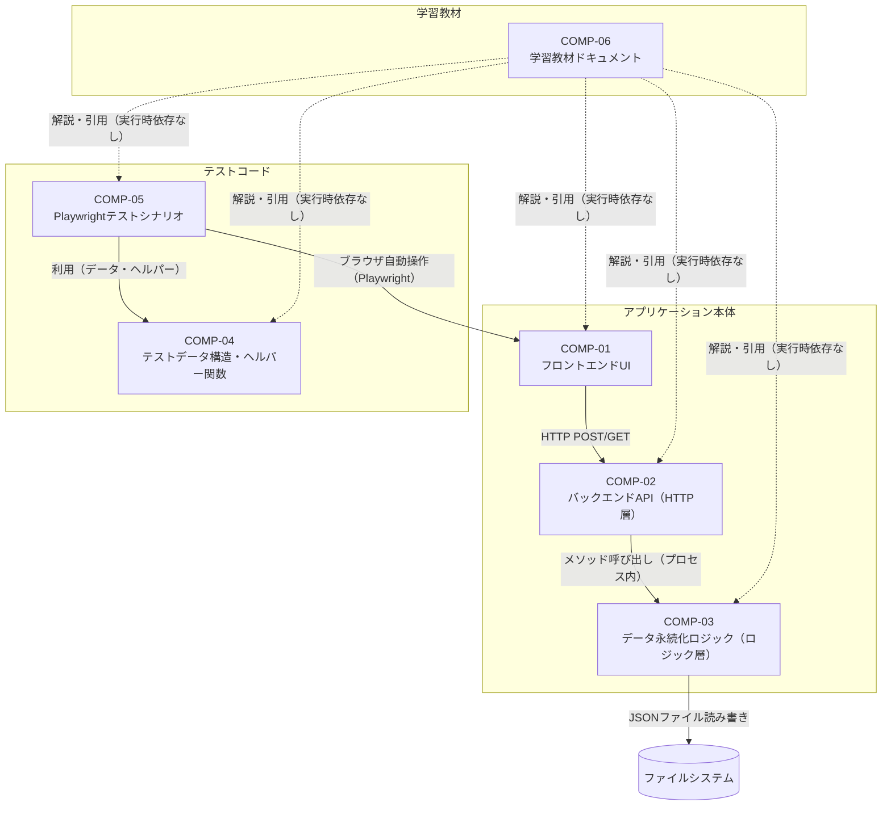
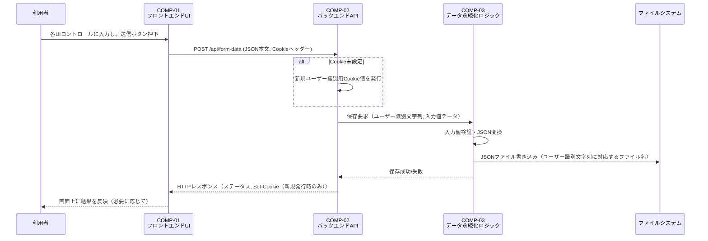
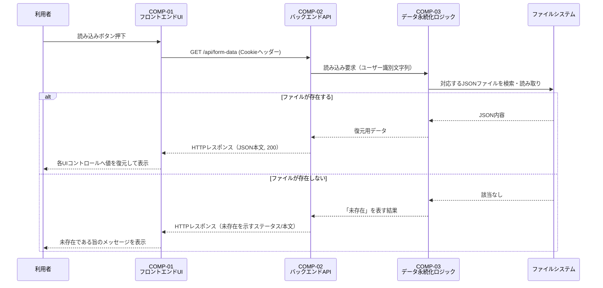
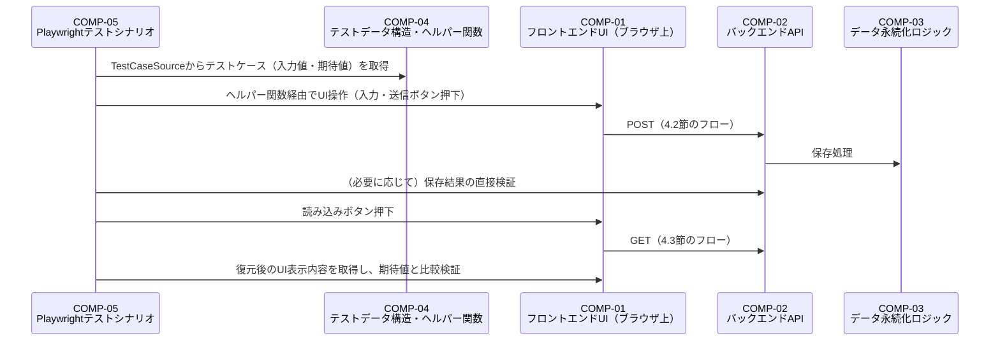

# コンポーネント設計書（基本設計）

## 1. 文書情報

| 項目 | 内容 |
|---|---|
| 文書名 | LearnPlaywright コンポーネント設計書 |
| 版数 | v1.0 |
| 作成日 | 2026-09-23 |
| 作成者 | ClaudeCode（コンポーネント設計工程サブエージェント） |

### 改訂履歴

| 版数 | 日付 | 変更内容 | 変更者 |
|---|---|---|---|
| v1.0 | 2026-09-23 | 初版作成 | ClaudeCode |

## 2. 設計方針

- **ロジック層とGUI/表示層・HTTP通信処理の分離（NFR-06）**: サーバー側を「HTTP通信処理（COMP-02）」と「入力値検証・JSON変換・復元処理を担うロジック層（COMP-03）」に分割する。COMP-03はASP.NET Core等の外部ライブラリに依存せず、C#の標準機能のみで単体テスト可能な構成とする。COMP-02はHTTPリクエスト/レスポンス・Cookieの授受のみを担当し、業務ロジックを持たない薄い層とする。
- **フロントエンド（GUI層）とサーバー側の分離**: フロントエンド（COMP-01）はDOM操作・イベントハンドリング・HTTP通信の発行のみを担当し、UIコンポーネントの構成要素として独立させる。
- **テストヘルパー/データ構造とシナリオテストの分離**: 入力値・期待値の組をレコード型等で一元管理し`TestCaseSource`等でパラメータ化する基盤（COMP-04）と、実際にPlaywrightでブラウザ操作を行いシナリオを検証するテストコード（COMP-05）を別コンポーネントとする。COMP-04はCOMP-05から再利用される基盤ライブラリと位置付け、COMP-05はCOMP-04に依存する一方、COMP-04はCOMP-05に依存しない（単方向依存）。
- **学習教材ドキュメントの独立性**: 学習教材（COMP-06）はアプリケーション本体（COMP-01〜03）・テストコード（COMP-04〜05）とは独立したドキュメント成果物とする。COMP-06はCOMP-01〜05のソースコードを解説・引用対象として参照するが、COMP-01〜05はCOMP-06に依存しない（ドキュメントの有無がアプリ・テストの動作に影響しない）。
- **Cookieによるユーザー識別の責務分界**: HTTP Cookieの読み取り・発行（REQ-06）はHTTPプロトコルの関心事であるため、COMP-02（HTTP層）が担当する。COMP-03（ロジック層）はCookie自体を意識せず、COMP-02から渡される「ユーザー識別用の文字列（Cookie値そのもの）」のみを入力として受け取り、ファイル名等の対応付けに用いる。これによりCOMP-03はHTTP特有の型（`HttpContext`等）に依存しない構成となる。

## 3. コンポーネント一覧

### COMP-01: フロントエンドUI

- **責務**: サンプルサイトのフォーム画面のUIコントロール表示、利用者操作の受付（入力・送信ボタン・読み込みボタンのクリック）、サーバーとのHTTP通信の発行（POST/GET）、取得したJSONに基づくUIコントロールへの値の復元、注意書き・エラーメッセージ（保存データ未存在時等）の画面表示。
- **入出力（インターフェース）**:
  - 入力: 利用者のUI操作（テキスト入力・スライダー操作・プルダウン選択・ラジオボタン選択・ボタンクリック）、COMP-02からのHTTPレスポンス（JSON、HTTPステータス）
  - 出力: COMP-02へのHTTP POSTリクエスト（フォーム入力値をJSON形式のボディに格納）、COMP-02へのHTTP GETリクエスト、画面上のDOM更新（値の復元・メッセージ表示）
- **実装技術**: HTML / CSS / JavaScript（フレームワーク不使用、CON-02）
- **対応要件**: REQ-01, REQ-02, REQ-04, REQ-05, REQ-07, NFR-01, NFR-08, CON-02, CON-06

### COMP-02: バックエンドAPI（HTTP層）

- **責務**: HTTPリクエスト（POST/GET）の受付とルーティング、リクエストヘッダーからのユーザー識別用Cookie値の読み取り、Cookie未設定時の新規Cookie発行とレスポンスへの付与（REQ-06）、COMP-03（ロジック層）へのデータ受け渡しと呼び出し、COMP-03の処理結果に基づくHTTPレスポンス（JSON本文・ステータスコード）の生成。業務ロジック（検証・JSON変換・復元処理そのもの）は持たない。
- **入出力（インターフェース）**:
  - 入力: COMP-01からのHTTP POST/GETリクエスト（JSON本文、Cookieヘッダー）
  - 出力: COMP-01へのHTTPレスポンス（JSON本文、`Set-Cookie`ヘッダー、ステータスコード）。COMP-03へは、Cookie値から得たユーザー識別文字列と（POST時は）デシリアライズ済みの入力値データを、C#メソッド呼び出しとしてプロセス内で受け渡す（ネットワーク越しではない）。
- **実装技術**: C# / .NET 10 / ASP.NET Core（CON-03）
- **対応要件**: REQ-02, REQ-03, REQ-04, REQ-06, NFR-02, NFR-06, CON-01, CON-03, CON-05, CON-06

### COMP-03: データ永続化ロジック（ロジック層）

- **責務**: POSTされた入力値の検証、JSON形式への変換とファイルシステムへの保存（ユーザー識別文字列とファイルの対応付けを含む）、GET要求時の対応するJSONファイルの読み取りと復元用データの返却、対応ファイルが存在しない場合の「未存在」の判定結果の返却。外部ライブラリ（ASP.NET Core等）に依存せず、単体テスト可能な純粋なロジックとして構成する。
- **入出力（インターフェース）**:
  - 入力: COMP-02からのメソッド呼び出し。保存時はユーザー識別文字列＋フォーム入力値データ（デシリアライズ済みのオブジェクト）、読み込み時はユーザー識別文字列のみ。
  - 出力: 保存処理の成功可否、読み込み時はフォーム入力値データ（存在する場合）または「未存在」を表す結果値。ファイルシステムへのJSONファイルの読み書き（保存先ディレクトリは`.gitignore`でGit管理対象から除外、CON-07）。
- **実装技術**: C#（.NET標準ライブラリのみ、外部ライブラリ非依存）
- **対応要件**: REQ-03, REQ-04, NFR-06, CON-03, CON-05, CON-07

### COMP-04: テストデータ構造・ヘルパー関数

- **責務**: Playwrightテストで用いる入力値・期待値の組を、レコード型等のデータ構造として一元管理し、NUnitの`TestCaseSource`等で参照可能な形で提供する。個々のテストメソッドへの値のハードコードや、新規入力パターン追加時のテストロジック本体の修正が不要な構成とする（NFR-07）。加えて、UIコントロールへの値設定・取得等、COMP-05から繰り返し利用される汎用的なPlaywright操作の便利関数を提供する。
- **入出力（インターフェース）**:
  - 入力: なし（静的なデータ定義・ライブラリとして提供）
  - 出力: COMP-05から参照される、テストケースのデータ構造（入力値・期待値の組）および`TestCaseSource`互換の列挙、ならびにPlaywrightの`Page`オブジェクト等を引数に取る汎用ヘルパーメソッド群
- **実装技術**: C# / Playwright for .NET / NUnit（CON-04）
- **対応要件**: REQ-08, NFR-07, CON-04

### COMP-05: Playwrightテストシナリオ

- **責務**: COMP-04が提供するデータ構造・ヘルパー関数を用いて、「UIへの入力操作→送信ボタン押下→サーバー保存内容の検証」および「読み込みボタン押下→UI復元後の各コントロール表示内容の検証」という一連のシナリオを、Playwrightによりブラウザ自動操作として実行する。COMP-01（フロントエンド）を通じてCOMP-02・COMP-03（サーバー側）まで含めたエンドツーエンドの検証を行う。
- **入出力（インターフェース）**:
  - 入力: COMP-04からのテストケースデータ・ヘルパー関数、Playwrightが操作するブラウザ上のCOMP-01（UI）、その先のCOMP-02・COMP-03（サーバー側の保存結果）
  - 出力: NUnitのテスト実行結果（成功/失敗）、ブラウザ操作（クリック・入力）
- **実装技術**: C# / Playwright for .NET / NUnit（CON-04）
- **対応要件**: REQ-08, REQ-09, CON-01, CON-04, CON-06

### COMP-06: 学習教材ドキュメント

- **責務**: Playwrightによるテスト自動化のベストプラクティス解説章（テストケースの独立性、待機処理の書き方、ロケーターの選び方、パラメータ化の考え方等）の提供、およびベストプラクティス解説章を先に配置した上での段階的学習コンテンツ（各ステップに解説テキストとサンプルコードを含む）の提供。初心者が環境構築からサンプルテスト実行まで先頭から読み進めるだけで到達できる構成とし、各ステップは前のステップの内容のみを前提とする。サンプルコードには説明コメントを付与する。
- **入出力（インターフェース）**:
  - 入力: なし（COMP-01〜05のソースコード・仕様を解説・引用対象として参照するが、実行時の依存関係は持たない）
  - 出力: Markdown形式のドキュメントファイル一式（ベストプラクティス章、段階的学習コンテンツ各ステップ＋サンプルコード）
- **実装技術**: Markdown
- **対応要件**: REQ-10, REQ-11, REQ-12, NFR-03, NFR-04, NFR-05, CON-06

## 4. コンポーネント間の依存関係・データフロー

### 4.1 依存関係（全体構成）

### 4.2 データフロー（送信ボタン押下時: REQ-02, REQ-03, REQ-06）

### 4.3 データフロー（読み込みボタン押下時: REQ-04, REQ-05）

### 4.4 テスト実行時の依存関係（REQ-08, REQ-09）

## 5. 全要件のコンポーネント対応セルフチェック

| 要件ID | 対応コンポーネント | 備考 |
|---|---|---|
| REQ-01 | COMP-01 | |
| REQ-02 | COMP-01, COMP-02 | フロントエンド側の送信とサーバー側の受信で分担 |
| REQ-03 | COMP-02, COMP-03 | HTTP受付はCOMP-02、保存ロジックはCOMP-03 |
| REQ-04 | COMP-01, COMP-02, COMP-03 | GET送信・未存在メッセージ表示（COMP-01）、HTTP処理（COMP-02）、存在有無判定・読み取り（COMP-03） |
| REQ-05 | COMP-01 | |
| REQ-06 | COMP-02 | Cookie発行はHTTP層の責務 |
| REQ-07 | COMP-01 | |
| REQ-08 | COMP-04, COMP-05 | TestCaseSourceの仕組み自体はCOMP-04、テストメソッドでの適用はCOMP-05 |
| REQ-09 | COMP-05 | |
| REQ-10 | COMP-06 | |
| REQ-11 | COMP-06 | |
| REQ-12 | COMP-06 | |
| NFR-01 | COMP-01 | 運用上の注意事項だが、技術的な担保はREQ-07のUI警告表示（COMP-01）による |
| NFR-02 | COMP-02 | |
| NFR-03 | COMP-06 | |
| NFR-04 | COMP-06 | |
| NFR-05 | COMP-06 | |
| NFR-06 | COMP-02, COMP-03 | 分離方針そのものがCOMP-02/COMP-03の分割として具現化されている |
| NFR-07 | COMP-04 | |
| NFR-08 | COMP-01 | |
| CON-01 | COMP-02, COMP-05 | ローカルホストでの稼働（COMP-02）およびローカルWindows環境でのテスト実行（COMP-05） |
| CON-02 | COMP-01 | |
| CON-03 | COMP-02, COMP-03 | いずれもC#/.NET 10実装。ASP.NET Core自体はCOMP-02のみが直接依存 |
| CON-04 | COMP-04, COMP-05 | |
| CON-05 | COMP-02, COMP-03 | 認証・認可機構を持たない構成上の制約 |
| CON-06 | COMP-01〜06（全コンポーネント） | ソースコード・ドキュメントの全成果物がPublic GitHubリポジトリで公開される前提のため、全コンポーネントに共通して適用される横断的制約 |
| CON-07 | COMP-03（構造的対応）, COMP-01〜06（全コンポーネント、コーディング規約として） | 保存先ディレクトリの`.gitignore`除外という構造的な設計判断はCOMP-03固有。秘密情報・個人情報を含めないという規約自体は全コンポーネントの成果物に横断的に適用される |

**セルフチェック結果**: REQ-01〜12、NFR-01〜08、CON-01〜07の全29項目について、最低1つのコンポーネントへの対応付けを確認済み（すべて充足）。

### コンポーネント間の責務分担の重複・欠落確認

- **重複**: REQ-02〜04はフロントエンド・HTTP層・ロジック層の3層にまたがる要件のため、複数コンポーネントに対応付けているが、各コンポーネントが担う範囲（送信/受信の別、HTTP処理かファイルI/Oか）は3節の「責務」記載で明確に分離しており、実質的な責務の重複（同じ処理を複数コンポーネントが二重に実装する）はない。
- **欠落**: サーバー側の「HTTPリクエストの受付」「業務ロジック（検証・変換・永続化）」「ファイルI/O」はいずれかのコンポーネントが担っており、責務の抜け（担当コンポーネント不在の処理）は確認されなかった。

### ロジック層とGUI/表示層の分離方針（NFR-06）確認

- COMP-02（HTTP層）とCOMP-03（ロジック層）を明確に分離し、COMP-03は外部ライブラリ非依存・単体テスト可能な構成として設計した（2節・3節参照）。
- COMP-01（フロントエンドUI、GUI/表示層）とCOMP-02・COMP-03（サーバー側）もプロセス・言語レベルで分離されており、混在は生じない。

### 排他制御・ロックの要否検討

該当なし。要件定義書6節「スコープ外」に「複数ユーザーの同時アクセスを想定した性能要件・負荷対策」が明記されており、本設計でも同一ユーザー識別文字列に対する同時POST等の排他制御・ロック機構は新設しない。将来的に同時アクセスを扱う場合は、COMP-03（データ永続化ロジック）のファイル書き込み処理にファイルロック等の排他制御を追加する設計変更が必要になる点を、本セルフチェックの記録として留意事項に残す。
