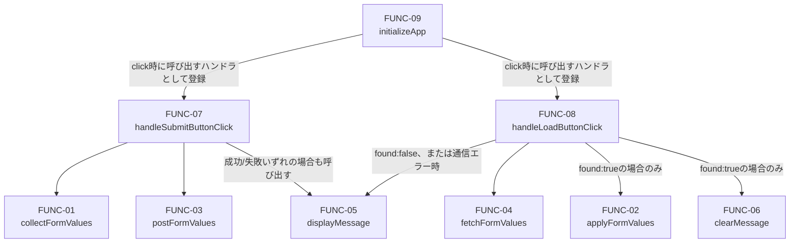

# 関数設計書（詳細設計）: COMP-01 フロントエンドUI

## 1. 文書情報

| 項目 | 内容 |
|---|---|
| 文書名 | LearnPlaywright 関数設計書（COMP-01: フロントエンドUI） |
| 版数 | v1.2 |
| 作成日 | 2026-09-23 |
| 作成者 | ClaudeCode（関数設計工程サブエージェント） |

### 改訂履歴

| 版数 | 日付 | 変更内容 | 変更者 |
|---|---|---|---|
| v1.0 | 2026-09-23 | 初版作成 | ClaudeCode |
| v1.1 | 2026-09-23 | FUNC-02のvalues.text/slider想定外値時の挙動を明記（軽微指摘対応） | ClaudeCode |
| v1.2 | 2026-09-23 | 可読性向上（内容変更なし） | ClaudeCode（design-doc-readability-editor） |

論理的な正しさ・網羅性・テスト容易性はv1.1までの工程で確定済みであり、本版（v1.2）では文章表現・構成の可読性向上のみを行った。関数名・引数・戻り値・副作用・例外仕様・対応要件ID・数値・判断内容の変更は一切含まない。

## 2. 対応コンポーネント

- 対象コンポーネント: **COMP-01（フロントエンドUI）**
- 対応要件ID（コンポーネント設計書 v1.3 3節より）: REQ-01, REQ-02, REQ-04, REQ-05, REQ-07, NFR-01, NFR-08, CON-02, CON-06, CON-07
- 実装技術: HTML / CSS / JavaScript（フレームワーク不使用、CON-02）

### 2.1 静的HTML/CSSで充足し、関数化しない要件（関数一覧の対象外）

以下は本コンポーネントの責務に含まれるが、JavaScript関数としてではなく静的なHTML構造・CSS定義で充足する。関数設計の対象外とするが、COMP-01の責務からの欠落ではないことを明記する。

| 要件ID | 充足手段 |
|---|---|
| REQ-01 | 6種類のUIコントロール（テキストボックス・スライダー・プルダウンリスト・ラジオボタン・送信ボタン・読み込みボタン）は静的HTMLマークアップとして配置する。3節のFUNC-09（`initializeApp`）がイベントリスナーを登録することで操作可能になる。 |
| REQ-07 | 個人情報・機微情報を入力しないよう促す注意書きは、固定文言として静的HTML内に配置する。内容が利用者操作や取得データに応じて動的に変化するものではないため、専用の描画関数は設けない。 |
| NFR-01 | 運用上の注意事項（ダミー値のみ入力する運用）であり、コード上の技術的な担保はREQ-07の注意書き表示（上記）による。関数レベルでの追加対応はない。 |
| NFR-08 | 文字色・背景色のコントラスト比（4.5:1以上）はCSSの静的な配色定義で担保する。JavaScript関数の対象外。 |
| CON-02 | 3節に列挙する全関数はフレームワーク非依存のプレーンJavaScript関数として設計しており、構造的に充足する。 |
| CON-06, CON-07 | 秘密情報・個人情報をソースコード中に含めないことは全関数に横断的に適用されるコーディング規約であり、個別関数固有の設計事項ではない（例: エラーメッセージ文言に内部パス等の情報を含めない）。 |

## 3. 型定義（関数一覧の前提）

以降の関数の引数・戻り値で共通して用いる型を先に定義する。

```
FormValues = {
  text:   string,           // テキストボックスの入力値
  slider: number,            // スライダーの現在値
  select: string,             // プルダウンリストで選択中の値（option要素のvalue属性）
  radio:  string | null        // 選択中のラジオボタンの値（input要素のvalue属性）。いずれも未選択の場合はnull
}

FormElements = {
  textInput:    HTMLInputElement,   // type="text" の入力欄
  slider:       HTMLInputElement,   // type="range" のスライダー
  select:       HTMLSelectElement,  // プルダウンリスト
  radioButtons: HTMLInputElement[]  // type="radio" のinput要素の配列（同一name属性でグループ化されたもの）
}
```

## 4. 関数一覧

設計方針（CLAUDE.md品質方針・NFR-06の考え方の準用）に基づき、DOM読み取り／DOM書き込み／通信処理／ロジック（値の変換等）を関数として明確に分離する。各関数は1種類の副作用（またはなし）のみを持つ。

ただし、`FormValues`の型（例: `slider: number`）を満たすために必要な最小限の型変換・値照合（例: FUNC-01でのスライダー値の`Number()`変換と`NaN`判定、FUNC-02でのselect/radioの選択肢値との照合）は、別関数へ切り出すほど独立したロジックではないため、DOM読み取り／DOM書き込み関数に含めてよいものとする。

全9関数の一覧は以下のとおり。詳細（引数・戻り値・例外仕様等）は各節を参照。

| ID | 関数名 | 種別 | 責務（要約） | 対応要件 |
|---|---|---|---|---|
| FUNC-01 | `collectFormValues` | DOM読み取り | 4種のUIコントロールの現在値を`FormValues`として取得する | REQ-02 |
| FUNC-02 | `applyFormValues` | DOM書き込み | `FormValues`をUIコントロールへ反映し復元する | REQ-05 |
| FUNC-03 | `postFormValues` | 通信 | `FormValues`をJSONでサーバーへPOST送信する | REQ-02 |
| FUNC-04 | `fetchFormValues` | 通信 | 保存済み`FormValues`をサーバーからGET取得する | REQ-04 |
| FUNC-05 | `displayMessage` | DOM書き込み | メッセージ表示領域にテキストと種別を反映する | REQ-04 |
| FUNC-06 | `clearMessage` | DOM書き込み | メッセージ表示領域の内容をクリアする | REQ-05 |
| FUNC-07 | `handleSubmitButtonClick` | 統括（イベントハンドラ） | 送信処理（収集→POST→結果表示）を統括する | REQ-02 |
| FUNC-08 | `handleLoadButtonClick` | 統括（イベントハンドラ） | 読み込み処理（GET→復元/未存在表示）を統括する | REQ-04, REQ-05 |
| FUNC-09 | `initializeApp` | 統括（初期化） | 送信・読み込みボタンへイベントリスナーを登録する | REQ-01, REQ-02, REQ-04, REQ-05 |

### FUNC-01: collectFormValues

- **責務**: DOM上の4種類の入力系UIコントロール（テキストボックス・スライダー・プルダウンリスト・ラジオボタン）の現在値を読み取り、1つの`FormValues`オブジェクトとして返す。
- **引数**:
  - `elements: FormElements` — 値の読み取り対象となるDOM要素の集合
- **戻り値**: `FormValues`
- **副作用**: なし（DOM要素のプロパティ読み取りのみ。書き込み・通信は行わない）
- **例外/エラー時の挙動**:
  - `elements`、または`elements.textInput` / `elements.slider` / `elements.select` / `elements.radioButtons`のいずれかが`null`/`undefined`の場合: `TypeError`をthrowする
  - `elements.radioButtons`が（`null`/`undefined`ではなく）空配列、またはいずれの要素も`.checked === true`でない場合: 例外は投げず、戻り値の`radio`に`null`を設定する
  - `elements.slider.value`（文字列）を`Number()`で数値変換した結果が`NaN`になる場合: `Error`をthrowする
- **対応要件**: REQ-02

### FUNC-02: applyFormValues

- **責務**: `FormValues`オブジェクトの内容を対応する各UIコントロールへ反映し、画面表示を復元する。
- **引数**:
  - `elements: FormElements` — 反映先のDOM要素の集合
  - `values: FormValues` — 反映する値
- **戻り値**: なし（`undefined`）
- **副作用**: あり — `textInput.value`、`slider.value`、`select.value`、該当ラジオボタンの`.checked`を書き換える（DOM書き込み）
- **例外/エラー時の挙動**:
  - `elements`または`values`が`null`/`undefined`の場合: `TypeError`をthrowする
  - `values.text`・`values.slider`が想定外の値（`undefined`等）の場合: 例外は投げず、該当DOM要素にそのまま代入する（ブラウザのDOM値セッターに委ねる。画面表示が乱れる可能性はあるが、致命的なエラーにはしない設計とする）
  - `values.select`が`select`要素のいずれの選択肢（`option`のvalue）にも一致しない場合: 例外を投げず、`select`要素の選択状態は変更しない（スキップ）
  - `values.radio`が`radioButtons`のいずれのvalueにも一致しない場合: 例外を投げず、ラジオボタンの選択状態は変更しない（スキップ。全選択解除等の破壊的操作は行わない）
  - `values.radio`が`null`の場合: ラジオボタンの選択状態には一切手を加えない（既存の選択状態を保持する）
- **対応要件**: REQ-05

### FUNC-03: postFormValues

- **責務**: `FormValues`をJSON形式のHTTPリクエストボディとしてサーバーへPOST送信する。
- **引数**:
  - `url: string` — POST先エンドポイントURL
  - `values: FormValues` — 送信する値
  - `fetchFn: function`（省略可、既定値はグローバルの`fetch`）— HTTP通信を行う関数。テスト時にモック関数を注入するための引数
- **戻り値**: `Promise<{ ok: boolean, status: number }>`
  - `ok`: HTTPステータスコードが200番台であれば`true`
  - `status`: HTTPステータスコード
- **副作用**: あり — `fetchFn`の呼び出しによるネットワークI/O（HTTP POSTリクエスト送信）。Cookie送信は同一オリジンへの`fetch`の既定の資格情報送信設定に委ねる（明示的な`credentials`オプション指定要否は実装工程で確定する）
- **例外/エラー時の挙動**:
  - `fetchFn`自体が例外をthrow/rejectした場合（ネットワーク到達不能等）: そのまま`Promise`をrejectする（呼び出し元でcatchする）
  - HTTPレスポンスが返った場合、ステータスコードが200番台以外であっても例外は投げず、`{ ok: false, status }`を返す（成否判定を戻り値で行えるようにする）
- **対応要件**: REQ-02

### FUNC-04: fetchFormValues

- **責務**: サーバーへHTTP GETリクエストを送信し、保存済みの`FormValues`を取得する。対応データが存在しない場合は「未存在」を表す結果を返す。
- **引数**:
  - `url: string` — GET先エンドポイントURL
  - `fetchFn: function`（省略可、既定値はグローバルの`fetch`）
- **戻り値**: `Promise<{ found: boolean, values: FormValues | null, status: number }>`
  - `found: true`の場合、`values`に`FormValues`が入る
  - `found: false`の場合、`values`は`null`
- **副作用**: あり — `fetchFn`の呼び出しによるネットワークI/O（HTTP GETリクエスト送信）
- **例外/エラー時の挙動**:
  - HTTPステータス200: レスポンスボディをJSONとしてパースし`{ found: true, values: <パース結果>, status: 200 }`を返す。JSONパースに失敗した場合は`Error`をthrowして`Promise`をrejectする
  - HTTPステータス404（サーバーが「対応ファイル未存在」を表すために用いる想定のステータスコード。COMP-02の関数設計で確定する実際のステータスコードと整合させること。本設計では暫定的に404を前提とする）: `{ found: false, values: null, status: 404 }`を返す（正常系として扱い、例外は投げない）
  - 上記以外のHTTPステータス（500等）: 「未存在」とは異なる異常系として扱い、`Error`をthrowして`Promise`をrejectする
  - `fetchFn`自体が例外をthrow/rejectした場合: そのまま`Promise`をrejectする
- **対応要件**: REQ-04

### FUNC-05: displayMessage

- **責務**: 画面上のメッセージ表示領域に、指定したテキストと種別を反映する。送信結果（成功/失敗）・読み込み結果（未存在・エラー）の両方の表示に共通して用いる。
- **引数**:
  - `messageElement: HTMLElement` — メッセージ表示用のDOM要素
  - `text: string` — 表示するメッセージ文字列
  - `type: 'success' | 'error' | 'info'` — メッセージの種別。対応するCSSクラスの切替に用いる
- **戻り値**: なし
- **副作用**: あり — `messageElement.textContent`の書き換え、および`type`に応じたCSSクラス（例: `message--success` / `message--error` / `message--info`）の付与と既存クラスの除去
- **例外/エラー時の挙動**:
  - `messageElement`が`null`/`undefined`の場合: `TypeError`をthrowする
  - `type`が`'success'` / `'error'` / `'info'`のいずれでもない場合: `Error`をthrowする
- **対応要件**: REQ-04（未存在メッセージ表示）。送信結果（成功/失敗）の画面反映についてはコンポーネント設計書4.2節で「反映の要否・具体的な表示内容は関数設計工程で確定する」とされていた点であり、本関数設計では「反映する」と判断し本関数を再利用する（独自判断。詳細は`docs/qa_log.md`参照）

### FUNC-06: clearMessage

- **責務**: メッセージ表示領域の内容をクリアする（前回表示していたメッセージを消去する）。
- **引数**:
  - `messageElement: HTMLElement`
- **戻り値**: なし
- **副作用**: あり — `messageElement.textContent`を空文字列にし、種別ごとのCSSクラスを全て除去する
- **例外/エラー時の挙動**: `messageElement`が`null`/`undefined`の場合: `TypeError`をthrowする
- **対応要件**: REQ-05（復元操作に付随する補助処理としての位置づけ。REQ-05の要件文言はUIコントロールの値の復元を定めるものであり、メッセージ領域のクリアには直接言及していないが、復元前の画面初期化として必要な処理と判断し対応付けた。要件文言に対する拡大解釈である点に留意する）

### FUNC-07: handleSubmitButtonClick

- **責務**: 送信ボタンクリック時の一連の処理（値収集 → POST送信 → 結果表示）を統括する。FUNC-01・FUNC-03・FUNC-05を呼び出す。ロジックそのものは持たず、呼び出し順序の制御とエラーハンドリングに専念する。
- **引数**:
  - `event: Event` — クリックイベントオブジェクト。フォームの既定送信動作を抑止するため`event.preventDefault()`を呼び出す
  - `deps: { elements: FormElements, messageElement: HTMLElement, postUrl: string, fetchFn?: function }` — 依存オブジェクト。テスト時にモックを注入できるようにするため個別引数ではなくまとめて受け取る
- **戻り値**: `Promise<void>`
- **副作用**: あり — `event.preventDefault()`の呼び出し、およびFUNC-01（DOM読み取り）・FUNC-03（通信）・FUNC-05（DOM書き込み）の呼び出しを介した間接的な副作用
- **例外/エラー時の挙動**:
  - FUNC-01が例外をthrowした場合（フォーム構造の不整合等）: catchし、FUNC-05でエラーメッセージ（`type: 'error'`）を表示する。呼び出し元へ例外を再送出しない
  - FUNC-03の`Promise`がrejectされた場合（ネットワークエラー等）: catchし、FUNC-05でエラーメッセージを表示する
  - FUNC-03の戻り値が`ok: false`の場合（サーバーがエラーステータスを返した場合）: FUNC-05でエラーメッセージを表示する
  - 正常時（`ok: true`）: FUNC-05で保存完了メッセージ（`type: 'success'`）を表示する
- **対応要件**: REQ-02

### FUNC-08: handleLoadButtonClick

- **責務**: 読み込みボタンクリック時の一連の処理（GET取得 → UI復元、または未存在メッセージ表示）を統括する。FUNC-02・FUNC-04・FUNC-05・FUNC-06を呼び出す。
- **引数**:
  - `event: Event`
  - `deps: { elements: FormElements, messageElement: HTMLElement, loadUrl: string, fetchFn?: function }`
- **戻り値**: `Promise<void>`
- **副作用**: あり — `event.preventDefault()`の呼び出し、およびFUNC-02（DOM書き込み）・FUNC-04（通信）・FUNC-05/FUNC-06（DOM書き込み）の呼び出しを介した間接的な副作用
- **例外/エラー時の挙動**:
  - FUNC-04の`Promise`が`found: true`でresolveした場合: FUNC-02でUIへ値を復元し、FUNC-06でメッセージ領域をクリアする
  - FUNC-04の`Promise`が`found: false`でresolveした場合: UIコントロールへの復元は行わず、FUNC-05で「保存されたデータがありません」旨のメッセージ（`type: 'info'`）を表示する（REQ-04）
  - FUNC-04の`Promise`がrejectされた場合（ネットワークエラー・予期しないHTTPエラー等）: catchし、FUNC-05でエラーメッセージ（`type: 'error'`）を表示する。呼び出し元へ例外を再送出しない
- **対応要件**: REQ-04, REQ-05

### FUNC-09: initializeApp

- **責務**: ページ読み込み完了時（`DOMContentLoaded`）に1度だけ呼び出され、送信ボタン・読み込みボタンへクリックイベントリスナーを登録する。
- **引数**:
  - `deps: { elements: FormElements, messageElement: HTMLElement, submitButton: HTMLButtonElement, loadButton: HTMLButtonElement, postUrl: string, loadUrl: string, fetchFn?: function }`
- **戻り値**: なし
- **副作用**: あり — `submitButton` / `loadButton`への`addEventListener('click', ...)`呼び出し（それぞれFUNC-07・FUNC-08をイベントハンドラとして登録する）
- **例外/エラー時の挙動**: `deps.elements` / `deps.submitButton` / `deps.loadButton`のいずれかが`null`/`undefined`の場合: `TypeError`をthrowする（初期化失敗を早期に検知できるようにする）
- **対応要件**: REQ-01（画面のインタラクティブ化）、REQ-02, REQ-04, REQ-05（FUNC-07・FUNC-08をイベントハンドラとして登録することで、FUNC-08が対応するREQ-04・REQ-05の双方を間接的に成立させるため）

## 5. 関数間の呼び出し関係



- FUNC-01（DOM読み取り）とFUNC-03（通信）はFUNC-07からのみ呼び出され、両者は互いに依存しない（値の受け渡しはFUNC-07が仲介する）。
- FUNC-04（通信）とFUNC-02（DOM書き込み）はFUNC-08からのみ呼び出され、両者は互いに依存しない。
- FUNC-05・FUNC-06はFUNC-07・FUNC-08の両方から共通利用される。
