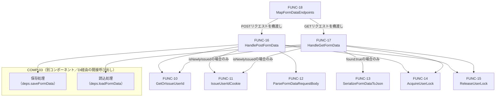

# 関数設計書（詳細設計）: COMP-02 バックエンドAPI（HTTP層）

## 1. 文書情報

| 項目 | 内容 |
|---|---|
| 文書名 | LearnPlaywright 関数設計書（COMP-02: バックエンドAPI／HTTP層） |
| 版数 | v1.4 |
| 作成日 | 2026-09-23 |
| 作成者 | ClaudeCode（関数設計工程サブエージェント） |

### 改訂履歴

| 版数 | 日付 | 変更内容 | 変更者 |
|---|---|---|---|
| v1.0 | 2026-09-23 | 初版作成 | ClaudeCode |
| v1.1 | 2026-09-23 | 論理レビュー指摘対応: FUNC-13/17の対応要件からREQ-05（COMP-01専属要件）を削除、FUNC-14のロックget-or-create操作の原子性を明記、FUNC-16/17の手順1(FUNC-10)・手順2(FUNC-11)の例外処理を追記、CookieWriteOptions.maxAgeのnull＝永続Cookieという誤った説明を修正、SaveResult.success:falseの契約（検証エラー専用）を明記、FUNC-14/15の対応要件からNFR-02を削除 | ClaudeCode |
| v1.2 | 2026-09-23 | 論理レビュー2回目指摘対応: FUNC-16の処理順序冒頭要約「いずれの手順の例外も500」が手順3（例外は400）と矛盾していた記述を「手順ごとに定められたステータス（既定500、手順3は400）」に修正、FUNC-11の責務にCookieWriteOptions（maxAge:31536000〈暫定値〉等）の組み立てとsetCookieFnへの受け渡しを明記、FUNC-16/17の対応要件欄からNFR-02を削除しCON-06/07と同様の横断的要件（関数ごとの欄には明記しない）として統一、7節の自己チェック説明を上記方針に合わせて調整 | ClaudeCode |
| v1.3 | 2026-09-23 | NFR-02の実装工程への申し送りを2.1節に明記（軽微指摘対応） | ClaudeCode |
| v1.4 | 2026-09-23 | 可読性向上（内容変更なし）。関数名・引数・戻り値・副作用・例外仕様・対応ID・数値・判断内容・契約は変更せず、(1) NFR-02を対応要件欄から除外する理由が2.1節・FUNC-14・FUNC-16・FUNC-17・7節に重複して記述されていたため、2.1節を正としFUNC-16/17・7節の記述を簡潔な相互参照へ整理、(2) `CookieWriteOptions.maxAge`の説明コメントを1行の長文から複数行構成に整理、(3) 2節の対応要件ID一覧を機能要件／非機能要件／制約の区分ラベル付きに整理、(4) 6節のMermaid図にCOMP-03（別コンポーネント）のサブグラフ区分を追加 | ClaudeCode |

## 2. 対応コンポーネント

- 対象コンポーネント: **COMP-02（バックエンドAPI／HTTP層）**
- 対応要件ID（コンポーネント設計書 v1.3 3節より）: 機能要件 REQ-02, REQ-03, REQ-04, REQ-06／非機能要件 NFR-02, NFR-06／制約 CON-01, CON-03, CON-05, CON-06, CON-07
- 実装技術: C# / .NET 10 / ASP.NET Core（CON-03）

業務ロジック（入力値検証・JSON変換・保存/復元処理そのもの）はCOMP-03の責務であり、COMP-02はHTTPリクエスト/レスポンスの処理（Cookie読み取り・発行、ステータスコード決定、リクエストボディのパース）とCOMP-03への処理委譲に専念する（品質方針・NFR-06）。

### 2.1 本工程で確定した仕様決定事項（独自判断・要申し送り）

以下はコンポーネント設計書で「関数設計工程で確定する」とされていた事項、またはCOMP-01の関数設計（`docs/03_function_design/COMP-01.md`）が暫定仮定を置いていた事項について、本工程で確定した結論である。詳細な理由は各関数の説明および4節を参照。`docs/qa_log.md`にも独自判断として記録する。

| 事項 | 結論 |
|---|---|
| 対応するJSONファイルが存在しない場合のHTTPステータスコード（COMP-01 FUNC-04が暫定404と仮定） | **404 Not Found に確定する**（本文なし）。COMP-01側の仮定と一致するため、COMP-01側の追随修正は不要。 |
| 排他制御・ロックの要否（コンポーネント設計書5.4節の申し送り事項） | **対応する**。COMP-02のHTTPハンドラ層でユーザー識別文字列単位の排他ロックを行う。詳細は4節。 |
| POST成功時のHTTPステータスコード | 200 OK（本文なし）に確定する。 |
| POST時の入力値検証エラー・GET/POST共通の想定外エラーのHTTPステータスコード | 検証エラー（COMP-03が`{success: false}`を返す場合）およびリクエストボディのJSON構文エラーは400 Bad Request、COMP-03側の未処理例外等は500 Internal Server Errorに確定する。 |
| ユーザー識別用Cookieの名前 | `lp_user_id` に確定する（他コンポーネントに影響しない実装細部のため独自判断とする）。 |
| NFR-02（ローカルホスト限定）の実装位置と実装工程への申し送り | Kestrel起動設定（`Program.cs`等）の既定設定（localhost限定）で充足される。FUNC-10〜18のいずれのハンドラ関数の責務でもない横断的要件であり、実装工程で`UseUrls`等の設定変更を行わないことを確認する。 |

## 3. 型定義（関数一覧の前提）

```
FormDataDto = {
  text:   string,           // テキストボックスの入力値
  slider: number,             // スライダーの現在値
  select: string,              // プルダウンリストで選択中の値
  radio:  string | null        // 選択中のラジオボタンの値。未選択の場合はnull
}
// COMP-01のFormValues型とフィールド構成を一致させる（HTTP境界を挟んで同一の論理的形状を保つ）。

SaveResult = {
  success: bool
  // 失敗理由の詳細化（検証エラーの内容等）は本設計のスコープ外とし、COMP-03の関数設計で必要に応じて拡張する。
  //
  // 【契約（COMP-03の関数設計への申し送り事項）】 success:false は、COMP-03における入力値検証エラー
  // （FormDataDtoのフィールド値が業務上許容される範囲・形式でない場合等）の場合にのみ用いる。
  // ファイルI/O異常（ディスク書き込み失敗、権限エラー等）や、その他の検証エラー以外の失敗は
  // success:false で表現せず、例外をthrowする契約とする。
  // 理由: FUNC-16（HandlePostFormData）は「success:false → 400 Bad Request」「例外 → 500 Internal Server Error」
  // という区別でHTTPステータスコードを決定する（手順7・8参照）。この区別は「利用者の入力に起因する
  // 検証エラー（400が適切）」と「サーバー側の想定外の失敗（500が適切）」というHTTPの意味論上の区別に
  // 対応させる必要があるため、success:false の用途を検証エラーに限定する。COMP-03の関数設計工程は
  // この契約に従って保存処理を設計すること。
}

LoadResult = {
  found: bool,
  data:  FormDataDto | null   // found:trueの場合のみ非null
}

CookieWriteOptions = {
  httpOnly: bool,     // true固定を想定（JavaScriptからの読み取りを許容しない。実装工程で最終確認）
  path:     string,   // "/" を想定
  maxAge:   number | null
  // Cookieの有効期間（秒）。
  // 【注意】null（MaxAge/Expires属性を付与しない）は実際にはセッションCookie（ブラウザを閉じると消える）を
  // 意味し、永続Cookieにはならない点に注意する。
  // REQ-06によるユーザー識別の継続（再訪問時も同一ユーザー識別文字列を維持する実効性）には、ブラウザを
  // 閉じた後も値が保持される永続Cookieが必要である。そのため本設計ではnullではなく具体的な有効期間を
  // 既定値とする方針とし、暫定値として1年（31536000秒）を置く（具体値は実装工程で最終確定する）。
}
```

`UserIdCookieName`（定数） = `"lp_user_id"`。COMP-02内の全関数・エンドポイント登録で共通して用いる。

## 4. 排他制御に関する結論（コンポーネント設計書5.4節への回答）

**結論: 対応する。** COMP-02のHTTPハンドラ層（FUNC-16 `HandlePostFormData`、FUNC-17 `HandleGetFormData`）が、ユーザー識別文字列単位の排他ロック（FUNC-14 `AcquireUserLock` / FUNC-15 `ReleaseUserLock`）でCOMP-03への処理委譲区間（ファイル読み書き）を直列化する。

- **対応が必要な理由**: ASP.NET Coreは既定で複数リクエストを並行処理するため、同一ユーザー識別文字列に対する多重POST（送信ボタンの二重クリック等）や、書き込み中の同時GETが発生し得る。コンポーネント設計書5.4節が指摘するファイル破損・データ不整合のリスクは実在し、要件定義書6節のスコープ外規定（複数ユーザー間の性能・負荷対策）はこの懸念を根拠に対応省略を正当化しない。
- **ロックをCOMP-02側に置く理由**: COMP-03は外部ライブラリ非依存・単体テスト可能な純粋ロジックとする方針（NFR-06）のため、HTTPリクエストの並行処理を意識した排他制御の主体はCOMP-03ではなくCOMP-02が適任と判断した。ロック自体は`System.Threading`の標準機能（`SemaphoreSlim`等）で実装でき、ASP.NET Core固有の型には依存しないため、COMP-02が外部フレームワーク依存を増やすことにもならない。
- **方式**: プロセス内メモリ上で、ユーザー識別文字列ごとに1つの排他ロック（`SemaphoreSlim(1,1)`等）を保持する辞書（例: `ConcurrentDictionary<string, SemaphoreSlim>`）を用いる。読み取り（GET）と書き込み（POST）を区別しない単純な排他ロックとする（Reader-Writerロックは採用しない）。
  - 理由: 本システムは単一ユーザーのローカル学習用途であり同時リクエスト数は極めて少ないため、読み取り専用ロックによる並行性向上のメリットより実装・テストの単純さを優先した。読み取り中に書き込みが割り込むと不完全なJSONを読む可能性があるため、GET側もロック対象に含めることでこれを防ぐ。
- **スコープ外・限界**:
  - 本ロックはユーザー識別文字列単位のため、他ユーザーの処理はブロックしない（複数ユーザー間の性能要件がスコープ外である点とは矛盾しない）。
  - ロック状態はプロセス内メモリ上にのみ存在し、プロセス再起動でリセットされる。複数サーバープロセスが同時起動される事態（多重起動）は、CON-01（ローカル環境での単一プロセス実行を前提）の制約下では想定せず、対応しない。
  - デッドロックの懸念: ロック取得後は必ず対応する解放処理を行う（FUNC-16/17の例外処理フローでtry-finally相当の構造を用いる。詳細は各関数の説明を参照）。

## 5. 関数一覧

| ID | 関数名 | 種別 | 責務（要約） | 対応要件 |
|---|---|---|---|---|
| FUNC-10 | `GetOrIssueUserId` | ロジック（Cookie値の解決） | Cookie値からユーザー識別文字列を決定し、未設定なら新規発行する | REQ-06 |
| FUNC-11 | `IssueUserIdCookie` | HTTP応答書き込み | 新規発行したユーザー識別文字列をレスポンスのSet-Cookieとして付与する | REQ-06 |
| FUNC-12 | `ParseFormDataRequestBody` | リクエスト解析 | POSTリクエストボディの生JSON文字列を`FormDataDto`へデシリアライズする | REQ-02, REQ-03 |
| FUNC-13 | `SerializeFormDataToJson` | レスポンス生成 | `FormDataDto`をGETレスポンス用のJSON文字列へ変換する | REQ-04 |
| FUNC-14 | `AcquireUserLock` | 排他制御 | ユーザー識別文字列単位の排他ロックを取得する | NFR-06 |
| FUNC-15 | `ReleaseUserLock` | 排他制御 | FUNC-14で取得したロックを解放する | NFR-06 |
| FUNC-16 | `HandlePostFormData` | 統括（POSTエンドポイント処理） | POST処理（Cookie解決→ボディ解析→ロック→COMP-03保存委譲→ステータス決定）を統括する | REQ-02, REQ-03, REQ-06, NFR-06, CON-01, CON-03, CON-05 |
| FUNC-17 | `HandleGetFormData` | 統括（GETエンドポイント処理） | GET処理（Cookie解決→ロック→COMP-03読込委譲→ステータス/本文決定）を統括する | REQ-04, REQ-06, NFR-06, CON-01, CON-03, CON-05 |
| FUNC-18 | `MapFormDataEndpoints` | 統括（ルーティング登録） | ASP.NET CoreルーティングへPOST/GETエンドポイントを登録し、HttpContextとFUNC-16/17を橋渡しする | REQ-02, REQ-03, REQ-04, REQ-06, CON-01, CON-03 |

以降、各関数の詳細を記載する。

### FUNC-10: GetOrIssueUserId

- **責務**: リクエストのCookieヘッダーから、ユーザー識別用Cookie（`lp_user_id`）の値を読み取る。値が存在しない（未設定）場合は、新規のユーザー識別文字列を発行する。HTTPレスポンスへのCookie書き込み自体は行わない（FUNC-11の責務として分離する）。
- **引数**:
  - `cookieValue: string | null` — リクエストのCookieヘッダーから`lp_user_id`という名前で取得した値。未設定の場合`null`（空文字列`""`の場合も未設定として扱う）
  - `idGenerator: (() -> string)`（省略可、既定値はGUID文字列生成関数）— テスト時に固定値を注入するための引数
- **戻り値**: `{ userId: string, isNewlyIssued: bool }`
- **副作用**: なし（`idGenerator`呼び出しが乱数生成を伴う場合があるが、外部状態（ファイル・HTTPレスポンス等）は変更しない）
- **例外/エラー時の挙動**:
  - `cookieValue`が`null`または`""`の場合: 例外は投げず、`idGenerator()`を呼び出して`{ userId: <生成値>, isNewlyIssued: true }`を返す
  - `cookieValue`が空文字列以外の非null値の場合: そのまま`{ userId: cookieValue, isNewlyIssued: false }`を返す（値の形式検証（GUID形式か等）は行わない。改ざん・不正値のリスクはCON-05〈認証・認可機構なし〉の既知の制約として許容する）
  - `idGenerator`が例外をthrowした場合: そのまま呼び出し元に伝播する
- **対応要件**: REQ-06

### FUNC-11: IssueUserIdCookie

- **責務**: FUNC-10で新規発行されたユーザー識別文字列を、HTTPレスポンスのSet-Cookieヘッダーとして付与する。付与にあたっては`CookieWriteOptions`（`{ httpOnly: true, path: "/", maxAge: 31536000 }`〈`maxAge`は3節の方針に基づく暫定値=1年。具体値は実装工程で最終確定する〉）を組み立て、`setCookieFn`へ渡す。
- **引数**:
  - `userId: string` — 発行するユーザー識別文字列
  - `setCookieFn: (name: string, value: string, options: CookieWriteOptions) -> void` — 実際にレスポンスへCookieを付与する関数（本番実装ではASP.NET Coreの`HttpResponse.Cookies.Append`相当をラップしたものを注入し、単体テスト時はモック関数を注入する）
- **戻り値**: なし
- **副作用**: あり — `setCookieFn`の呼び出しを介した間接的なHTTPレスポンスヘッダーの書き換え
- **例外/エラー時の挙動**:
  - `userId`が`null`/`undefined`または空文字列の場合: `ArgumentException`をthrowする（`setCookieFn`は呼び出さない）
  - `setCookieFn`自体が例外をthrowした場合: そのまま呼び出し元（FUNC-16/17）に伝播する
- **対応要件**: REQ-06

### FUNC-12: ParseFormDataRequestBody

- **責務**: POSTリクエストボディの生JSON文字列を`FormDataDto`へデシリアライズする。値の妥当性検証（許容範囲内か等の業務ロジック）は行わず、JSON構文としての形状変換のみを担う。
- **引数**:
  - `requestBodyJson: string` — リクエストボディの生JSON文字列
- **戻り値**: `FormDataDto`
- **副作用**: なし
- **例外/エラー時の挙動**:
  - `requestBodyJson`がJSON構文として不正な場合、または`FormDataDto`の必須フィールド（`text`/`slider`/`select`/`radio`）の型が一致しない場合（例: `slider`が数値でない）: `JsonException`（または同等のデシリアライズ例外）をthrowする。呼び出し元（FUNC-16）でcatchしHTTP 400として扱う
  - `radio`フィールドが欠落している、または`null`の場合: 例外を投げず`radio: null`として扱う（COMP-01のFormValues型と同様、未選択状態を表す正常値のため）
  - フィールド値の意味的妥当性（`select`の値が実在の選択肢か等）はここでは検証しない。これはCOMP-03の責務（保存処理内での検証）とする
- **対応要件**: REQ-02, REQ-03

### FUNC-13: SerializeFormDataToJson

- **責務**: `FormDataDto`をGETレスポンスボディ用のJSON文字列へ変換する。
- **引数**:
  - `data: FormDataDto`
- **戻り値**: `string`（JSON文字列）
- **副作用**: なし
- **例外/エラー時の挙動**: `data`が`null`/`undefined`の場合、`ArgumentNullException`をthrowする
- **対応要件**: REQ-04

### FUNC-14: AcquireUserLock

- **責務**: 指定したユーザー識別文字列に対する排他ロックを取得する（取得できるまで呼び出し元をブロックする）。同一ユーザー識別文字列への同時POST/GETリクエストが、COMP-03のファイル読み書き処理を同時に実行しないよう直列化するための機構（4節参照）。
- **引数**:
  - `userId: string`
- **戻り値**: なし（呼び出しはロック取得完了までブロックする同期的な操作として定義する。実装工程で非同期版〈`Task`化〉が必要と判断した場合はその旨を実装工程の記録に残す）
- **副作用**: あり — プロセス内の共有状態（ユーザー識別文字列ごとのロックオブジェクトを保持する辞書）の参照・更新。ロック取得中は呼び出しスレッドをブロックする
- **ロックオブジェクトのget-or-create操作の原子性**: 指定した`userId`に対応するロックインスタンスが辞書に未登録の場合、新規に生成して登録する（get-or-create）。この処理は、未登録の同一`userId`に対して複数リクエストが同時に到達した場合でも、必ず単一のロックインスタンスを共有する結果になることを保証しなければならない。実装は`ConcurrentDictionary<string, SemaphoreSlim>.GetOrAdd`のような、参照の取得と生成・登録を単一のアトミックな操作として行う手段を用いること。`TryGetValue`で存在確認し、なければ新規`SemaphoreSlim`を生成して`Add`（またはインデクサ代入）するという非アトミックな実装は、2つのスレッドが共に「未登録」と判定した場合にそれぞれ別個のロックインスタンスを生成・使用してしまい、同一ユーザー識別文字列に対する排他制御が機能しなくなる（4節が前提とするファイル破損・データ不整合対策が無効化される）ため、採用しない。
- **例外/エラー時の挙動**: `userId`が`null`/`undefined`または空文字列の場合、`ArgumentException`をthrowする
- **対応要件**: NFR-06（コンポーネント設計書5.4節「排他制御・ロックの要否検討」への回答として新設。個別の機能要件IDには直接紐付かない横断的な品質対応。NFR-02〈ローカルホスト限定〉はネットワークバインディングに関する要件であり、本関数が対応するプロセス内排他制御とは論理的に別種の関心事のため対応要件から除外する）

### FUNC-15: ReleaseUserLock

- **責務**: FUNC-14で取得したロックを解放する。
- **引数**:
  - `userId: string`
- **戻り値**: なし
- **副作用**: あり — FUNC-14と同じ共有状態の更新（ロック解放）
- **例外/エラー時の挙動**:
  - `userId`が`null`/`undefined`または空文字列の場合、`ArgumentException`をthrowする
  - 対応するロックが未取得の状態（FUNC-14を呼ばずに呼び出した等の誤用）での挙動は、本論理設計では規定しない。呼び出し元（FUNC-16/17）がFUNC-14と必ず対で使用する規約を前提とする。実装工程で用いる同期プリミティブ（`SemaphoreSlim.Release`等）が誤用時に例外をthrowする場合はそれに委ねてよい
- **対応要件**: NFR-06（NFR-02〈ローカルホスト限定〉はFUNC-14と同様の理由で対応要件から除外する）

### FUNC-16: HandlePostFormData

- **責務**: POSTリクエスト処理の一連の流れ（ユーザー識別文字列の解決→〈新規発行時のみ〉Cookie付与→リクエストボディ解析→排他ロック取得→COMP-03への保存委譲→ロック解放→ステータスコード決定）を統括する。FUNC-10・FUNC-11・FUNC-12・FUNC-14・FUNC-15、およびCOMP-03の保存処理を呼び出す。業務ロジック（検証等）は持たない。
- **引数**:
  - `cookieValue: string | null` — リクエストのCookieヘッダーから取得した`lp_user_id`の値
  - `requestBodyJson: string` — POSTリクエストボディの生JSON文字列
  - `deps: { saveFormData: (userId: string, data: FormDataDto) -> SaveResult, setCookieFn?: (...) -> void, idGenerator?: () -> string }` — 依存オブジェクト。`saveFormData`はCOMP-03への委譲呼び出し（必須）。`setCookieFn`・`idGenerator`は省略可でテスト時にモックを注入できるようにする
- **戻り値**: `{ statusCode: number }`（200 | 400 | 500 のいずれか。Cookie発行自体は`deps.setCookieFn`呼び出しを通じた副作用として行われるため、戻り値には含めない＝副作用と戻り値を分離する）
- **副作用**: あり — FUNC-10・FUNC-11（新規発行時のみ）・FUNC-12・FUNC-14・FUNC-15・`deps.saveFormData`（COMP-03呼び出し、ファイルI/O発生）を介した間接的副作用
- **処理順序（論理フロー）**: 手順1〜9全体を一つのtry-catchで囲み、いずれの手順で例外が送出されても（手順4以降でロックを取得済みの場合は手順6のfinally相当の解放処理を経た上で）呼び出し元へ再送出せず`{ statusCode }`を返す（手順ごとに定められたステータスコードを用いる。既定は500だが、手順3の入力解析エラーは400とする）ことで、「常に`{ statusCode }`を返す」という戻り値契約を満たす。
  1. FUNC-10でユーザー識別文字列を解決する。`idGenerator`が例外をthrowした場合、それ以降の手順を行わず`{ statusCode: 500 }`を返す（ロック未取得のためFUNC-15の呼び出しは不要）
  2. `isNewlyIssued`が`true`の場合、FUNC-11でCookieを付与する。`setCookieFn`が例外をthrowした場合、それ以降の手順を行わず`{ statusCode: 500 }`を返す（ロック未取得のためFUNC-15の呼び出しは不要）
  3. FUNC-12でリクエストボディを`FormDataDto`へ解析する。ここで例外が発生した場合は手順4以降を行わず`{ statusCode: 400 }`を返す
  4. FUNC-14でユーザー識別文字列に対するロックを取得する
  5. `deps.saveFormData(userId, dto)`を呼び出す（COMP-03への委譲）
  6. 手順5の成否・例外の有無にかかわらず、FUNC-15でロックを解放する（try-finally相当の構造とする）
  7. 手順5が例外をthrowした場合: `{ statusCode: 500 }`を返す
  8. 手順5が`{ success: false }`を返した場合: `{ statusCode: 400 }`を返す
  9. 手順5が`{ success: true }`を返した場合: `{ statusCode: 200 }`を返す
- **例外/エラー時の挙動**: 上記処理順序の手順1・2・3・6・7に集約。手順1（`idGenerator`）・手順2（`setCookieFn`）の例外も手順7（`saveFormData`）の例外と同様にcatchして500として扱い、いずれの手順で例外が発生しても呼び出し元（FUNC-18）へは例外を再送出せず、常に`{ statusCode }`を返す
- **対応要件**: REQ-02, REQ-03, REQ-06, NFR-06, CON-01, CON-03, CON-05（NFR-02は横断的要件のため対応要件欄には明記しない。理由は2.1節・7節参照）

### FUNC-17: HandleGetFormData

- **責務**: GETリクエスト処理の一連の流れ（ユーザー識別文字列の解決→〈新規発行時のみ〉Cookie付与→排他ロック取得→COMP-03への読込委譲→ロック解放→ステータスコード/本文決定）を統括する。FUNC-10・FUNC-11・FUNC-13・FUNC-14・FUNC-15、およびCOMP-03の読込処理を呼び出す。
- **引数**:
  - `cookieValue: string | null`
  - `deps: { loadFormData: (userId: string) -> LoadResult, setCookieFn?: (...) -> void, idGenerator?: () -> string }` — `loadFormData`はCOMP-03への委譲呼び出し（必須）
- **戻り値**: `{ statusCode: number, bodyJson: string | null }`
  - `statusCode`: 200（存在する）| 404（存在しない）| 500（COMP-03側の未処理例外等）
  - `bodyJson`: `statusCode: 200`の場合のみFUNC-13でシリアライズしたJSON文字列。それ以外は`null`（レスポンス本文なし）
- **副作用**: あり — FUNC-10・FUNC-11（新規発行時のみ）・FUNC-14・FUNC-15・`deps.loadFormData`（COMP-03呼び出し、ファイル読み取りI/O）を介した間接的副作用
- **処理順序（論理フロー）**: 手順1〜8全体を一つのtry-catchで囲み、いずれの手順で例外が送出されても（手順3以降でロックを取得済みの場合は手順5のfinally相当の解放処理を経た上で）呼び出し元へ再送出せず`{ statusCode: 500, bodyJson: null }`を返すことで、「常に`{ statusCode }`を返す」という戻り値契約を満たす。
  1. FUNC-10でユーザー識別文字列を解決する。`idGenerator`が例外をthrowした場合、それ以降の手順を行わず`{ statusCode: 500, bodyJson: null }`を返す（ロック未取得のためFUNC-15の呼び出しは不要）
  2. `isNewlyIssued`が`true`の場合、FUNC-11でCookieを付与する（新規発行時は対応ファイルが存在しないため、後述の手順4は必ず「存在しない」分岐に合流する。コンポーネント設計書4.3節の通り）。`setCookieFn`が例外をthrowした場合、それ以降の手順を行わず`{ statusCode: 500, bodyJson: null }`を返す（ロック未取得のためFUNC-15の呼び出しは不要）
  3. FUNC-14でユーザー識別文字列に対するロックを取得する
  4. `deps.loadFormData(userId)`を呼び出す（COMP-03への委譲）
  5. 手順4の成否・例外の有無にかかわらず、FUNC-15でロックを解放する
  6. 手順4が例外をthrowした場合: `{ statusCode: 500, bodyJson: null }`を返す
  7. 手順4が`{ found: false, data: null }`を返した場合: `{ statusCode: 404, bodyJson: null }`を返す
  8. 手順4が`{ found: true, data }`を返した場合: FUNC-13で`data`をJSON文字列化し、`{ statusCode: 200, bodyJson: <JSON文字列> }`を返す
- **例外/エラー時の挙動**: 上記処理順序の手順1・2・5・6に集約。手順1（`idGenerator`）・手順2（`setCookieFn`）の例外も手順6（`loadFormData`）の例外と同様にcatchして500として扱い、いずれの手順で例外が発生しても呼び出し元（FUNC-18）へは例外を再送出しない
- **対応要件**: REQ-04（復元用データの提供）, REQ-06, NFR-06, CON-01, CON-03, CON-05（NFR-02の除外理由はFUNC-16と同様。詳細は2.1節・7節参照）

### FUNC-18: MapFormDataEndpoints

- **責務**: ASP.NET Coreのルーティングに`POST /api/form-data`・`GET /api/form-data`エンドポイントを登録し、各リクエストをFUNC-16・FUNC-17へ橋渡しする。HttpContextからのCookie値・リクエストボディの抽出、およびFUNC-16/17の戻り値（`statusCode`・`bodyJson`）・Cookie発行副作用の実HTTPレスポンスへの反映を行う、ASP.NET Core APIとFUNC-16/17の間の薄いアダプタ層。
- **引数**:
  - `app: WebApplication`（または`IEndpointRouteBuilder`）
- **戻り値**: なし
- **副作用**: あり — アプリ起動時: ルーティングテーブルへのエンドポイント登録。各リクエスト処理時: `HttpContext.Request.Cookies`からの`lp_user_id`読み取り、`HttpContext.Request.Body`からのリクエストボディ読み取り、FUNC-16/17呼び出し、`HttpContext.Response.Cookies.Append`呼び出し（`setCookieFn`の実装として）、`HttpContext.Response.StatusCode`設定、レスポンス本文書き込み
- **例外/エラー時の挙動**:
  - 登録時（アプリ起動時）に`app`が`null`の場合: `ArgumentNullException`をthrowする
  - 個々のリクエスト処理中に発生する業務上の例外はFUNC-16/17が内部でcatchし`statusCode`として表現するため、本関数まで伝播しない
  - COMP-03のDI解決失敗等、FUNC-16/17に到達する前の想定外例外は本関数ではcatchせず、ASP.NET Coreの既定の例外処理ミドルウェアに委ねる（既定で500として扱われる）
- **対応要件**: REQ-02, REQ-03, REQ-04, REQ-06, CON-01, CON-03

## 6. 関数間の呼び出し関係



- FUNC-10（Cookie値解決）とFUNC-11（Cookie発行）はFUNC-16・FUNC-17の双方から共通利用される。
- FUNC-14・FUNC-15（ロック取得/解放）は必ず対で呼び出され、COMP-03への委譲呼び出し（保存/読込）を挟む。
- FUNC-12（ボディ解析）はFUNC-16（POST）からのみ、FUNC-13（レスポンス生成）はFUNC-17（GET）からのみ呼び出され、互いに依存しない。
- COMP-03への実際の呼び出し（保存処理・読込処理）はFUNC-16/17の引数`deps`経由の間接呼び出しであり、COMP-02はCOMP-03の具体的な実装（関数ID等）に直接依存しない（DIによる分離）。COMP-03自体の関数設計は別工程で行う。

## 7. 自己チェック結果

- **テストケース設計への転用可能性**: 各関数の引数・戻り値・例外条件を表形式で明示しており、境界値（Cookie未設定/空文字列、JSON構文エラー、`success:false`、`found:false`、ロック取得中の例外等）をそのままテストケースの入力・期待値として転用できる粒度とした。
- **副作用とロジックの分離、COMP-03への委譲の明確さ**: FUNC-10・FUNC-12・FUNC-13は副作用なし（純粋関数）。FUNC-11・FUNC-14・FUNC-15は単一の副作用（Cookie書き込み／ロック操作）のみを持つ。FUNC-16・FUNC-17はCOMP-03の保存/読込処理を`deps`引数経由の間接呼び出しとして受け取り、COMP-03の内部実装（ファイルI/O・JSON変換・検証ロジック）には一切立ち入らない。
- **責務網羅性**: REQ-02（POST受付・COMP-03への委譲）、REQ-03（保存要求のHTTP受付）、REQ-04（GET受付・未存在判定の反映）、REQ-06（Cookie読取・新規発行）、NFR-06（HTTP層とロジック層の分離。FUNC-16/17と`deps`によるDI分離で充足）、CON-01/03/05（ローカル実行・C#/.NET 10・ASP.NET Core・認証機構なしを前提とした設計）を過不足なくカバーしていることを確認した。NFR-02（ローカルホスト限定）・CON-06/07（秘密情報・個人情報の非混入）は、いずれも個別関数固有の設計事項ではなく横断的な要件・規約であるため、関数ごとの対応要件欄には明記していない（NFR-02の実装位置・除外理由の詳細は2.1節を参照。FUNC-14/15・FUNC-16/17を通じて統一した扱いとしている）。
- **COMP-01 FUNC-04との整合性**: HTTPステータスコード404（対応ファイル未存在時）の採用で一致。COMP-01側の追随修正は不要と判断した（2.1節参照）。
