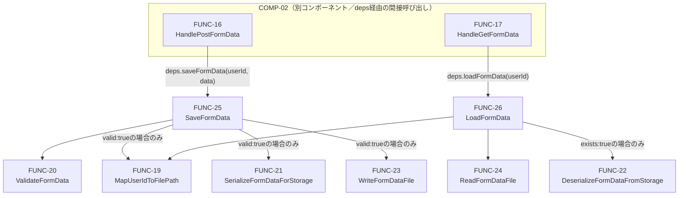

# 関数設計書（詳細設計）: COMP-03 データ永続化ロジック（ロジック層）

## 1. 文書情報

| 項目 | 内容 |
|---|---|
| 文書名 | LearnPlaywright 関数設計書（COMP-03: データ永続化ロジック／ロジック層） |
| 版数 | v1.3 |
| 作成日 | 2026-09-23 |
| 作成者 | ClaudeCode（関数設計工程サブエージェント） |

### 改訂履歴

| 版数 | 日付 | 変更内容 | 変更者 |
|---|---|---|---|
| v1.0 | 2026-09-23 | 初版作成 | ClaudeCode |
| v1.1 | 2026-09-23 | 5節自己チェックの参照先誤りを修正、CON-06充足根拠を追記（軽微指摘対応） | ClaudeCode |
| v1.2 | 2026-09-23 | 可読性向上（内容変更なし） | ClaudeCode |
| v1.3 | 2026-09-23 | 5節の見出し構成を整理（可読性向上、内容変更なし） | ClaudeCode |

## 2. 対応コンポーネント

- 対象コンポーネント: **COMP-03（データ永続化ロジック／ロジック層）**
- 対応要件ID（コンポーネント設計書 v1.3 3節より）: 機能要件 REQ-03, REQ-04／非機能要件 NFR-06／制約 CON-03, CON-05, CON-06, CON-07
- 実装技術: C#（.NET標準ライブラリのみ。`System.IO`・`System.Security.Cryptography`・`System.Text.Json`等のBCL機能のみを用い、ASP.NET Core等のWebフレームワークには依存しない。`System.Text.Json`は.NET SDKに同梱されるBCL機能でありASP.NET Core固有の型を要求しないため、NFR-06の「外部ライブラリに依存しない」という制約に抵触しない）

COMP-03はCOMP-02からのメソッド呼び出しのみを入力とし、HTTP型（`HttpContext`・Cookie等）を一切扱わない。COMP-02の関数設計書（`docs/03_function_design/COMP-02.md` v1.4）がCOMP-03に課す契約（3節参照）に整合する形で設計する。

### 2.1 本工程で確定した仕様決定事項（独自判断・要申し送り）

以下はコンポーネント設計書・COMP-02関数設計書のいずれにも具体値の定めがなく、本工程で確定した事項である。詳細な理由は各関数の説明を参照。`docs/qa_log.md`にも独自判断として記録する。

| 事項 | 結論 |
|---|---|
| 入力値検証（REQ-03）の具体的なルール | `text`は必須（null不可）・最大1000文字、`select`は必須（null・空文字列不可）・最大200文字、`radio`は`null`許容・非null時は最大200文字、`slider`は有限数値（`NaN`・±`Infinity`不可）であることのみを検証し具体的な数値範囲は設けない。詳細はFUNC-20参照。 |
| プルダウン・ラジオボタンの選択肢実在チェックの要否 | 行わない。選択肢一覧はCOMP-01のHTMLマークアップに属する情報であり、COMP-03がこれを保持するとUI変更のたびにCOMP-03側の修正が必要になりNFR-06の層分離方針に反するため。詳細はFUNC-20参照。 |
| ユーザー識別文字列からファイルパスへの変換方式（パストラバーサル対策） | ユーザー識別文字列をSHA-256でハッシュ化し、16進数文字列（`[0-9a-f]`のみ、64文字固定長）をファイル名として用いる方式を採用する。入力文字列がそのままパスの一部として使われないため、パストラバーサル文字列（`../`等）・OS予約デバイス名（`CON`/`NUL`等）・制御文字・極端な長さの文字列のいずれについても、ハッシュ化により安全なファイル名へ正規化される。詳細はFUNC-19参照。 |
| 保存先ディレクトリ（`baseDirectory`）の受け渡し方法 | COMP-03の各関数の引数として明示的に受け取る方式とする（テスト時に一時ディレクトリを注入できるようにするため）。COMP-02の契約（`deps.saveFormData: (userId, data) -> SaveResult`、`deps.loadFormData: (userId) -> LoadResult`）は`baseDirectory`引数を持たないため、実装工程のDI構成コード（COMP-02関数設計書FUNC-18に相当するアプリ起動時の結線処理、またはより上位の`Program.cs`）側で、確定済みの`baseDirectory`値をクロージャに固定した2引数版の関数として`deps`へ注入する。この結線処理はCOMP-02・COMP-03いずれの関数設計の責務にも含めない。 |
| `SaveFormData`/`LoadFormData`が返す成功系・失敗系の区別 | COMP-02契約（`SaveResult.success:false`は検証エラー専用、それ以外は例外）に厳密に従う。詳細はFUNC-25・FUNC-26参照。 |

### 2.2 排他制御に関する前提

コンポーネント設計書5.4節の排他制御の要否検討は、COMP-02関数設計書（v1.4）4節で「COMP-02のHTTPハンドラ層（FUNC-14`AcquireUserLock`/FUNC-15`ReleaseUserLock`）が担う」と結論済みである。したがって**COMP-03の各関数は排他制御を一切意識しない**。同一ユーザー識別文字列に対する`SaveFormData`/`LoadFormData`の呼び出しが直列化されていることは、呼び出し元（COMP-02）が保証する前提条件とする。COMP-03に対してこの前提に反する呼び出し（同一ユーザー識別文字列に対する同時呼び出し）が行われた場合にファイル破損等が生じる可能性は、本設計のスコープ外とする（COMP-02側の責務）。

### 2.3 型定義（関数一覧の前提）

```
FormDataDto = {
  text:   string,           // テキストボックスの入力値
  slider: number,             // スライダーの現在値
  select: string,              // プルダウンリストで選択中の値
  radio:  string | null        // 選択中のラジオボタンの値。未選択の場合はnull
}
// COMP-02関数設計書（v1.4）3節のFormDataDtoと完全に同一の形状とする（HTTP境界を挟んで
// COMP-02から渡される／COMP-02へ返す値であるため、型が一致していなければCOMP-02側の
// 契約〈deps.saveFormData/deps.loadFormDataの引数・戻り値〉を満たせない）。

SaveResult = {
  success: bool
  // 【契約】success:false は、本設計のFUNC-20（ValidateFormData）による入力値検証エラーの
  // 場合にのみ用いる。ファイルI/O異常（ディスク書き込み失敗、権限エラー等）や、その他の
  // 検証エラー以外の失敗は success:false で表現せず、例外をthrowする
  // （COMP-02関数設計書 v1.4 3節の契約に準拠）。
}

LoadResult = {
  found: bool,
  data:  FormDataDto | null   // found:trueの場合のみ非null
}
// found:false は「対応するJSONファイルが存在しない」ことを表す。COMP-01 FUNC-04が
// 前提とするHTTP 404の判定は、COMP-02 FUNC-17がこのfound:falseを受けて行う
// （COMP-02関数設計書 v1.4 5節FUNC-17手順7）。

ValidationResult = {
  valid:  bool,
  errors: string[]   // valid:trueの場合は空配列。valid:falseの場合、違反したルールごとに
                       // 1件のメッセージを含む（先頭の違反のみで打ち切らず、全ルールを評価する）
}
```

## 3. 関数一覧

| ID | 関数名 | 種別 | 責務（要約） | 対応要件 |
|---|---|---|---|---|
| FUNC-19 | `MapUserIdToFilePath` | ロジック（パス解決） | ユーザー識別文字列を安全なファイルパスへ変換する（パストラバーサル対策） | REQ-03, REQ-04, CON-05 |
| FUNC-20 | `ValidateFormData` | ロジック（検証） | `FormDataDto`の各フィールドが業務上許容される範囲・形式かを検証する | REQ-03 |
| FUNC-21 | `SerializeFormDataForStorage` | ロジック（JSON変換） | `FormDataDto`を保存用のJSON文字列へ変換する | REQ-03 |
| FUNC-22 | `DeserializeFormDataFromStorage` | ロジック（JSON変換） | 保存済みJSON文字列を`FormDataDto`へ復元する | REQ-04 |
| FUNC-23 | `WriteFormDataFile` | ファイルI/O | JSON文字列を指定ファイルパスへ書き込む | REQ-03 |
| FUNC-24 | `ReadFormDataFile` | ファイルI/O | 指定ファイルパスの内容を読み取る。ファイル未存在を区別可能な形で返す | REQ-04 |
| FUNC-25 | `SaveFormData` | 統括（保存処理） | 検証→パス解決→JSON変換→書き込みを統括し`SaveResult`を返す（COMP-02への`deps.saveFormData`委譲先） | REQ-03, NFR-06, CON-05 |
| FUNC-26 | `LoadFormData` | 統括（読込処理） | パス解決→読み取り→JSON復元を統括し`LoadResult`を返す（COMP-02への`deps.loadFormData`委譲先） | REQ-04, NFR-06, CON-05 |

種別の内訳: ロジック4件（FUNC-19〜22）、ファイルI/O 2件（FUNC-23・24）、統括2件（FUNC-25・26、COMP-02への窓口はこの2件のみ）。

以降、各関数の詳細を記載する。

### FUNC-19: MapUserIdToFilePath

- **責務**: ユーザー識別文字列（Cookie値そのもの、COMP-02 FUNC-10で形式検証されていない任意の文字列）を、ファイルシステム上の安全なファイルパスへ変換する。パストラバーサル・OS予約デバイス名・制御文字・極端な長さ等、ユーザー識別文字列に起因する不正なパスの生成を構造的に防止する。
- **引数**:
  - `userId: string` — ユーザー識別文字列（形式未検証。空文字列・記号・パス区切り文字等を含み得る）
  - `baseDirectory: string` — 保存先ディレクトリの絶対パス（CON-07により`.gitignore`除外対象となる想定のディレクトリ。具体的な値は実装工程で確定する設定値）
- **戻り値**: `string` — 解決済みの絶対ファイルパス。生成方式: `userId`をUTF-8バイト列化しSHA-256ハッシュを計算、16進数小文字64文字（`[0-9a-f]{64}`）にエンコードした文字列に`.json`拡張子を付与し、`baseDirectory`と結合したパス
- **副作用**: なし（ファイルシステムへのアクセスを行わない純粋な文字列・ハッシュ計算のみ）
- **例外/エラー時の挙動**:
  - `userId`が`null`または空文字列の場合: `ArgumentException`をthrowする
  - `baseDirectory`が`null`または空文字列の場合: `ArgumentException`をthrowする
  - （防御的実装）計算結果のファイルパスの正規化後の絶対パスが、`baseDirectory`の正規化後の絶対パス配下でない場合: `InvalidOperationException`をthrowする。ハッシュベースの命名方式では原理的に到達しない分岐だが、実装誤りに対する保険として規定する
- **テスト容易性メモ**: 同一`userId`・同一`baseDirectory`の入力に対しては常に同一の戻り値を返す（決定的）。パストラバーサル文字列（`"../../etc/passwd"`, `"..\\..\\windows\\system32"`）、OS予約デバイス名（`"CON"`, `"NUL"`, `"COM1"`等）、`null`文字を含む文字列、極端に長い文字列（数千文字）のいずれを入力しても、戻り値のファイル名部分は常に`[0-9a-f]{64}\.json`の形式のみになることをテストケースとして転用できる
- **対応要件**: REQ-03（保存時のファイル対応付け）, REQ-04（読込時の対応ファイル特定）, CON-05（認証機構を持たずCOMP-02側で形式検証されていない`userId`を安全に扱う必要性への対応）

### FUNC-20: ValidateFormData

- **責務**: `FormDataDto`の各フィールドが、業務上許容される範囲・形式であるかを検証する。JSON構文としての形状変換（COMP-02 FUNC-12の責務）ではなく、値の意味的妥当性の検証に専念する。
- **引数**:
  - `dto: FormDataDto`
- **戻り値**: `ValidationResult`
  - 検証ルール（すべて評価し、違反したルールごとに`errors`へ1件追加する。いずれの違反もなければ`{ valid: true, errors: [] }`）:
    | フィールド | ルール | 違反時のメッセージ例 |
    |---|---|---|
    | `text` | `null`不可 | `"text is required"` |
    | `text` | 文字列長が1000文字を超える場合不可（`null`でない場合のみ評価） | `"text exceeds maximum length of 1000 characters"` |
    | `slider` | `NaN`または`±Infinity`の場合不可 | `"slider must be a finite number"` |
    | `select` | `null`または空文字列（`""`）の場合不可 | `"select is required"` |
    | `select` | 文字列長が200文字を超える場合不可（`null`でない場合のみ評価） | `"select exceeds maximum length of 200 characters"` |
    | `radio` | `null`は許容（未選択状態を表す正常値。違反としない） | （該当なし） |
    | `radio` | 非`null`かつ文字列長が200文字を超える場合不可 | `"radio exceeds maximum length of 200 characters"` |
  - 選択肢（`select`・`radio`）が実在の選択肢値と一致するかの検証は**行わない**（2.1節参照。COMP-01のHTMLマークアップへの依存を避けるため）
- **副作用**: なし
- **例外/エラー時の挙動**: `dto`が`null`の場合、`ArgumentNullException`をthrowする（`dto`自体の欠落は呼び出し規約違反であり、`ValidationResult.valid:false`では表現しない）
- **対応要件**: REQ-03

### FUNC-21: SerializeFormDataForStorage

- **責務**: `FormDataDto`を、ファイル保存用のJSON文字列へ変換する。
- **引数**:
  - `dto: FormDataDto`
- **戻り値**: `string`（JSON文字列。プロパティ名は`text`/`slider`/`select`/`radio`のcamelCase、`radio`が`null`の場合はJSON上の`null`として出力する）
- **副作用**: なし
- **例外/エラー時の挙動**: `dto`が`null`の場合、`ArgumentNullException`をthrowする
- **対応要件**: REQ-03

### FUNC-22: DeserializeFormDataFromStorage

- **責務**: ファイルから読み取ったJSON文字列を`FormDataDto`へ復元する。値の意味的妥当性検証（FUNC-20の責務）は行わない。
- **引数**:
  - `jsonContent: string` — ファイルから読み取った生JSON文字列
- **戻り値**: `FormDataDto`
- **副作用**: なし
- **例外/エラー時の挙動**:
  - `jsonContent`がJSON構文として不正な場合、または`text`/`slider`/`select`の型が一致しない場合（例: `slider`が数値でない）: `JsonException`（または同等のデシリアライズ例外）をthrowする。呼び出し元（FUNC-26）はこれをcatchせず伝播させ、COMP-02 FUNC-17が500として扱う
  - `radio`フィールドが欠落している、または`null`の場合: 例外を投げず`radio: null`として扱う（FUNC-12と同様の扱い）
  - JSON内に`text`/`slider`/`select`/`radio`以外の未知のプロパティが含まれる場合: 無視する（例外を投げない。将来のフィールド追加に対する後方互換性のための方針）
- **対応要件**: REQ-04

### FUNC-23: WriteFormDataFile

- **責務**: JSON文字列を指定されたファイルパスへ書き込む（新規作成、または既存ファイルの上書き）。書き込み先ディレクトリが存在しない場合は作成する。
- **引数**:
  - `filePath: string` — FUNC-19が返す絶対ファイルパス
  - `jsonContent: string` — FUNC-21が返すJSON文字列
- **戻り値**: なし
- **副作用**: あり — ファイルシステムへの書き込み（親ディレクトリが存在しない場合はディレクトリ作成を含む）。既存ファイルがある場合は内容を全置換する（部分更新・マージは行わない）
- **例外/エラー時の挙動**:
  - `filePath`または`jsonContent`が`null`の場合: `ArgumentNullException`をthrowする
  - ディスク書き込み失敗・権限エラー等のファイルI/O異常が発生した場合: `IOException`（または`UnauthorizedAccessException`等の同等の例外）をthrowする。呼び出し元（FUNC-25）はこれをcatchせず伝播させる（COMP-02契約: ファイルI/O異常は`success:false`ではなく例外で表現する）
  - 本関数は書き込みの原子性（一時ファイルへの書き込み後にリネームする等の手法）までは実装しない。呼び出し元（COMP-02）が同一ユーザー識別文字列単位で書き込みを直列化する前提（2.2節）のため、書き込み途中に同一ファイルへの同時読み取り・同時書き込みが発生しないことを前提とする
- **対応要件**: REQ-03

### FUNC-24: ReadFormDataFile

- **責務**: 指定されたファイルパスの内容を読み取る。ファイルが存在しない場合は、例外ではなく戻り値でその旨を区別可能な形で返す（REQ-04の「未存在」判定の基礎）。
- **引数**:
  - `filePath: string` — FUNC-19が返す絶対ファイルパス
- **戻り値**: `{ exists: bool, content: string | null }`
  - `exists: true`の場合、`content`にファイルの全内容（文字列）が入る
  - `exists: false`の場合、`content`は`null`
- **副作用**: なし（ファイルシステムからの読み取りのみ）
- **例外/エラー時の挙動**:
  - `filePath`が`null`の場合: `ArgumentNullException`をthrowする
  - 指定パスにファイルが存在しない場合: 例外を投げず`{ exists: false, content: null }`を返す
  - ファイルは存在するが読み取りに失敗した場合（権限エラー、他プロセスによる排他ロック等のファイルI/O異常）: `IOException`（または`UnauthorizedAccessException`等の同等の例外）をthrowする。呼び出し元（FUNC-26）はこれをcatchせず伝播させる
- **対応要件**: REQ-04

### FUNC-25: SaveFormData

- **責務**: POSTされた入力値の保存処理を統括する（検証→〈検証成功時のみ〉ファイルパス解決→JSON変換→ファイル書き込み）。FUNC-19・FUNC-20・FUNC-21・FUNC-23を呼び出す。COMP-02の`deps.saveFormData: (userId: string, data: FormDataDto) -> SaveResult`契約を満たす（`baseDirectory`の受け渡し方法は2.1節参照）。
- **引数**:
  - `userId: string` — ユーザー識別文字列（COMP-02 FUNC-10で解決済み。形式未検証）
  - `dto: FormDataDto` — 保存する入力値データ
  - `baseDirectory: string` — 保存先ディレクトリの絶対パス
- **戻り値**: `SaveResult`
- **副作用**: あり — FUNC-23を介したファイルシステムへの書き込み（検証エラー時は発生しない）
- **処理順序（論理フロー）**:
  1. `userId`が`null`または空文字列の場合: `ArgumentException`をthrowする（呼び出し規約違反。COMP-02 FUNC-10は常に非空文字列を返すため、通常到達しない）
  2. `dto`が`null`の場合: `ArgumentNullException`をthrowする
  3. `baseDirectory`が`null`または空文字列の場合: `ArgumentException`をthrowする
  4. FUNC-20 (`ValidateFormData(dto)`) を呼び出す
  5. 手順4の結果が`valid: false`の場合: ファイルシステムには一切アクセスせず`{ success: false }`を返す（処理終了）
  6. 手順4の結果が`valid: true`の場合: FUNC-19 (`MapUserIdToFilePath(userId, baseDirectory)`) でファイルパスを解決する
  7. FUNC-21 (`SerializeFormDataForStorage(dto)`) でJSON文字列へ変換する
  8. FUNC-23 (`WriteFormDataFile(filePath, json)`) でファイルへ書き込む。ここで例外が発生した場合、catchせずそのまま呼び出し元へ伝播させる（COMP-02契約: ファイルI/O異常は例外で表現する）
  9. 手順8が例外なく完了した場合: `{ success: true }`を返す
- **例外/エラー時の挙動**: 手順1〜3（引数不正）、手順8（ファイルI/O異常）で例外をthrowする。手順5（検証エラー）のみ`{ success: false }`という戻り値で表現し、例外は投げない（COMP-02契約に厳密に従う）
- **対応要件**: REQ-03, NFR-06（COMP-02からの`deps`経由の間接呼び出しに徹し、検証・変換・I/Oの内部関数群〈FUNC-19〜24〉に処理を委譲する構成そのものがロジック層としての独立性を体現する）, CON-05

### FUNC-26: LoadFormData

- **責務**: GET要求時のデータ読込処理を統括する（ファイルパス解決→ファイル読み取り→〈存在する場合のみ〉JSON復元）。FUNC-19・FUNC-22・FUNC-24を呼び出す。COMP-02の`deps.loadFormData: (userId: string) -> LoadResult`契約を満たす（`baseDirectory`の受け渡し方法は2.1節参照）。
- **引数**:
  - `userId: string` — ユーザー識別文字列（COMP-02 FUNC-10で解決済み。形式未検証）
  - `baseDirectory: string` — 保存先ディレクトリの絶対パス
- **戻り値**: `LoadResult`
- **副作用**: なし（FUNC-24を介したファイルシステムからの読み取りのみ。書き込みは行わない）
- **処理順序（論理フロー）**:
  1. `userId`が`null`または空文字列の場合: `ArgumentException`をthrowする
  2. `baseDirectory`が`null`または空文字列の場合: `ArgumentException`をthrowする
  3. FUNC-19 (`MapUserIdToFilePath(userId, baseDirectory)`) でファイルパスを解決する
  4. FUNC-24 (`ReadFormDataFile(filePath)`) でファイルを読み取る。ここでファイルI/O異常（存在しない場合を除く）が発生した場合、catchせずそのまま呼び出し元へ伝播させる
  5. 手順4の結果が`exists: false`の場合: `{ found: false, data: null }`を返す（処理終了。COMP-02 FUNC-17がこれを受けて404を返す）
  6. 手順4の結果が`exists: true`の場合: FUNC-22 (`DeserializeFormDataFromStorage(content)`) で`FormDataDto`へ復元する。ここでJSON構文異常等が発生した場合、catchせずそのまま呼び出し元へ伝播させる（ファイルが外部要因で破損している場合等の想定外エラーであり、「未存在」とは異なる異常系として扱う）
  7. 手順6が例外なく完了した場合: `{ found: true, data: <復元結果> }`を返す
- **例外/エラー時の挙動**: 手順1〜2（引数不正）、手順4（ファイル存在確認以外のI/O異常）、手順6（JSON復元異常）で例外をthrowする。手順5（ファイル未存在）のみ`{ found: false, data: null }`という戻り値で表現し、例外は投げない
- **対応要件**: REQ-04, NFR-06, CON-05

## 4. 関数間の呼び出し関係



- FUNC-19（パス解決）はFUNC-25・FUNC-26の双方から共通利用される。
- FUNC-20（検証）はFUNC-25からのみ呼び出され、検証失敗時は後続のFUNC-19・21・23を一切呼び出さない（ファイルシステムに触れない）。
- FUNC-21（保存用JSON変換）とFUNC-22（復元用JSON変換）はそれぞれFUNC-25（保存方向）・FUNC-26（読込方向）専属であり、互いに依存しない。
- FUNC-23（書き込み）とFUNC-24（読み取り）はそれぞれFUNC-25・FUNC-26専属であり、互いに依存しない。
- COMP-02への実際の窓口はFUNC-25・FUNC-26のみであり、COMP-02はFUNC-19〜24の存在を意識しない（COMP-03内部の実装詳細として隠蔽される）。

## 5. 自己チェック結果

- **テストケース設計への転用可能性**: 各関数の引数・戻り値・例外条件を表形式で明示した。境界値（`text`1000文字ちょうど/1001文字、`select`の空文字列、`slider`の`NaN`/`Infinity`、パストラバーサル文字列、ファイル未存在、JSON構文異常等）をそのままテストケースの入力・期待値として転用できる粒度とした。
- **外部ライブラリ非依存（NFR-06）**: FUNC-19〜26はいずれも`System.IO`・`System.Security.Cryptography`・`System.Text.Json`等の.NET標準ライブラリ（BCL）のみを用いる設計とし、ASP.NET Core等のWebフレームワーク型には一切依存しない（2節参照）。COMP-02とのやり取りはFUNC-25・FUNC-26の引数・戻り値（`FormDataDto`/`SaveResult`/`LoadResult`という単純なデータ型）のみに限定され、HTTP型を受け取らない。
- **責務網羅性**: 以下を過不足なくカバーしていることを確認した。
  - REQ-03（POSTされた入力値の検証〈FUNC-20〉、JSON変換とファイル保存〈FUNC-21・23〉、ユーザー識別文字列とファイルの対応付け〈FUNC-19〉）
  - REQ-04（対応ファイルの読み取り〈FUNC-24〉、復元用データの返却〈FUNC-22〉、未存在の判定結果の返却〈FUNC-24・26〉）
  - NFR-06（外部ライブラリ非依存・単体テスト可能な構成であることを本節前段で確認）
  - **CON-03・CON-06・CON-07の扱い**
    - CON-03（C#実装）は全関数に構造的に充足
    - CON-06・CON-07（秘密情報・個人情報の非混入、保存先ディレクトリの`.gitignore`除外）は個別関数固有の設計事項ではなく横断的な規約・配置上の決定であるため、関数ごとの対応要件欄には明記していない。CON-07相当の内容はFUNC-19の引数説明（`baseDirectory`パラメータ）で確認でき、CON-06（秘密情報・個人情報を保存JSONに含めさせない方針）についても、本コンポーネントは入力値をそのまま保存するのみで、内容の意味的な検閲は行わない構成とすることで、CON-06の実効性がCOMP-01のREQ-07（UI注意書き）・NFR-01（運用方針）に依存することを明記している。
- **COMP-02が課す契約との整合性**:
  - `SaveResult.success:false`は入力値検証エラー（FUNC-20が`valid:false`と判定した場合）にのみ用い、ファイルI/O異常（FUNC-23の例外）は例外として伝播させる設計とした（FUNC-25手順5・8）。
  - ファイル不存在は`LoadResult.found:false`という戻り値で表現し、例外を投げない設計とした（FUNC-24・FUNC-26手順4・5）。これによりCOMP-02 FUNC-17がこれを受けて404を返し、COMP-01 FUNC-04が前提とするHTTP 404の判定チェーンが成立する。
  - COMP-02の`deps.saveFormData`/`deps.loadFormData`は2引数（`userId`+`data`／`userId`のみ）のシグネチャだが、COMP-03のFUNC-25・FUNC-26は`baseDirectory`を含む3引数／2引数として設計した。この差分は実装工程のDI結線コードでクロージャ化して吸収する方針とし、2.1節に明記した。
  - COMP-02側の排他制御（FUNC-14/15）を前提とし、COMP-03側では排他制御を一切実装しない設計とした（2.2節）。
- **ユーザー識別文字列→ファイルパスの安全性**: FUNC-19はユーザー識別文字列を直接パスへ埋め込まず、SHA-256ハッシュ値（16進数64文字固定長）をファイル名とする方式を採用した。これにより、パストラバーサル文字列・OS予約デバイス名・制御文字・極端な長さの文字列のいずれが入力されても、生成されるファイル名は常に`[0-9a-f]{64}\.json`という安全な形式に正規化される。加えて、生成結果が`baseDirectory`配下から外れないことを確認する防御的チェックも規定した。
