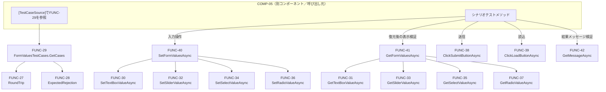

# 関数設計書（詳細設計）: COMP-04 テストデータ構造・ヘルパー関数

## 1. 文書情報

| 項目 | 内容 |
|---|---|
| 文書名 | LearnPlaywright 関数設計書（COMP-04: テストデータ構造・ヘルパー関数） |
| 版数 | v1.0 |
| 作成日 | 2026-09-23 |
| 作成者 | ClaudeCode（関数設計工程サブエージェント） |

### 改訂履歴

| 版数 | 日付 | 変更内容 | 変更者 |
|---|---|---|---|
| v1.0 | 2026-09-23 | 初版作成 | ClaudeCode |

## 2. 対応コンポーネント

- 対象コンポーネント: **COMP-04（テストデータ構造・ヘルパー関数）**
- 対応要件ID（コンポーネント設計書 v1.3 3節より）: 機能要件 REQ-08／非機能要件 NFR-07／制約 CON-04, CON-06, CON-07
- 実装技術: C# / Playwright for .NET / NUnit（CON-04）

COMP-04はCOMP-05からのみ参照される基盤ライブラリであり、COMP-05に依存しない（単方向依存、コンポーネント設計書2節）。本設計はCOMP-01関数設計書（`docs/03_function_design/COMP-01.md` v1.2）の`FormValues`型（3節）と対応するデータ構造、およびCOMP-03関数設計書（`docs/03_function_design/COMP-03.md` v1.3）の`FormDataDto`型（2.3節）とフィールド構成が一致するデータ構造を持つ。

### 2.1 本工程で確定した仕様決定事項（独自判断・要申し送り）

以下はコンポーネント設計書のいずれにも具体値の定めがなく、本工程で確定した事項である。`docs/qa_log.md`にも独自判断として記録する。

| 事項 | 結論 |
|---|---|
| Playwrightからのブラウザ要素特定方式 | `data-testid`属性による要素特定方式を採用する。COMP-01の実装（`src/`配下のHTML）は、テキストボックス・スライダー・プルダウンリスト・ラジオボタン各選択肢・送信ボタン・読み込みボタン・メッセージ表示領域のそれぞれに、4節の`FormTestIds`定数と一致する`data-testid`属性を付与する必要がある。COMP-01関数設計書（v1.2）はJavaScript関数の契約のみを定めHTML属性には言及していないため、本決定はCOMP-01関数設計書と矛盾しないが、COMP-01の実装時に本節の内容を踏まえて`data-testid`属性を追加することを申し送る。 |
| スライダーのmin/max、プルダウン・ラジオボタンの具体的な選択肢値 | COMP-01の静的HTMLマークアップ（REQ-01、COMP-01関数設計書2.1節）に属する実装詳細であり、本工程時点では未確定。4節の`FormFieldLimits`に仮値（プレースホルダ）を置き、実装工程でCOMP-01の実際のHTML属性値が確定し次第、本ファイルの値を実装値に合わせて更新することを申し送る。 |
| テストケースの命名・識別方法 | `FormValuesTestCase.CaseId`をNUnitのテストケース表示名として用いる（`TestCaseData.SetName(caseId)`）。障害発生時にどの入力パターンが失敗したかをテスト結果から即座に判別できるようにするため。 |
| 排他制御の要否 | COMP-04はテストコード側の静的データ・ヘルパー関数のみで構成され、複数テスト間で共有される可変状態を持たない（各テストは独立したブラウザコンテキスト・独立したユーザー識別Cookieを用いる前提、COMP-05側の責務）。したがってコンポーネント設計書5.4節の排他制御検討はCOMP-04には適用されない。 |

## 3. データ構造定義

以降で用いる型・定数をすべて示す。COMP-01の`FormValues`型・COMP-03の`FormDataDto`型と意味的に同一のフィールド構成（`text` / `slider` / `select` / `radio`）を持つC#版の型を`FormValues`として定義し、これを核にテストケース構造を組み立てる。

```csharp
namespace LearnPlaywright.Tests.TestData;

/// <summary>
/// COMP-01のFormValues型（JS、COMP-01関数設計書3節）およびCOMP-03のFormDataDto型
/// （COMP-03関数設計書2.3節）と同一のフィールド構成を持つ、フォーム入力値の集合。
/// </summary>
public sealed record FormValues(
    string Text,     // テキストボックスの入力値。null不可（COMP-03 FUNC-20の検証ルールに合わせる）。空文字列は許容
    double Slider,    // スライダーの現在値。JSのnumberに対応するためdoubleとする
    string Select,    // プルダウンリストで選択中の値（option要素のvalue属性）。null不可
    string? Radio     // 選択中のラジオボタンの値。いずれも未選択の場合はnull
);

/// <summary>
/// メッセージ表示領域（COMP-01 FUNC-05/FUNC-06の対象要素）の現在の表示状態。
/// </summary>
public sealed record MessageState(
    string Text,   // 表示中のテキスト。何も表示されていない場合は空文字列
    string? Type   // 'success' | 'error' | 'info' | null（いずれのCSSクラスも付与されていない場合）
);

/// <summary>
/// 1件のテストケース: UIへ入力する値（Input）と、送信結果・復元結果として
/// 期待する値の組。REQ-08（TestCaseSourceによるパラメータ化）・REQ-09
/// （送信→保存検証、読込→復元検証のシナリオ）に対応する。
/// </summary>
public sealed record FormValuesTestCase(
    string CaseId,                  // 例: "BND-TEXT-OVERLEN"。NUnitのテスト表示名・失敗時ログで識別するための一意な文字列
    string Category,                // 例: "代表値" / "境界値-文字列長" / "境界値-数値" / "境界値-未選択" / "検証エラー"。境界値網羅の分類ラベル
    FormValues Input,                // UIへ入力し送信する値
    bool ExpectedSubmitSuccess,      // 送信時にサーバー（COMP-03 FUNC-20）が保存を受理すると期待するか
    FormValues? ExpectedRestored     // 読み込みボタン押下後にUIへ復元されると期待する値。
                                       // ExpectedSubmitSuccess:trueの場合は通常Inputと同一値。
                                       // falseの場合は「保存されなかった」ことを表すためnull
                                       // （読み込み時は「未保存」旨のメッセージが表示されると期待する）
)
{
    public override string ToString() => CaseId; // NUnitのテストケース名にCaseIdを使わせるためのオーバーライド

    // FUNC-27: 正常な入力値について、送信成功・復元値が入力値と一致するケースを生成する。
    public static FormValuesTestCase RoundTrip(string caseId, string category, FormValues input)
    {
        if (string.IsNullOrEmpty(caseId)) throw new ArgumentException("caseId is required", nameof(caseId));
        if (input is null) throw new ArgumentNullException(nameof(input));
        return new FormValuesTestCase(caseId, category, input, true, input);
    }

    // FUNC-28: サーバー側検証（COMP-03 FUNC-20）により保存が拒否されると期待する入力値のケースを生成する。
    public static FormValuesTestCase ExpectedRejection(string caseId, string category, FormValues invalidInput)
    {
        if (string.IsNullOrEmpty(caseId)) throw new ArgumentException("caseId is required", nameof(caseId));
        if (invalidInput is null) throw new ArgumentNullException(nameof(invalidInput));
        return new FormValuesTestCase(caseId, category, invalidInput, false, null);
    }
}

/// <summary>
/// COMP-03の検証ルール（COMP-03関数設計書FUNC-20）と一致させる境界値定数、
/// およびCOMP-01のHTML実装に依存するため実装工程で確定するプレースホルダ値。
/// </summary>
public static class FormFieldLimits
{
    // --- COMP-03 FUNC-20の検証ルールと一致させる値（確定済み） ---
    public const int TextMaxLength = 1000;    // text: 1000文字を超える場合は検証エラー
    public const int SelectMaxLength = 200;   // select: 200文字を超える場合は検証エラー（実運用ではHTML選択肢の短い固定値のため到達しにくい）
    public const int RadioMaxLength = 200;    // radio: 200文字を超える場合は検証エラー（同上）

    // --- COMP-01実装（静的HTML）確定後に更新するプレースホルダ値 ---
    // スライダー（type="range"）のmin/max属性の実際値。実装工程で確定次第、本値を更新すること（2.1節）。
    public const double SliderMinPlaceholder = 0;
    public const double SliderMaxPlaceholder = 100;
}

/// <summary>
/// Playwrightがブラウザ要素を特定するために用いる data-testid 属性値。
/// COMP-01実装時、対応するHTML要素へ同名の data-testid 属性を付与すること（2.1節）。
/// </summary>
public static class FormTestIds
{
    public const string TextInput = "text-input";
    public const string Slider = "slider";
    public const string Select = "select";
    public const string RadioOption = "radio-option";  // 個々のradio要素。value属性で個別に識別する（例: [data-testid="radio-option"][value="..."]）
    public const string SubmitButton = "submit-button";
    public const string LoadButton = "load-button";
    public const string MessageArea = "message-area";
}
```

### 3.1 NFR-07充足の説明

新しい入力パターンを追加する場合、`FormValuesTestCase.RoundTrip(...)`または`.ExpectedRejection(...)`で1件のレコードを組み立て、後述FUNC-29（`FormValuesTestCases.GetCases`）が返す列挙へ追加するだけでよい。COMP-05側のテストメソッド本体（`[TestCaseSource]`でこの列挙を参照する側）は入力パターン追加のたびに変更する必要がない。個々のテストメソッドへ値をハードコードする経路も存在しない（すべての具体値は本ファイルの`FormValuesTestCases`に一元化される）。

## 4. 関数一覧

| ID | 関数名 | 種別 | 責務（要約） | 対応要件 |
|---|---|---|---|---|
| FUNC-27 | `FormValuesTestCase.RoundTrip` | データ生成（ロジック） | 送信成功・入力値どおりの復元を期待するテストケースを生成する | REQ-08, NFR-07 |
| FUNC-28 | `FormValuesTestCase.ExpectedRejection` | データ生成（ロジック） | 送信拒否（検証エラー）を期待するテストケースを生成する | REQ-08, NFR-07 |
| FUNC-29 | `FormValuesTestCases.GetCases` | データ生成（TestCaseSource提供） | 代表値・境界値を網羅したテストケース列挙を返す | REQ-08, NFR-07 |
| FUNC-30 | `SetTextBoxValueAsync` | Playwright操作（DOM書き込み） | テキストボックスへ値を設定する | REQ-08, REQ-09 |
| FUNC-31 | `GetTextBoxValueAsync` | Playwright操作（DOM読み取り） | テキストボックスの現在値を取得する | REQ-08, REQ-09 |
| FUNC-32 | `SetSliderValueAsync` | Playwright操作（DOM書き込み） | スライダーへ値を設定する | REQ-08, REQ-09 |
| FUNC-33 | `GetSliderValueAsync` | Playwright操作（DOM読み取り） | スライダーの現在値を取得する | REQ-08, REQ-09 |
| FUNC-34 | `SetSelectValueAsync` | Playwright操作（DOM書き込み） | プルダウンリストの選択項目を設定する | REQ-08, REQ-09 |
| FUNC-35 | `GetSelectValueAsync` | Playwright操作（DOM読み取り） | プルダウンリストの現在の選択値を取得する | REQ-08, REQ-09 |
| FUNC-36 | `SetRadioValueAsync` | Playwright操作（DOM書き込み） | 指定値のラジオボタンを選択する | REQ-08, REQ-09 |
| FUNC-37 | `GetRadioValueAsync` | Playwright操作（DOM読み取り） | 現在選択中のラジオボタンの値を取得する | REQ-08, REQ-09 |
| FUNC-38 | `ClickSubmitButtonAsync` | Playwright操作（クリック） | 送信ボタンをクリックする | REQ-08, REQ-09 |
| FUNC-39 | `ClickLoadButtonAsync` | Playwright操作（クリック） | 読み込みボタンをクリックする | REQ-08, REQ-09 |
| FUNC-40 | `SetFormValuesAsync` | Playwright操作（複合・DOM書き込み） | `FormValues`の全項目をUIへ一括反映する | REQ-08, REQ-09, NFR-07 |
| FUNC-41 | `GetFormValuesAsync` | Playwright操作（複合・DOM読み取り） | UIの全項目の現在値を`FormValues`として一括取得する | REQ-08, REQ-09, NFR-07 |
| FUNC-42 | `GetMessageAsync` | Playwright操作（DOM読み取り） | メッセージ表示領域のテキスト・種別を取得する | REQ-08, REQ-09 |

種別の内訳: データ生成3件（FUNC-27〜29）、Playwright操作の個別コントロール用DOM読み取り/書き込み10件（FUNC-30〜39）、複合ヘルパー2件（FUNC-40・41）、メッセージ読み取り1件（FUNC-42）。FUNC-27〜28はデータ構造（3節）に内包されるため、以降の詳細節では独立節を設けず3節のコード内コメントを一次情報源とする。

以降、FUNC-29〜42の詳細を記載する。

### FUNC-29: FormValuesTestCases.GetCases

- **責務**: NUnitの`[TestCaseSource]`から参照される、代表値および境界値を網羅したテストケースの列挙を返す。FUNC-27・FUNC-28を用いて個々のケースを組み立てる。
- **引数**: なし
- **戻り値**: `IEnumerable<NUnit.Framework.TestCaseData>` — 各要素は1個の`FormValuesTestCase`を唯一の引数として保持し、`.SetName(testCase.CaseId)`でテスト表示名を`CaseId`に設定したもの
- **副作用**: なし（固定データの組み立てのみ）
- **例外/エラー時の挙動**: 本関数自体は固定データを組み立てるのみのため通常例外は発生しない。内部で呼び出すFUNC-27/28の引数不正（実装バグ）があればそのまま伝播する
- **含むケース一覧（設計時点。具体的な数値・選択肢文字列は実装工程でCOMP-01の実HTML・COMP-03の確定値に合わせて最終化する）**:

  | CaseId | Category | 内容 | ExpectedSubmitSuccess |
  |---|---|---|---|
  | `REP-DEFAULT` | 代表値 | text/slider/select/radioすべて典型的な値 | true |
  | `BND-TEXT-EMPTY` | 境界値-文字列長 | text=""（空文字列）。`text`のCOMP-03検証ルールはnull不可のみで空文字列は許容 | true |
  | `BND-TEXT-MAXLEN` | 境界値-文字列長 | textの長さ=`FormFieldLimits.TextMaxLength`（1000）ちょうど | true |
  | `BND-TEXT-OVERLEN` | 検証エラー | textの長さ=`FormFieldLimits.TextMaxLength + 1`（1001） | false |
  | `BND-SLIDER-MIN` | 境界値-数値 | slider=`FormFieldLimits.SliderMinPlaceholder` | true |
  | `BND-SLIDER-MAX` | 境界値-数値 | slider=`FormFieldLimits.SliderMaxPlaceholder` | true |
  | `BND-SELECT-FIRST` | 境界値-選択肢 | プルダウンの先頭の選択肢を選択 | true |
  | `BND-SELECT-LAST` | 境界値-選択肢 | プルダウンの末尾の選択肢を選択 | true |
  | `BND-RADIO-UNSELECTED` | 境界値-未選択 | radio=null（いずれも未選択のまま送信） | true |
  | `BND-RADIO-EACHOPTION-*` | 境界値-選択肢 | ラジオボタンの各選択肢を1つずつ選択（選択肢数に応じてCaseIdを連番化） | true |

  `select`・`radio`はCOMP-01のHTML選択肢一覧という閉じた集合からのみ値を取り得るため（自由入力ではない）、COMP-03の文字数上限（200文字）に対する境界は実運用上到達しにくいと判断し、これらのフィールドについては文字数境界ではなく「選択肢の網羅」を境界値の観点として採用した（自己チェック参照）。
- **対応要件**: REQ-08, NFR-07

### FUNC-30: SetTextBoxValueAsync

- **責務**: テキストボックス（`data-testid="text-input"`）へ指定文字列を設定する。
- **引数**:
  - `page: Microsoft.Playwright.IPage` — 操作対象のPlaywrightページ
  - `value: string` — 設定する文字列（空文字列可）
- **戻り値**: `Task`
- **副作用**: あり — `page.Locator(FormTestIds.TextInput).FillAsync(value)`によるDOM上のテキストボックスの値の書き換え
- **例外/エラー時の挙動**:
  - `page`または`value`が`null`の場合: `ArgumentNullException`をthrowする
  - 対象要素がPlaywrightの既定タイムアウト内に見つからない場合: Playwrightの`TimeoutException`がそのままthrowされる（本関数はcatchしない）
- **対応要件**: REQ-08, REQ-09

### FUNC-31: GetTextBoxValueAsync

- **責務**: テキストボックスの現在値を取得する。
- **引数**: `page: IPage`
- **戻り値**: `Task<string>` — 現在の入力値（未入力時は空文字列）
- **副作用**: なし（`InputValueAsync()`による読み取りのみ）
- **例外/エラー時の挙動**: `page`が`null`の場合`ArgumentNullException`。要素未検出時はPlaywrightの`TimeoutException`
- **対応要件**: REQ-08, REQ-09

### FUNC-32: SetSliderValueAsync

- **責務**: スライダー（`type="range"`、`data-testid="slider"`）へ指定数値を設定する。
- **引数**:
  - `page: IPage`
  - `value: double` — 設定する数値
- **戻り値**: `Task`
- **副作用**: あり — スライダーの値の書き換え。range要素は`FillAsync`では値変更イベントが発火しない場合があるため、`Locator.EvaluateAsync("(el, v) => { el.value = v; el.dispatchEvent(new Event('input', { bubbles: true })); el.dispatchEvent(new Event('change', { bubbles: true })); }", value)`相当の実装、またはPlaywrightの`FillAsync`が range 要素に対応していることを実装工程で確認したうえでいずれかに確定する
- **例外/エラー時の挙動**:
  - `page`が`null`の場合: `ArgumentNullException`
  - `value`が`NaN`または`±Infinity`の場合: `ArgumentException`をthrowする（COMP-03 FUNC-20の検証ルールと対称に、UIへ設定不能な値を渡すこと自体を早期に防止する）
  - 対象要素がタイムアウト内に見つからない場合: `TimeoutException`
  - HTML `min`/`max`属性の範囲外の値を指定した場合の挙動（ブラウザ側でクランプされるか等）は本関数では規定しない。ブラウザのrange input仕様に委ねる
- **対応要件**: REQ-08, REQ-09

### FUNC-33: GetSliderValueAsync

- **責務**: スライダーの現在値を取得する。
- **引数**: `page: IPage`
- **戻り値**: `Task<double>`
- **副作用**: なし
- **例外/エラー時の挙動**:
  - `page`が`null`の場合: `ArgumentNullException`
  - `InputValueAsync()`で取得した文字列を`double.Parse`する際に変換失敗した場合: `FormatException`をthrowする（range要素は常に数値文字列を返すため通常到達しない防御的分岐）
  - 要素未検出時: `TimeoutException`
- **対応要件**: REQ-08, REQ-09

### FUNC-34: SetSelectValueAsync

- **責務**: プルダウンリストの選択項目を指定値に変更する。
- **引数**:
  - `page: IPage`
  - `value: string` — 選択する`option`要素のvalue属性値
- **戻り値**: `Task`
- **副作用**: あり — `page.Locator(FormTestIds.Select).SelectOptionAsync(value)`
- **例外/エラー時の挙動**:
  - `page`または`value`が`null`の場合: `ArgumentNullException`
  - `value`に一致する`option`が存在しない場合: Playwrightの標準例外（該当なしエラー）がそのままthrowされる
  - 要素未検出時: `TimeoutException`
- **対応要件**: REQ-08, REQ-09

### FUNC-35: GetSelectValueAsync

- **責務**: プルダウンリストの現在の選択値を取得する。
- **引数**: `page: IPage`
- **戻り値**: `Task<string>`
- **副作用**: なし（`page.Locator(FormTestIds.Select).InputValueAsync()`による読み取りのみ）
- **例外/エラー時の挙動**: `page`が`null`の場合`ArgumentNullException`。要素未検出時は`TimeoutException`
- **対応要件**: REQ-08, REQ-09

### FUNC-36: SetRadioValueAsync

- **責務**: 指定した値に対応するラジオボタンを選択する。`value`が`null`の場合は何も操作しない（COMP-01 FUNC-02の「`radio: null`の場合は既存の選択状態を保持する」という意味論に合わせる。テスト開始直後の初期状態ではいずれのラジオボタンも未選択であることを前提とする）。
- **引数**:
  - `page: IPage`
  - `value: string?`
- **戻り値**: `Task`
- **副作用**: `value`が非`null`の場合のみあり — `page.Locator($"[data-testid='{FormTestIds.RadioOption}'][value='{value}']").CheckAsync()`
- **例外/エラー時の挙動**:
  - `page`が`null`の場合: `ArgumentNullException`
  - `value`が`null`の場合: 例外を投げず即座に完了する（no-op）
  - `value`に一致するラジオボタンが存在しない場合: Playwrightの標準例外（`TimeoutException`、対象要素が見つからない）がそのままthrowされる
- **対応要件**: REQ-08, REQ-09

### FUNC-37: GetRadioValueAsync

- **責務**: 現在選択中のラジオボタンの値を取得する。いずれも選択されていない場合は`null`を返す。
- **引数**: `page: IPage`
- **戻り値**: `Task<string?>`
- **副作用**: なし（`page.Locator($"[data-testid='{FormTestIds.RadioOption}']:checked")`による読み取りのみ）
- **例外/エラー時の挙動**:
  - `page`が`null`の場合: `ArgumentNullException`
  - ラジオボタン要素群（`data-testid="radio-option"`）自体が1件も存在しない場合: フォーム構造の不整合とみなし`InvalidOperationException`をthrowする（COMP-01 FUNC-01が要素欠落時に`TypeError`をthrowする設計と同様の考え方）
  - 要素群は存在するが選択済みのものが1件もない場合: 例外を投げず`null`を返す（正常系。REQ-08のテストケースで`radio: null`を表現するために必須の分岐）
  - 選択済みの要素が2件以上検出された場合（同一`name`のグループとして正しくマークアップされていない実装不整合）: `InvalidOperationException`をthrowする
- **対応要件**: REQ-08, REQ-09

### FUNC-38: ClickSubmitButtonAsync

- **責務**: 送信ボタン（`data-testid="submit-button"`）をクリックする。
- **引数**: `page: IPage`
- **戻り値**: `Task`
- **副作用**: あり — `page.Locator(FormTestIds.SubmitButton).ClickAsync()`。COMP-01 FUNC-07（`handleSubmitButtonClick`）が起動し、POSTリクエストが発行される
- **例外/エラー時の挙動**: `page`が`null`の場合`ArgumentNullException`。要素未検出時は`TimeoutException`
- **対応要件**: REQ-08, REQ-09

### FUNC-39: ClickLoadButtonAsync

- **責務**: 読み込みボタン（`data-testid="load-button"`）をクリックする。
- **引数**: `page: IPage`
- **戻り値**: `Task`
- **副作用**: あり — `page.Locator(FormTestIds.LoadButton).ClickAsync()`。COMP-01 FUNC-08（`handleLoadButtonClick`）が起動し、GETリクエストが発行される
- **例外/エラー時の挙動**: `page`が`null`の場合`ArgumentNullException`。要素未検出時は`TimeoutException`
- **対応要件**: REQ-08, REQ-09

### FUNC-40: SetFormValuesAsync

- **責務**: `FormValues`の全4フィールドをUIへ一括反映する複合ヘルパー。FUNC-30・FUNC-32・FUNC-34・FUNC-36を順に呼び出す。COMP-05のテストメソッドが個々のコントロールを都度呼び出す必要をなくす。
- **引数**:
  - `page: IPage`
  - `values: FormValues`
- **戻り値**: `Task`
- **副作用**: あり（内包する4関数の副作用の合算）
- **例外/エラー時の挙動**:
  - `page`または`values`が`null`の場合: `ArgumentNullException`
  - 内部で呼び出す各関数（FUNC-30・32・34・36）が例外をthrowした場合、catchせずそのまま伝播する。途中の項目で例外が発生した場合、それ以降の項目への設定は行われず、UIは部分適用状態になり得る。この状態のハンドリング（テスト失敗として扱う等）はCOMP-05側の責務とする
- **対応要件**: REQ-08, REQ-09, NFR-07（COMP-05のテストメソッド本体を、入力パターン追加のたびに修正不要にするための基盤）

### FUNC-41: GetFormValuesAsync

- **責務**: UI上の4種類のコントロールの現在値をまとめて取得し、1つの`FormValues`として返す複合ヘルパー。FUNC-31・FUNC-33・FUNC-35・FUNC-37を呼び出す。
- **引数**: `page: IPage`
- **戻り値**: `Task<FormValues>`
- **副作用**: なし
- **例外/エラー時の挙動**: `page`が`null`の場合`ArgumentNullException`。内部で呼び出す各関数（FUNC-31・33・35・37）の例外をそのまま伝播する
- **対応要件**: REQ-08, REQ-09, NFR-07

### FUNC-42: GetMessageAsync

- **責務**: メッセージ表示領域（`data-testid="message-area"`、COMP-01 FUNC-05/FUNC-06の対象要素）の現在のテキストと、付与されているCSSクラス（`message--success` / `message--error` / `message--info`）から種別を判定し、`MessageState`として返す。
- **引数**: `page: IPage`
- **戻り値**: `Task<MessageState>`
- **副作用**: なし（`TextContentAsync()`・`GetAttributeAsync("class")`による読み取りのみ）
- **例外/エラー時の挙動**:
  - `page`が`null`の場合: `ArgumentNullException`
  - メッセージ表示領域自体が見つからない場合: `TimeoutException`
  - `message--success` / `message--error` / `message--info`のいずれのクラスも付与されていない場合: 例外を投げず`Type: null`として返す（FUNC-06呼び出し直後の初期状態等、正常系として扱う）
  - 上記3クラスのうち2つ以上が同時に付与されている場合（COMP-01実装の不整合）: `InvalidOperationException`をthrowする（防御的チェック）
- **対応要件**: REQ-08, REQ-09

## 5. 関数間の呼び出し関係



- FUNC-27・FUNC-28（データ生成）はFUNC-29からのみ呼び出され、互いに依存しない。
- FUNC-30・32・34・36（個別DOM書き込み）はFUNC-40からまとめて呼び出される他、COMP-05が個別に直接呼び出すことも妨げない（複合ヘルパーは利便性のためのラッパーであり、個別関数の呼び出しを隠蔽・強制するものではない）。
- FUNC-31・33・35・37（個別DOM読み取り）についても同様にFUNC-41から呼び出される他、COMP-05からの直接呼び出しも可能。
- FUNC-38（送信）・FUNC-39（読込）・FUNC-42（メッセージ取得）はいずれもCOMP-05から直接呼び出される独立した末端関数であり、COMP-04内の他関数からは呼び出されない。

## 6. 自己チェック結果

- **テストケース設計への転用可能性**: `FormValuesTestCase`はCaseId・Category・Input・ExpectedSubmitSuccess・ExpectedRestoredの5フィールドで構成され、テスト仕様書（`docs/04_test/`）のテストケース一覧へそのまま転記できる粒度とした。FUNC-29の含むケース一覧（表形式）は、次工程（テスト工程）でのテストケースIDへの転用元として利用できる。
- **テストデータ構造とヘルパー関数の分離（NFR-07）**: 3節（データ構造: `FormValues` / `MessageState` / `FormValuesTestCase` / 定数群）と4節（ヘルパー関数: Playwright操作を伴うFUNC-30〜42）を明確に分離した。データ生成用のFUNC-27〜29は`Page`引数を取らず、Playwright操作用のFUNC-30〜42は必ず`Page`引数を取るという構造的な区別によって、両者の混在を防いでいる。新規入力パターンの追加はFUNC-29の返す列挙への1件追加のみで完結し、既存のテストロジック本体（COMP-05側）・ヘルパー関数本体（FUNC-30〜42）のいずれも修正不要である（3.1節）。
- **COMP-01のFormValues型との対応**: 本設計の`FormValues`（C#）は、COMP-01関数設計書3節の`FormValues`（JS）と`text` / `slider` / `select` / `radio`の4フィールド・意味づけが完全に一致する。COMP-03の`FormDataDto`とも同一形状であり、UI層・保存層・テスト層で一貫したデータ形状を保っている。
- **COMP-04の責務網羅性（REQ-08 / NFR-07 / CON-04, 06）**:
  - REQ-08（`TestCaseSource`によるパラメータ化）: FUNC-29が`IEnumerable<TestCaseData>`を返す設計で充足。
  - NFR-07（データ構造の一元管理、ハードコード・ロジック改修の不要化）: 3.1節・本節前段で確認済み。
  - CON-04（Playwright for .NET／C#／NUnit）: 全関数がC#で設計され、NUnitの`TestCaseSource`・`TestCaseData`を用いる。
  - CON-06・CON-07（秘密情報・個人情報の非混入）: 本コンポーネントが扱うテストデータはダミー値のみであり、個別関数固有の設計事項ではなく横断的な規約として扱う（COMP-01・COMP-03と同様の整理）。テストケースの具体的な文字列値（代表値等）に実在の個人情報を用いないことは、実装工程・テスト仕様書工程での順守事項として申し送る。
- **境界値の表現可能性**: `FormValuesTestCase`は`ExpectedSubmitSuccess: false`を持てる設計としたことで、「文字数超過により保存が拒否される」ような境界値ケース（`BND-TEXT-OVERLEN`）も、往復一致ケースと同じデータ構造で表現できる。空文字列（`BND-TEXT-EMPTY`）、文字列長ちょうどの上限（`BND-TEXT-MAXLEN`）、数値の最小/最大（`BND-SLIDER-MIN/MAX`）、未選択（`BND-RADIO-UNSELECTED`）をFUNC-29の一覧に含めた。`select`・`radio`はHTMLの閉じた選択肢集合からのみ値を取るため、これらについては文字数境界ではなく「選択肢の網羅」を境界値の観点として採用した（FUNC-29詳細参照）。この判断根拠を明記することで、単純な数値・文字列長の境界パターンの流用では拾えない、UIコントロール種別ごとの境界の違いを考慮した設計であることを示す。
