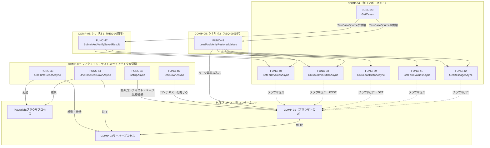

# 関数設計書（詳細設計）: COMP-05 Playwrightテストシナリオ

## 1. 文書情報

| 項目 | 内容 |
|---|---|
| 文書名 | LearnPlaywright 関数設計書（COMP-05: Playwrightテストシナリオ） |
| 版数 | v1.4 |
| 作成日 | 2026-09-23 |
| 作成者 | ClaudeCode（関数設計工程サブエージェント・論理設計担当／可読性向上担当） |

### 改訂履歴

| 版数 | 日付 | 変更内容 | 変更者 |
|---|---|---|---|
| v1.0 | 2026-09-23 | 初版作成（論理設計。可読性向上は別工程で実施） | ClaudeCode |
| v1.1 | 2026-09-23 | 論理レビュー1回目の指摘3件に対応。(1)FUNC-47の責務記述をREQ-09前半の文言流用から実態（メッセージ種別による間接検証）に修正し、値レベルの一致検証がFUNC-48との組み合わせで初めて充足される旨を4節・6節に明記、(2)FUNC-43の責務・2.1節に、サーバープロセスを`ServerConfig.BaseUrl`のポートで実際に待ち受けさせるための起動時指定方法（`--urls`引数またはASPNETCORE_URLS環境変数）を実装工程で確定・反映する旨を追記、(3)FUNC-47・FUNC-48の対応要件欄からCON-06・CON-07を削除し、COMP-02/COMP-04同様6節自己チェックでのみ横断的要件として言及する形に統一 | ClaudeCode |
| v1.2 | 2026-09-23 | テスト工程への申し送り事項を追記（軽微指摘対応） | ClaudeCode |
| v1.3 | 2026-09-23 | 可読性向上（内容変更なし）。(1)4節冒頭に6関数のID・関数名・所属グループの一覧表を追加し、重複していた文章説明を整理、(2)4節内のグループ見出しレベルを`####`から`###`へ統一（節→個別関数見出しと同階層のグループ見出しが一段深くなっていたアウトライン上の逆転を解消）、(3)2節冒頭の連続する2文の接続をやや単調だった箇所で調整。関数名・引数・戻り値・副作用・例外仕様・対応ID・数値・判断内容・契約は一切変更していない | ClaudeCode |
| v1.4 | 2026-09-23 | 実装工程での確定を反映。`ServerConfig.BaseUrl`=`http://localhost:5080`、サーバープロジェクト=`src/LearnPlaywright.Server`で確定（名称は維持）。FUNC-43は`dotnet run --project <path> --no-build --no-launch-profile --urls <BaseUrl>`で起動し、保存先を環境変数`DataDirectory`で一時ディレクトリに向ける。起動前にポート使用中を検出した場合は失敗させる。ヘッドフル実行は環境変数`LEARNPLAYWRIGHT_HEADED=1`。FUNC-44は一時ディレクトリも削除する | ClaudeCode |

## 2. 対応コンポーネント

- 対象コンポーネント: **COMP-05（Playwrightテストシナリオ）**
- 対応要件ID（コンポーネント設計書 v1.3 3節より）: 機能要件 REQ-08（適用面）, REQ-09／制約 CON-01, CON-04, CON-06, CON-07
- 実装技術: C# / Playwright for .NET / NUnit（CON-04）

COMP-05はCOMP-04（`docs/03_function_design/COMP-04.md` v1.2）が提供するデータ構造（`FormValues` / `FormValuesTestCase` / `MessageState` / `FormTestIds`）およびヘルパー関数（FUNC-27〜42）にのみ依存し、COMP-04に依存されない（単方向依存、コンポーネント設計書2節）。また、COMP-01（`docs/03_function_design/COMP-01.md` v1.2）が公開するUI（`data-testid`属性、COMP-04 2.1節で確定済み）をPlaywrightのブラウザ自動操作を通じてのみ検証し、COMP-02・COMP-03へのHTTP直接呼び出しやファイルシステムへの直接アクセスは行わない（コンポーネント設計書3節「COMP-01を通じてCOMP-02・COMP-03まで含めたエンドツーエンドの検証を行う」の方針に基づく）。

### 2.1 本工程で確定した仕様決定事項（独自判断・要申し送り）

以下はコンポーネント設計書・COMP-01〜04関数設計書のいずれにも具体値の定めがなく、本工程で確定した事項である。`docs/qa_log.md`にも独自判断として記録する。

| 事項 | 結論 |
|---|---|
| バックエンドサーバー（COMP-02）プロセスの起動主体 | COMP-05が自身のテストフィクスチャの`[OneTimeSetUp]`（FUNC-43）でサーバープロセスを起動し、`[OneTimeTearDown]`（FUNC-44）で終了させる設計とする。CLAUDE.mdの「テスト実行コマンドの標準化」章が`dotnet test`の標準形のみでのテスト実行を求めており、テスト実行者が別途手動でサーバーを起動しておく運用は前提にできないため。 |
| サーバーのベースURL・待受ポート | プレースホルダとして`http://localhost:5080`を暫定値とする（4節`ServerConfig.BaseUrl`）。COMP-02の関数設計書はNFR-02（localhost限定）をKestrel既定設定で充足するとのみ定め、具体的なポート番号までは確定していない。実装工程でCOMP-02側の`launchSettings.json`等の実際の待受ポートが確定次第、本値を更新することを申し送る。あわせて、FUNC-43がサーバープロセスを起動する際に、このポートで実際に待ち受けさせるための起動時指定方法（`dotnet run --urls=<ServerConfig.BaseUrl>`のような起動引数、またはプロセス起動時の環境変数`ASPNETCORE_URLS`設定等）をCOMP-02側の起動構成と合わせて実装工程で確定・反映することも申し送る（4節FUNC-43参照）。 |
| サーバー起動完了の待ち受け方法 | COMP-02が新設のヘルスチェック専用エンドポイントを持たない前提のため、既存の`GET /api/form-data`エンドポイントへ`HttpClient`でポーリングし、（Cookie未設定でも200/404いずれかの正常なHTTPレスポンスが返れば）起動完了とみなす設計とする（4節FUNC-43）。新規エンドポイントをCOMP-02へ追加要求しないことで、確定済みのCOMP-02契約に変更を生じさせない。 |
| ブラウザの種類・ヘッドレス設定の既定値 | Chromiumを既定ブラウザとし、既定で`Headless: true`とする（自動実行時の安定性・CON-01のWindows 11ローカル実行前提を優先）。デバッグ時にヘッドフルで確認したい場合は、実装工程で環境変数等による切替手段を設けることを申し送る（本設計では切替の要否・方式までは規定しない）。 |
| テスト間のブラウザコンテキスト分離方式 | 各テストの`[SetUp]`（FUNC-45）で共有`IBrowser`から新規`IBrowserContext`を生成し、Cookie等の状態を一切共有しない設計とする。これによりCOMP-04関数設計書2.1節が前提とする「各テストは独立したブラウザコンテキスト・独立したユーザー識別Cookieを用いる」という要求をCOMP-05側の責務として満たす。 |
| シナリオ1（送信→保存検証）における「サーバー保存内容の検証」の方法 | COMP-05はCOMP-01を通じたエンドツーエンドの検証に徹する方針（2節）であり、COMP-04もHTTPクライアントや直接ファイル参照のヘルパーを提供しない。そのため、送信結果の検証はCOMP-01 FUNC-07が表示するメッセージ種別（COMP-04 FUNC-42 `GetMessageAsync`が返す`MessageState.Type`）を用いた間接検証（成功メッセージ＝保存成功、エラーメッセージ＝保存拒否）とする。保存された内容そのものの値レベルでの一致検証は、読み込み経由でのみ確認可能なためシナリオ2（FUNC-48）の責務とする。 |
| シナリオ2（読込→復元検証）における前提データの用意方法 | シナリオ1のテスト実行結果を流用せず、シナリオ2自身の中で独自に送信操作（FUNC-40・FUNC-38相当）を行い前提データを用意する設計とする。NUnitのテストケースは実行順序に依存せず独立して成立すべきという一般原則、およびCON-04が前提とするNUnitベースの標準的なテスト設計慣行に従う。 |

## 3. 設計方針の補足（テストメソッドの戻り値についての注記）

本コンポーネントが持つテストメソッド（FUNC-47・FUNC-48）は、C#の型としては`Task`（非同期メソッドの標準形）を返すが、これはNUnit/Playwright for .NETの非同期テストメソッドとしての定型的な戻り値であり、**業務的な意味での戻り値・検証結果を表すものではない**。検証結果（成功/失敗）はメソッド内部で行う`Assert.That`等のNUnitアサーションの成否によって表現される。アサーションが失敗すると`AssertionException`がNUnit内部でcatchされ、当該テストケース（`[TestCaseSource]`で供給される1件）が失敗として記録される。呼び出し元（NUnitのテストランナー）へ明示的な合否フラグを返す設計にはなっていない点に注意する。この点は以降のFUNC-47・FUNC-48の各節でも改めて明記する。

## 4. 関数一覧

COMP-05が持つ6関数の全体像は次のとおり。種別ごとに3グループへ分かれる。

| ID | 関数名 | 所属グループ |
|---|---|---|
| FUNC-43 | `OneTimeSetUpAsync` | グループ1: テストフィクスチャ全体のライフサイクル管理 |
| FUNC-44 | `OneTimeTearDownAsync` | グループ1: テストフィクスチャ全体のライフサイクル管理 |
| FUNC-45 | `SetUpAsync` | グループ2: 個々のテストのライフサイクル管理 |
| FUNC-46 | `TearDownAsync` | グループ2: 個々のテストのライフサイクル管理 |
| FUNC-47 | `SubmitAndVerifySavedResult` | グループ3: シナリオテストメソッド |
| FUNC-48 | `LoadAndVerifyRestoredValues` | グループ3: シナリオテストメソッド |

以降、グループごとに責務・対応要件を示す。

### グループ1: テストフィクスチャ全体のライフサイクル管理（`[OneTimeSetUp]` / `[OneTimeTearDown]`、2件）

| ID | 関数名 | 種別 | 責務（要約） | 対応要件 |
|---|---|---|---|---|
| FUNC-43 | `OneTimeSetUpAsync` | フィクスチャ初期化 | バックエンドサーバー（COMP-02）を起動し起動完了を待機したうえで、Playwrightドライバとブラウザを1回だけ初期化する | REQ-09, CON-01, CON-04 |
| FUNC-44 | `OneTimeTearDownAsync` | フィクスチャ終了処理 | ブラウザ・Playwrightドライバを破棄し、バックエンドサーバープロセスを終了する | REQ-09, CON-01, CON-04 |

### グループ2: 個々のテストのライフサイクル管理（`[SetUp]` / `[TearDown]`、2件）

| ID | 関数名 | 種別 | 責務（要約） | 対応要件 |
|---|---|---|---|---|
| FUNC-45 | `SetUpAsync` | テスト前処理 | 新規`IBrowserContext`・`IPage`を生成しアプリのトップページへ遷移する（テスト間の状態非共有を担保） | REQ-09, CON-01, CON-04 |
| FUNC-46 | `TearDownAsync` | テスト後処理 | FUNC-45で生成したコンテキストを閉じ、次のテストへ状態を持ち越さない | REQ-09, CON-01, CON-04 |

### グループ3: シナリオテストメソッド（`[Test]` + `[TestCaseSource]`、2件）

| ID | 関数名 | 種別 | 責務（要約） | 対応要件 |
|---|---|---|---|---|
| FUNC-47 | `SubmitAndVerifySavedResult` | シナリオテスト | 「UIへの入力操作→送信ボタン押下→送信結果（受理/拒否）のメッセージ種別による間接検証」（REQ-09前半）を1件のテストケースについて実行する | REQ-08, REQ-09, CON-01, CON-04 |
| FUNC-48 | `LoadAndVerifyRestoredValues` | シナリオテスト | 「読み込みボタン押下→UI復元後の各コントロール表示内容の検証」（REQ-09後半）を1件のテストケースについて実行する | REQ-08, REQ-09, CON-01, CON-04 |

以降、FUNC-43〜48の詳細を記載する。共通の前提として、以下の型・定数・フィールドを用いる。

```csharp
namespace LearnPlaywright.Tests.Scenarios;

using LearnPlaywright.Tests.TestData; // COMP-04（FormValues, FormValuesTestCase, FormValuesTestCases, FormTestIds, MessageState, 各Playwright操作ヘルパー）

/// <summary>
/// テスト実行時のサーバー起動・接続設定。実装工程でCOMP-02の実際の待受ポート・プロジェクトパスに
/// 合わせて値を確定・更新する（2.1節「本工程で確定した仕様決定事項」参照）。
/// </summary>
public static class ServerConfig
{
    public const string BaseUrl = "http://localhost:5080"; // プレースホルダ。実装工程で確定
    public const string ServerProjectPathPlaceholder = "src/LearnPlaywright.Server"; // プレースホルダ。実装工程で確定
    public static readonly TimeSpan StartupTimeout = TimeSpan.FromSeconds(30);
}

[TestFixture]
public sealed class FormDataScenarioTests
{
    // FUNC-43/44で管理（フィクスチャ全体で1個ずつ）
    private IPlaywright? _playwright;
    private IBrowser? _browser;
    private System.Diagnostics.Process? _serverProcess;

    // FUNC-45/46で管理（テストごとに1個ずつ）
    private IBrowserContext? _context;
    private IPage? _page;
}
```

### FUNC-43: OneTimeSetUpAsync

- **責務**: `[OneTimeSetUp]`属性を持ち、本テストフィクスチャ内の全テスト実行前に1回だけ呼び出される。(1) COMP-02のバックエンドサーバーを子プロセスとして起動する際、`ServerConfig.BaseUrl`で指定したポート（`http://localhost:5080`、プレースホルダ）で実際に待ち受けさせるよう、プロセス起動時に明示的に指定する（例: `dotnet run --urls=http://localhost:5080`のような起動引数、または環境変数`ASPNETCORE_URLS`をプロセス起動時に設定する。具体的な指定方法はCOMP-02側の起動構成と合わせて実装工程で確定・反映する。2.1節参照）。その上で`ServerConfig.BaseUrl`へのHTTPリクエストが正常に応答するまでポーリングして起動完了を待つ、(2) Playwrightドライバ（`Microsoft.Playwright.Playwright.CreateAsync()`）を初期化し、Chromiumブラウザ（既定`Headless: true`）を起動して`_browser`フィールドへ保持する。
- **引数**: なし（NUnitの`[OneTimeSetUp]`属性を持つパラメータなしメソッドという規約に従う）
- **戻り値**: `Task`（意味的な戻り値は持たない。正常終了＝フィクスチャ配下の全テストの実行が開始可能な状態になったことを表す）
- **副作用**: あり — OSプロセス起動（COMP-02サーバー）、ブラウザプロセス起動、インスタンスフィールド（`_serverProcess` / `_playwright` / `_browser`）への書き込み
- **例外/エラー時の挙動**:
  - サーバープロセスの起動自体に失敗した場合（実行ファイルが見つからない等）: OSレベルの例外（`System.ComponentModel.Win32Exception`等）がそのまま伝播し、NUnitが本フィクスチャ配下の全テストをエラー（Error）として記録する
  - `ServerConfig.StartupTimeout`（30秒）以内にサーバーからの正常なHTTPレスポンスが得られない場合: `TimeoutException`をthrowする。この場合も配下の全テストがエラーとして記録される
  - Playwrightドライバ・ブラウザの初期化に失敗した場合: Playwright側の例外がそのまま伝播する
- **対応要件**: REQ-09（シナリオ実行の前提環境を整える）, CON-01（Windows 11ローカル実行前提のプロセス起動・ポーリング方式）, CON-04（Playwright for .NETのドライバ初期化）

### FUNC-44: OneTimeTearDownAsync

- **責務**: `[OneTimeTearDown]`属性を持ち、本テストフィクスチャ内の全テスト終了後に1回だけ呼び出される。ブラウザ・Playwrightドライバを破棄し、FUNC-43で起動したバックエンドサーバープロセスを終了する。
- **引数**: なし
- **戻り値**: `Task`
- **副作用**: あり — ブラウザプロセス終了、Playwrightドライバの破棄、サーバープロセスの終了（`Process.Kill()`等）
- **例外/エラー時の挙動**: ブラウザの破棄・サーバープロセスの終了はそれぞれ独立したtry-catchで囲み、一方の解放処理が失敗しても他方の解放処理の実行を妨げない設計とする（クリーンアップ処理は可能な限り完遂させる方針）。個々の解放失敗はNUnitの警告（`TestContext.WriteLine`等）としてログに残す程度とし、後続のテストセッション（次回の`dotnet test`実行）へ影響を残さないことを優先する。プロセスが既に終了している状態での`Process.Kill()`呼び出し等、通常想定される例外はcatchして無視してよい
- **対応要件**: REQ-09（テスト実行環境の後始末）, CON-01, CON-04

### FUNC-45: SetUpAsync

- **責務**: `[SetUp]`属性を持ち、各テストメソッド（FUNC-47・FUNC-48それぞれの個々のテストケース実行）の直前に呼び出される。FUNC-43で起動済みの共有`_browser`から新規`IBrowserContext`（Cookie等の状態を持たない、他テストと共有しない独立したコンテキスト）を生成し、新規`IPage`を開いて`ServerConfig.BaseUrl`（アプリのトップページ）へ遷移する。
- **引数**: なし
- **戻り値**: `Task`
- **副作用**: あり — `_browser.NewContextAsync()`によるコンテキスト生成、`context.NewPageAsync()`によるページ生成、`page.GotoAsync(ServerConfig.BaseUrl)`によるページ遷移（HTTP GET）。生成した`IBrowserContext`・`IPage`をインスタンスフィールド（`_context` / `_page`）へ保持する
- **例外/エラー時の挙動**:
  - ページ遷移がPlaywrightの既定タイムアウト内に完了しない場合: `TimeoutException`がそのまま伝播し、当該テストケースがエラーとして記録される（テスト本体（FUNC-47/48）は実行されない）
  - コンテキスト・ページの生成自体に失敗した場合（ブラウザプロセスが既に終了している等）: Playwright側の例外がそのまま伝播する
- **対応要件**: REQ-09（各シナリオ実行前のテスト独立性の担保）, CON-01, CON-04

### FUNC-46: TearDownAsync

- **責務**: `[TearDown]`属性を持ち、各テストメソッドの実行後（成功・失敗を問わず）に呼び出される。FUNC-45で生成した`IBrowserContext`（`_context`、内包する`_page`を含む）を閉じる。
- **引数**: なし
- **戻り値**: `Task`
- **副作用**: あり — `_context.CloseAsync()`によるブラウザコンテキストの破棄（Cookie・ページを含む状態が破棄される）
- **例外/エラー時の挙動**: `_context`が既に`null`または既に閉じられている場合は何もしない（no-op）。`CloseAsync()`自体が例外をthrowした場合はそのまま伝播させ、NUnitに後処理失敗として報告させる（テスト本体の成否とは別に記録される。隠蔽しない）
- **対応要件**: REQ-09（各シナリオ実行後の状態リセット。次テストへの状態持ち越し防止）, CON-01, CON-04

### FUNC-47: SubmitAndVerifySavedResult

- **責務**: REQ-09前半のシナリオ「UIへの入力操作→送信ボタン押下→送信結果（受理/拒否）のメッセージ種別による間接検証」を、`[TestCaseSource]`から供給される1件の`FormValuesTestCase`について実行する。COMP-04のFUNC-40（`SetFormValuesAsync`）・FUNC-38（`ClickSubmitButtonAsync`）・FUNC-42（`GetMessageAsync`）のみをこの順に呼び出すオーケストレーションに徹し、DOM操作の詳細や入力値・期待値のハードコードを一切含まない。なお、本関数が検証するのはUIに表示されるメッセージ種別（success/error）のみであり、サーバーに保存されたJSONの値そのものが入力値と一致するかという値レベルの一致検証は行わない。値レベルの一致検証はFUNC-48（シナリオ2、読込→復元検証）が担う。したがってREQ-09前半が定める「保存内容の検証」は、本関数単体では内容レベルでは完結せず、FUNC-48と組み合わせて初めて充足される（2.1節・6節参照）。
- **メソッド属性**: `[Test]`, `[TestCaseSource(typeof(FormValuesTestCases), nameof(FormValuesTestCases.GetCases))]`
- **引数**: `testCase: FormValuesTestCase` — COMP-04 FUNC-29が供給する1件のテストケース（`CaseId`がNUnit上のテストケース表示名として使われる。COMP-04 2.1節）
- **戻り値**: `Task`（3節の注記のとおり、意味的な戻り値ではない。検証結果はNUnitアサーションの成否で表現される）
- **副作用**: あり — FUNC-40（UIへのDOM書き込み）・FUNC-38（送信ボタンクリックに伴うPOST通信・サーバー側ファイルI/O）・FUNC-42（メッセージ領域のDOM読み取り）の副作用の合算
- **処理内容（論理フロー）**:
  1. `SetFormValuesAsync(_page, testCase.Input)`を呼び出し、UIへ入力値を反映する
  2. `ClickSubmitButtonAsync(_page)`を呼び出し、送信ボタンをクリックする
  3. `GetMessageAsync(_page)`を呼び出し、送信結果として表示されたメッセージを取得する
  4. `testCase.ExpectedSubmitSuccess == true`の場合: 取得したメッセージの`Type`が`"success"`であることを`Assert.That`で検証する
  5. `testCase.ExpectedSubmitSuccess == false`の場合: 取得したメッセージの`Type`が`"error"`であることを検証する
- **例外/エラー時の挙動**:
  - 手順1〜3でPlaywrightの`TimeoutException`等が発生した場合: catchせずそのまま伝播させ、当該テストケースをエラー（Error。アサーション失敗によるFailedとは区別される）として記録する
  - 手順4・5のアサーションが不一致の場合: NUnitの`AssertionException`が内部でcatchされ、当該テストケースが失敗（Failed）として記録される
- **対応要件**: REQ-08（`TestCaseSource`による適用面）, REQ-09（前半シナリオ）, CON-01, CON-04（CON-06・CON-07は個別関数固有の対応事項ではなく横断的規約のため対応要件欄には記載しない。6節自己チェック参照）

### FUNC-48: LoadAndVerifyRestoredValues

- **責務**: REQ-09後半のシナリオ「読み込みボタン押下→UI復元後の各コントロール表示内容の検証」を、`[TestCaseSource]`から供給される1件の`FormValuesTestCase`について実行する。COMP-04のFUNC-40・FUNC-38（前提データ用意）・FUNC-39（`ClickLoadButtonAsync`）・FUNC-41（`GetFormValuesAsync`）・FUNC-42（`GetMessageAsync`）のみを呼び出すオーケストレーションに徹する。FUNC-47（シナリオ1）の実行結果には依存せず、本関数内で独自に前提データを用意する（2.1節）。
- **メソッド属性**: `[Test]`, `[TestCaseSource(typeof(FormValuesTestCases), nameof(FormValuesTestCases.GetCases))]`
- **引数**: `testCase: FormValuesTestCase`
- **戻り値**: `Task`（FUNC-47と同様、意味的な戻り値ではない）
- **副作用**: あり — FUNC-40・FUNC-38（前提データの送信）・ページ再読み込み（`_page.ReloadAsync()`、アプリのUI表示を初期状態へ戻すためのPlaywright標準のページ遷移操作であり、COMP-01の個々のDOM要素を直接操作するものではない）・FUNC-39（読み込みボタンクリックに伴うGET通信）・FUNC-41/FUNC-42（DOM読み取り）の副作用の合算
- **処理内容（論理フロー）**:
  1. `SetFormValuesAsync(_page, testCase.Input)`を呼び出し、UIへ入力値を反映する
  2. `ClickSubmitButtonAsync(_page)`を呼び出し、前提データとしてサーバーへ送信する（`testCase.ExpectedSubmitSuccess == false`のケースでは、この送信はサーバー側で拒否され何も保存されないことが期待値そのものである）
  3. `_page.ReloadAsync()`相当の操作でページを再読み込みし、UIの表示状態を初期状態へ戻す（同一`IBrowserContext`内の操作のため、Cookieは保持されたまま維持される）
  4. `ClickLoadButtonAsync(_page)`を呼び出し、読み込みボタンをクリックする
  5. `testCase.ExpectedRestored != null`の場合: `GetFormValuesAsync(_page)`を呼び出し、取得した`FormValues`の`Text` / `Slider` / `Select` / `Radio`各フィールドが`testCase.ExpectedRestored`の対応フィールドと一致することを検証する。`Slider`（`double`）の比較は、ブラウザ側の文字列表現経由の値取得（COMP-04 FUNC-33）に起因するごく僅かな誤差を許容するため、小さな許容誤差（例: `1e-9`）付きの比較とする
  6. `testCase.ExpectedRestored == null`の場合: `GetMessageAsync(_page)`を呼び出し、取得したメッセージの`Type`が`"info"`（COMP-01 FUNC-08が「保存されたデータがありません」旨の表示に用いる種別）であることを検証する。メッセージの具体的な文言（`Text`）はCOMP-01実装の詳細でありCOMP-05の検証対象契約に含めないため、`Type`のみを検証する
- **例外/エラー時の挙動**:
  - 手順1〜4でPlaywrightの`TimeoutException`等が発生した場合: catchせずそのまま伝播させ、当該テストケースをエラーとして記録する
  - 手順5・6のアサーションが不一致の場合: `AssertionException`により当該テストケースが失敗として記録される
- **対応要件**: REQ-08（`TestCaseSource`による適用面）, REQ-09（後半シナリオ）, CON-01, CON-04（CON-06・CON-07は個別関数固有の対応事項ではなく横断的規約のため対応要件欄には記載しない。FUNC-47と同様。6節自己チェック参照）

## 5. テスト実行時の関数呼び出し関係



- FUNC-43・FUNC-44（フィクスチャ全体）はテストアセンブリ全体で1回ずつしか呼び出されない。FUNC-45・FUNC-46（個々のテスト前後）は、FUNC-47・FUNC-48それぞれの個々のテストケース実行のたびに1回ずつ呼び出される。
- FUNC-47・FUNC-48はいずれもCOMP-04のFUNC-40・FUNC-38を共通して呼び出すが、互いに独立して実行される（2.1節。シナリオ2はシナリオ1の実行結果に依存しない）。
- FUNC-47・FUNC-48自体はCOMP-04が提供する関数群の呼び出し順序を制御するのみで、DOM要素への直接アクセス（`page.Locator`等の直接呼び出し）を一切含まない。唯一の例外はFUNC-48内のページ再読み込み（`page.ReloadAsync()`相当）であり、これはCOMP-01の個々のフォーム要素を操作するものではなくPlaywrightのページレベルのナビゲーション操作であるため、COMP-04が提供する個別コントロール用ヘルパー（FUNC-30〜37等）の対象外として扱う（6節自己チェックで補足）。

## 6. 自己チェック結果

- **各関数（テストメソッド含む）の入出力仕様の明確さ**: FUNC-43〜46（ライフサイクル管理）は引数なし・`Task`を返す定型のNUnitフィクスチャメソッドとして統一し、副作用（プロセス起動/終了、コンテキスト生成/破棄）を明記した。FUNC-47・FUNC-48（テストメソッド）は引数`testCase: FormValuesTestCase`のみを持ち、3節で明記したとおり戻り値`Task`は意味的な戻り値ではなくNUnitの定型形であって、検証結果はアサーションの成否で表現される点をFUNC-47・FUNC-48の各節でも重ねて明記した。
- **COMP-04への依存のみで完結し、DOM操作やデータのハードコードを含まないか（NFR-07の趣旨の順守）**: FUNC-47・FUNC-48の処理内容（論理フロー）は、すべてCOMP-04のFUNC-38・FUNC-39・FUNC-40・FUNC-41・FUNC-42の呼び出しと、その戻り値に対するNUnitアサーションのみで構成されており、`page.Locator`等のPlaywright DOM APIを直接呼び出す箇所は存在しない。入力値・期待値もすべて`testCase`（COMP-04 FUNC-29が供給）から取得しており、テストメソッド内に具体的な文字列・数値のハードコードは一切含まない。唯一DOM要素操作に該当しない例外はFUNC-48内のページ再読み込みであり、これはCOMP-01の個々のUIコントロールを操作するものではなくPlaywrightのページナビゲーション機能（COMP-05自身のテスト制御に属する操作）であるため、COMP-04が提供するヘルパー関数群の対象外として扱うことが妥当と判断した（5節参照）。
- **COMP-05の責務（REQ-08, REQ-09 / CON-01, 04, 06, 07）の過不足ないカバー**:
  - REQ-08（`TestCaseSource`のテストメソッドでの適用面）: FUNC-47・FUNC-48がいずれも`[TestCaseSource(typeof(FormValuesTestCases), nameof(FormValuesTestCases.GetCases))]`でパラメータ化されている。
  - REQ-09（2つのシナリオのPlaywright自動実行）: 次項で確認。
  - CON-01（Windows 11ローカル環境での実行）: FUNC-43がプロセス起動・ポーリングという形でローカル環境前提の起動方式を採用している。クラウド・外部サーバーへの依存はない。
  - CON-04（Playwright for .NET／C#／NUnit）: 全関数がC#・NUnit属性（`[OneTimeSetUp]`/`[OneTimeTearDown]`/`[SetUp]`/`[TearDown]`/`[Test]`/`[TestCaseSource]`）・Playwright for .NETのAPI（`IPlaywright`/`IBrowser`/`IBrowserContext`/`IPage`）で設計されている。
  - CON-06・CON-07（秘密情報・個人情報の非混入）: COMP-05自体は固定文言・秘密情報を持たず、すべての具体値はCOMP-04（ダミー値のみ）に一元化されているため、個別関数固有の対応事項ではなく横断的規約として扱う（COMP-01〜04と同様の整理）。
- **REQ-09の2つのシナリオが両方カバーされているか**: FUNC-47（`SubmitAndVerifySavedResult`）が「UIへの入力操作→送信ボタン押下→送信結果（受理/拒否）のメッセージ種別による間接検証」を、FUNC-48（`LoadAndVerifyRestoredValues`）が「読み込みボタン押下→UI復元後の各コントロール表示内容の検証」を、それぞれ独立したテストメソッドとして実装する設計とした（設計方針の指示どおり、1メソッドに両方を詰め込んでいない）。両シナリオとも`FormValuesTestCase`の`ExpectedSubmitSuccess: true`（往復一致）・`false`（検証エラーによる拒否）双方のケースを扱えるようアサーション分岐を設けており、COMP-04 FUNC-29が定義する境界値ケース（`BND-TEXT-OVERLEN`等）にもそのまま適用できる。ただし、FUNC-47単体が検証するのはメッセージ種別（success/error）のみであり、サーバー保存内容の値レベルでの一致検証は行わない。そのため、REQ-09前半が定める「保存内容の検証」はFUNC-47単体では内容レベルでは完結せず、値レベルの一致検証を行うFUNC-48（読込→復元検証。往復一致ケースでは間接的に送信内容と保存内容の一致を裏付ける）と組み合わせて初めて充足される設計である点に留意する。
- **テスト実行環境の自己完結性**: CLAUDE.mdの「テスト実行コマンドの標準化」章が求める`dotnet test`の標準形のみでの実行を満たすため、バックエンドサーバーの起動・終了までをFUNC-43・FUNC-44としてCOMP-05自身の責務に含めた（2.1節）。これにより、テスト実行者がサーバーを別途手動起動しておく必要がない設計とした。
- **テスト工程での④要件×テスト対応表作成時の注記（REQ-09の充足根拠）**: FUNC-47単体はメッセージ種別による間接検証のみを行うため、保存内容の値レベルでの一致検証はFUNC-48（読込→復元検証）が担当する。従って、テスト工程で`docs/traceability_matrix.md`の「④要件×テスト対応表」を作成する際は、REQ-09の行に対して、FUNC-47由来のテストID（シナリオ1）とFUNC-48由来のテストID（シナリオ2）の両方を記載する必要がある。これにより、「保存内容の検証」がシナリオ1と2の組み合わせで初めて充足される設計意図が、テスト段階から明確に可視化される。
