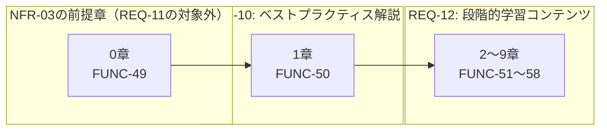
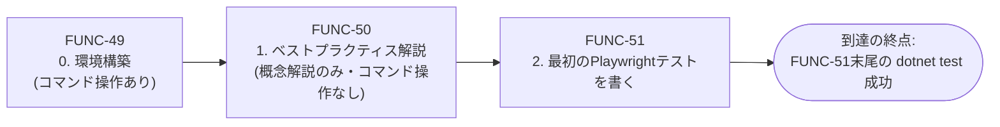
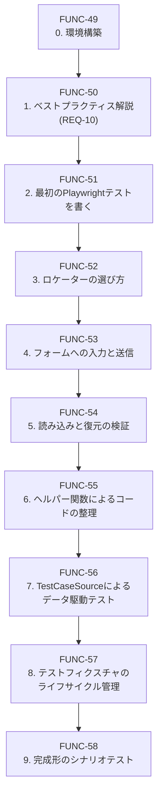

# 関数設計書（詳細設計）: COMP-06 学習教材ドキュメント

## 1. 文書情報

| 項目 | 内容 |
|---|---|
| 文書名 | LearnPlaywright 関数設計書（COMP-06: 学習教材ドキュメント） |
| 版数 | v1.5 |
| 作成日 | 2026-09-23 |
| 作成者 | ClaudeCode（関数設計工程サブエージェント・論理設計担当） |

### 改訂履歴

| 版数 | 日付 | 変更内容 | 変更者 |
|---|---|---|---|
| v1.0 | 2026-09-23 | 初版作成（論理設計。可読性向上は別工程で実施） | ClaudeCode |
| v1.1 | 2026-09-23 | 論理レビュー1回目指摘5件対応。(1) 重大: 3.4節がNFR-03到達を「FUNC-49・FUNC-51の2章のみ」としていた記述を、5節の前提関係図と整合する「FUNC-49→FUNC-50→FUNC-51の3章」に訂正し、FUNC-50が概念解説のみでコマンド操作を伴わないため到達性を損なわない旨を補足（6節も同様に訂正）。(2) 重大: FUNC-50「待機処理の書き方」の具体例を、Locator自動待機を実際に体験する3章FUNC-52・4章FUNC-53からの引用を主とする形に差し替え、COMP-05 FUNC-43（HTTPポーリング）はテスト基盤自身の別種の待機処理である旨を明記して混同を防止（4節FUNC-50の「対応するCOMP-01〜05の部分」欄も整合させた）。(3) 重大: 6節自己チェックの「全関数が最低1回参照されている」という実態と不一致だった記述を、実際の参照件数（COMP-01は9件中8件、COMP-02は9件中2件、COMP-03は8件中2件、COMP-04は16件中16件、COMP-05は6件中6件）に基づく正確な記述に訂正し、教材は代表的な関数を選んで引用する方針であり全関数の網羅を目的としていない旨を明記（未引用のFUNC-09等を意図的な取捨選択として説明）。(4) 軽微: FUNC-51のサーバー起動方法を「手動で`dotnet run`を実行してから開く」方式に確定し、`file://`簡易代替の並記を解消。(5) 軽微: FUNC-53のスライダー値設定説明を、COMP-04 FUNC-32が実装工程での確認事項として留保する2方式（`EvaluateAsync`方式／`FillAsync`のrange対応）のいずれかに実装工程で確定する、という表現に修正し断定的な記述を解消 | ClaudeCode |
| v1.2 | 2026-09-23 | 論理レビュー2回目指摘5件対応。(1) 重大: FUNC-50「待機処理の書き方」の具体例が、事実誤認（`CountAsync()`/`IsVisibleAsync()`をLocator自動待機の実装例と誤説明）を含んでいた点を訂正。自動待機の実例を4章FUNC-53の`FillAsync`/`ClickAsync`等のアクション系メソッドに一本化し、`CountAsync()`/`IsVisibleAsync()`はactionabilityチェックを待たず現在の状態を即座に返す非待機系メソッドであり自動待機の例ではない旨を明記（4節FUNC-50の「対応するCOMP-01〜05の部分」欄も整合させた）。(2) 重大: FUNC-50「対応するCOMP-01〜05の部分」がCOMP-04ヘルパー関数FUNC-30〜38を「3章FUNC-52・4章FUNC-53で実際に使う」としていた、3章・4章（素のPlaywright API使用）の実態と矛盾する記述を訂正。2.の待機処理の実例は4章FUNC-53が用いる素のPlaywright API呼び出しとし、COMP-04関数設計書FUNC-30〜38は「6章FUNC-55で導入される、同様の設計のヘルパー関数」として初出が6章であることを明記。(3) 重大: FUNC-57「扱う内容」に、2章FUNC-51で確定した読者によるサーバー手動起動運用を8章以降で終える旨（COMP-05 FUNC-43によるテストフィクスチャ内自動起動への切り替え、手動起動ターミナルの停止案内）を新規項目として追加。(4) 軽微: 6節「COMP-01引用元一覧」の列挙誤り（FUNC-51は「COMP-01の関数はまだ扱わない」と明記しているにもかかわらず引用元章に含まれていた）を訂正し「FUNC-53・54で8件」に修正。(5) 軽微: 6節「COMP-04引用元一覧」の列挙漏れ（FUNC-50・FUNC-53もCOMP-04の関数を引用しているにもかかわらず引用元章列挙から漏れていた）を訂正し「FUNC-50・52・53・55・56・58で全16件」に修正 | ClaudeCode |
| v1.3 | 2026-09-23 | 論理レビュー3回目指摘（軽微1件）対応。6節「COMP-04引用元一覧」からFUNC-50を除外（FUNC-50はCOMP-04の具体的な関数IDを引用しておらず、6章FUNC-55初出という不使用の断り書きのみだったため） | ClaudeCode |
| v1.4 | 2026-09-23 | ユーザー指示（実装工程で一部の環境構築をClaude Codeが代行したため、学習者が自身で実行できるよう教材に含める）により、FUNC-49の扱う内容に「サンプルアプリ（リポジトリ）の準備」を追加: リポジトリの取得（git clone／ZIP）、ルートでの`dotnet build`（nuget.orgからのパッケージ復元）、初回実行時メッセージ（テレメトリ・HTTPS開発証明書。`--trust`は不要）の説明、`dotnet run --project src/LearnPlaywright.Server`での起動と画面確認、（任意）完成版テスト用のChromium導入と`dotnet test`実行。あわせて既定サンプルテストの表記を`UnitTest1.cs`に修正済み | ClaudeCode |
| v1.5 | 2026-09-24 | 可読性向上（内容変更なし）。対応要件の割り当て方針・章構成・構成単位一覧・引用状況の表形式化、到達経路図・章区分図のMermaid追加、長文段落の箇条書き分割 | ClaudeCode |

本コンポーネントは実行コードではなくMarkdown等のドキュメント成果物である。そのため「関数」ではなく「教材の構成単位（章・レッスン）」を設計対象とする。以降、他コンポーネントの関数設計書との対応を取るため、構成単位にも`FUNC-xx`のIDを付与する（2節参照）。

## 2. 対応コンポーネント

| 項目 | 内容 |
|---|---|
| 対象コンポーネント | **COMP-06（学習教材ドキュメント）** |
| 対応要件ID（コンポーネント設計書 v1.3 3節より） | 機能要件 REQ-10, REQ-11, REQ-12／非機能要件 NFR-03, NFR-04, NFR-05／制約 CON-06, CON-07 |
| 実装技術 | Markdown |

COMP-06はCOMP-01〜05のソースコード・仕様を解説・引用対象として参照するが、実行時の依存関係は持たない（コンポーネント設計書3節）。

本設計は、COMP-01〜05関数設計書（`docs/03_function_design/COMP-01.md`〜`COMP-05.md`、いずれも確定済み）が定める実際の型・関数・データ構造・処理フローを、教材の題材として直接参照する。

### 2.1 対応要件IDの割り当て方針（構成単位ごとの記載と横断的要件の扱い）

| 要件ID | 対応付ける構成単位 | 補足 |
|---|---|---|
| REQ-10（ベストプラクティス解説） | FUNC-50 | 4節の章単位1件 |
| REQ-11（配置順序） | （個々の構成単位の対応要件欄には記載しない） | 下記参照 |
| REQ-12（段階的学習コンテンツ） | FUNC-51〜FUNC-58 | 4節の段階的レッスン各章 |
| NFR-03（環境構築〜サンプルテスト実行までの到達性） | FUNC-49, FUNC-51 | 直接の充足責務を負う2件（環境構築章／最初のテストを書き実行する章） |
| NFR-04（各ステップは前のステップのみを前提とする） | FUNC-51〜FUNC-58 | 下記参照 |
| NFR-05（サンプルコードへの説明コメント付与） | FUNC-49, FUNC-50, FUNC-51〜FUNC-58 | 下記参照 |
| CON-06・CON-07（秘密情報・個人情報の非混入） | （個別の対応要件欄には記載しない） | 下記参照 |

非自明な割り当ての補足:

- **REQ-11**: 特定の構成単位に対応付けられる性質の要件ではなく、教材全体の章立て順序（0→1→2〜N）そのものが充足手段である。3.1節・5節で充足を確認する（コンポーネント設計書がCON-06/07を「横断的制約」として個別コンポーネント欄に明記しない扱いと同様の整理）。
- **NFR-04**: 段階的レッスンの構造的性質そのものであるため、全レッスンに対応付ける（5節の前提関係図で構造的に充足を確認する）。
- **NFR-05**: サンプルコードを含む構成単位（FUNC-49、FUNC-51〜FUNC-58の全8レッスン）に対応付ける。FUNC-50はベストプラクティス解説の説明用コード断片を含むため、同様に対応付ける。
- **CON-06・CON-07**: 全構成単位に横断的に適用される規約である（6節自己チェックで確認する）。

## 3. 教材全体の構成方針

### 3.1 全体構成順序（REQ-11充足の根拠）

教材は以下の順序で構成する。番号は実際のMarkdownファイル・見出し番号として用いることを想定する。

| 章 | タイトル | 構成単位ID |
|---|---|---|
| 0 | 環境構築 | FUNC-49 |
| 1 | ベストプラクティス解説（REQ-10） | FUNC-50 |
| 2 | 最初のPlaywrightテストを書く | FUNC-51 |
| 3 | ロケーターの選び方（data-testid属性を使う） | FUNC-52 |
| 4 | フォームへの入力と送信 | FUNC-53 |
| 5 | 読み込みと復元の検証 | FUNC-54 |
| 6 | ヘルパー関数によるコードの整理 | FUNC-55 |
| 7 | TestCaseSourceによるデータ駆動テスト | FUNC-56 |
| 8 | テストフィクスチャのライフサイクル管理 | FUNC-57 |
| 9 | 完成形のシナリオテスト | FUNC-58 |

- **REQ-11の充足**: REQ-11は「REQ-10（ベストプラクティス解説章）をREQ-12（段階的学習コンテンツ）より先に配置する」ことを求める。上記構成では、ベストプラクティス解説（1章、FUNC-50）が段階的レッスン（2〜9章、FUNC-51〜58）のすべてより前に配置されており、充足する。
- **0章の位置づけ**: 0章（環境構築）はREQ-10・REQ-12いずれの直接の充足対象でもないが、NFR-03（環境構築からサンプルテスト実行までの到達性）を満たすための前提章として、教材全体の先頭に配置する。
  - 0章を1章より前に置くことは、REQ-11の配置順序制約（「REQ-10をREQ-12より先に」）と矛盾しない。0章はREQ-10・REQ-12いずれにも該当しないため、両者の前後関係を定めるREQ-11の対象外の章である。

### 3.2 前提知識の積み上げ方針（NFR-04充足の根拠）

- **厳密な線形構造**: 段階的レッスン（FUNC-51〜58）は、**各レッスンの前提とする構成単位を直前の1レッスンのみに限定する厳密な線形構造**とする（5節の前提関係図を参照）。あるレッスンの本文・サンプルコードは、それより後のレッスンで初めて解説する概念・関数・APIを一切使用しない。
- **前提知識の明記**: 各レッスンの本文冒頭には「このレッスンで前提とする知識」を、直前レッスンで学んだ内容の箇条書きとして明記する運用とする。具体的な文面は実装工程で作成するMarkdown本文側の責務とし、本設計書では「前提とする構成単位ID」として構造のみを規定する。
- **動機付けの連続性**: 各レッスンが取り上げるサンプルコードは、後続レッスンで「なぜこのままでは不十分か（例: コードの重複、値のハードコード）」を動機付けに使い、次のレッスンで導入する概念（ヘルパー関数化、データ駆動化等）へ接続する。これにより、前提知識の一方向な積み上げに加え、レッスン間の動機付けの連続性も確保する。

### 3.3 サンプルコードのコメント方針（NFR-05充足の根拠）

- **対象と形式**: サンプルコードを含むすべての構成単位（FUNC-49、FUNC-50の説明用コード断片、FUNC-51〜58の各レッスン）において、サンプルコード中の各行・各ブロックには、初心者の理解を助けるための説明コメント（`//`によるインラインコメント、またはXMLドキュメントコメント）を付与する方針とする。
- **What と Why**: コメントは「このコードが何をしているか」（What）だけでなく、初心者がつまずきやすい「なぜこの書き方をするのか」（Why）を含めることを基本方針とする。Whyの例:
  - なぜ`data-testid`属性でロケーターを取得するのか
  - なぜ`[SetUp]`で毎回新しい`IBrowserContext`を生成するのか
- **COMP-01〜05からの引用ルール**:
  - 既存のCOMP-01〜05関数設計書に記載された関数・型をサンプルコードとして引用する場合、関数シグネチャ・引数名・型はCOMP-01〜05関数設計書の記載と完全に一致させる（教材とソースコードの齟齬を防ぐため）。
  - 初心者向けコメントはCOMP-01〜05側の本番コードには存在しない教材固有の付加情報であるため、教材内のコード掲載箇所でのみ追加する。COMP-01〜05のソースコード自体に教材向けコメントを混入させることは行わない。
  - これにより、COMP-06がCOMP-01〜05に実行時依存を持たないという設計方針（コンポーネント設計書2節）と、ソースコードとドキュメントの独立更新可能性を両立する。

### 3.4 環境構築からサンプルテスト実行までの到達性方針（NFR-03充足の根拠）

- **到達の終点の定義**: NFR-03は「Playwright未経験の初心者がドキュメントを先頭から順に読み進めるだけで、環境構築からサンプルテストの実行までを到達できる」ことを求める。この「到達」の終点を、**FUNC-51（最初のPlaywrightテストを書く）の末尾で`dotnet test`を実行し、テストが成功（緑）することを確認する手順**と定義する。
- **FUNC-49の役割**: FUNC-49（環境構築）は、この終点に到達するために必要な環境（.NET 10 SDK・NUnitプロジェクト・Playwrightブラウザ本体）を過不足なく整える内容とする。コマンドの実行結果（期待される出力例）を明記することで、初心者が各手順の成否を自己判断できるようにする（詳細は4節FUNC-49参照）。
- **実際の到達経路**: 5節の前提関係図のとおり、FUNC-51はFUNC-50（1章ベストプラクティス解説）を前提とするため、実際の到達経路は**FUNC-49→FUNC-50→FUNC-51の3章**である。

- **FUNC-50を経由しても到達性を損なわない理由**: FUNC-50は後続レッスンの設計判断を解説する概念解説の章であり、コマンド操作・環境変更を一切伴わない（4節FUNC-50「扱う内容」参照）。そのため、この章を経由してもNFR-03が求める「迷わず到達できる」という要求（手を動かす操作の手順が途切れず、誤った分岐に迷い込まないこと）を損なわない。
- 途中にNFR-04の前提関係（3.2節）を満たさない章（後続レッスンの知識を要求する章）を挟まない点は変わらない。

## 4. 構成単位一覧

以降、FUNC-49〜FUNC-58の全10構成単位の詳細を記載する。各単位について、タイトル・目的・扱う内容（対応するCOMP-01〜05のどの部分を題材にするか）・前提とする構成単位ID・対応要件IDを示す。

一覧（詳細は各項を参照）:

| 構成単位ID | 章・タイトル | 前提とする構成単位ID | 対応要件ID |
|---|---|---|---|
| FUNC-49 | 0. 環境構築 | なし | NFR-03, NFR-05 |
| FUNC-50 | 1. ベストプラクティス解説 | FUNC-49 | REQ-10, NFR-05 |
| FUNC-51 | 2. 最初のPlaywrightテストを書く | FUNC-50 | REQ-12, NFR-03, NFR-04, NFR-05 |
| FUNC-52 | 3. ロケーターの選び方（data-testid属性を使う） | FUNC-51 | REQ-12, NFR-04, NFR-05 |
| FUNC-53 | 4. フォームへの入力と送信 | FUNC-52 | REQ-12, NFR-04, NFR-05 |
| FUNC-54 | 5. 読み込みと復元の検証 | FUNC-53 | REQ-12, NFR-04, NFR-05 |
| FUNC-55 | 6. ヘルパー関数によるコードの整理 | FUNC-54 | REQ-12, NFR-04, NFR-05 |
| FUNC-56 | 7. TestCaseSourceによるデータ駆動テスト | FUNC-55 | REQ-12, NFR-04, NFR-05 |
| FUNC-57 | 8. テストフィクスチャのライフサイクル管理 | FUNC-56 | REQ-12, NFR-04, NFR-05 |
| FUNC-58 | 9. 完成形のシナリオテスト | FUNC-57 | REQ-12, NFR-04, NFR-05 |

### FUNC-49: 0. 環境構築

- **目的**: Playwright未経験の初心者が、本教材を進めるために必要な開発環境（.NET 10 SDK、NUnitベースのPlaywrightテストプロジェクト、Playwrightブラウザ本体）を、迷わず・過不足なく整えられるようにする。
- **扱う内容**:
  1. **.NET 10 SDKの導入確認**
     - `dotnet --list-sdks`を実行し、出力に`10.0.x`が含まれることを確認する手順。
     - 含まれない場合は、CLAUDE.md「実装環境」章が指す公式インストーラー（https://dotnet.microsoft.com/download/dotnet/10.0 ）で導入する必要がある旨を案内する（本教材はインストーラーの実行そのものは代行せず、案内に留める）。
  2. **学習用プロジェクトの作成**
     - `dotnet new nunit -n <プロジェクト名>`でNUnitテストプロジェクトの雛形を作成する手順。
     - `dotnet add package Microsoft.Playwright.NUnit`でPlaywright for .NETのNUnit連携パッケージを追加する手順。
     - 注記: 本プロジェクト（LearnPlaywright）自体では、この雛形に相当するプロジェクトが`tests/`配下に実装工程で配置される予定であること（CLAUDE.md「フォルダ構成」章）を注記する。本章の手順は「Playwright for .NETプロジェクトの一般的な作り方」を体験させる学習用の独立した雛形作成であって、`tests/`配下の本体プロジェクトを上書き・複製するものではない旨を明確にする。
  3. **Playwrightブラウザ本体のインストール**: `dotnet build`実行後に生成される`bin/Debug/net10.0/playwright.ps1`スクリプトを用いた`pwsh bin/Debug/net10.0/playwright.ps1 install`の実行手順（CLAUDE.md「実装環境」章の記載に整合）。
  4. **動作確認**
     - `dotnet new nunit`が生成する既定のサンプルテスト（`UnitTest1.cs`〈クラス`Tests`〉の`Test1`等）を`dotnet test`で実行し、成功（Passed）することを確認する手順。
     - CLAUDE.md「プログラム実行の承認について」「テスト実行コマンドの標準化」章に従い、`dotnet test`の標準形のみを用いる旨を明記する。
  5. **期待される出力例**: 各手順について、期待されるコンソール出力の例（バージョン文字列の表示形式、`Passed!`表示の形式等）を示し、初心者が「うまくいったかどうか」を自己判断できるようにする。
- **対応するCOMP-01〜05の部分**: 本章単独ではCOMP-01〜05の具体的な関数・コードは扱わない（環境そのものの構築が目的のため）。ただし手順3は、COMP-05関数設計書FUNC-43（`OneTimeSetUpAsync`）が前提とする「Playwrightブラウザ本体がインストール済みであること」という実行環境上の前提条件を、本章の時点で満たす位置づけを持つ。
- **前提とする構成単位ID**: なし（教材の先頭章）
- **対応要件ID**: NFR-03, NFR-05

### FUNC-50: 1. ベストプラクティス解説

- **目的**: 段階的レッスン（2章以降）に入る前に、Playwrightによるテスト自動化における一般的なベストプラクティスを解説し、以降のレッスンで登場する設計判断（`data-testid`ロケーター、TestCaseSourceによるパラメータ化、`[SetUp]`でのコンテキスト分離等）の背景知識を先に提供する。
- **扱う内容**: 以下の4トピックを解説する（REQ-10が例示する範囲）。各トピックの解説には、後続レッスンで実際に登場するCOMP-01〜05の設計判断を「具体例」として引用する（レッスン本編のコードそのものは1章では扱わず、あくまで解説の裏付けとしての引用に留める）。
  1. **テストケースの独立性**
     - 解説内容: なぜ各テストが他のテストの実行結果・実行順序に依存してはいけないか。
     - 具体例: COMP-05関数設計書2.1節の「シナリオ2（読込→復元検証）はシナリオ1の実行結果を流用せず、自身で前提データを用意する」という設計判断、およびCOMP-05 FUNC-45（`SetUpAsync`）がテストごとに独立した`IBrowserContext`を生成する設計を引用する。
  2. **待機処理の書き方**
     - 解説内容: 固定時間の`sleep`ではなくPlaywrightの自動待機（`FillAsync`・`ClickAsync`等のアクション系メソッドが、要素の出現・操作可能状態を自動的に待ったうえで操作を実行する仕組み）に委ねるべき理由。
     - 自動待機の体験箇所: この考え方を実際に体験する箇所は4章FUNC-53（`FillAsync`/`ClickAsync`等の各操作）であり、いずれもLocatorに対するアクション実行時の自動待機に委ねた実装になっている。詳細な体験は4章で行い、本章では「なぜそうするか」の理由のみを先取りして解説する。
     - 非待機系メソッドとの区別: 3章FUNC-52で使う`CountAsync()`/`IsVisibleAsync()`は、actionabilityチェックを待たず現在の状態を即座に返す非待機系メソッドであり、`FillAsync`等のアクション系メソッドが持つ自動待機とは挙動が異なる。そのため自動待機の例としては引用しない（両者の違い自体は本章で触れてよいが、自動待機の実例としては誤用しない）。
     - 参考引用（別種の待機）: COMP-05関数設計書FUNC-43が、固定時間のスリープではなくサーバーの起動完了をHTTPポーリングで待つ設計を採用している点も参考として引用する。ただしこれはPlaywrightのLocator自動待機とは別種の、テスト基盤自身（テストコードを実行するプロセス側）が行う待機処理（HTTPポーリングによるプロセス起動待ち）であり、Locatorの自動待機の仕組みそのものの例ではない旨を明記し、両者の混同を防ぐ。
  3. **ロケーターの選び方**
     - 解説内容: CSSクラス名や要素の位置（DOM構造）に依存したロケーターがテストを壊れやすくする理由、および`data-testid`のようなテスト専用属性を用いる利点。
     - 具体例: COMP-04関数設計書2.1節の「Playwrightからのブラウザ要素特定方式として`data-testid`属性を採用する」という決定、および`FormTestIds`定数を引用する（詳細な使い方は3章FUNC-52で扱う）。
  4. **テストケースのパラメータ化の考え方**
     - 解説内容: 個々のテストメソッドに入力値・期待値をハードコードすることの問題点（新しい入力パターンを追加するたびにテストロジック自体を修正する必要が生じる等）、およびデータ構造として一元管理しテストメソッドから分離することの利点。
     - 具体例: COMP-04関数設計書3.1節（NFR-07充足の説明）、`FormValuesTestCase`型を引用する（詳細な使い方は7章FUNC-56で扱う）。
- **対応するCOMP-01〜05の部分**: 以下を、詳細実装ではなく「設計判断の結論とその理由」の引用元として参照する。

  | トピック | 引用元 |
  |---|---|
  | 1. テスト独立性 | COMP-05関数設計書2.1節・FUNC-45 |
  | 2. 待機処理（実例） | 4章FUNC-53が用いる`FillAsync`/`ClickAsync`等の素のPlaywright API呼び出し（注） |
  | 2. 待機処理（参考引用） | COMP-05関数設計書FUNC-43（テスト基盤自身のHTTPポーリング） |
  | 3. ロケーター選定 | COMP-04関数設計書2.1節・`FormTestIds` |
  | 4. パラメータ化 | COMP-04関数設計書3.1節・`FormValuesTestCase` |

  注: 6章FUNC-55で導入されるCOMP-04関数設計書FUNC-30〜37・FUNC-38（`SetTextBoxValueAsync`等）は、これら素のAPI呼び出しと同様にLocatorの自動待機に委ねた設計のヘルパー関数であり、4章時点ではまだ導入されない。
- **前提とする構成単位ID**: FUNC-49（0. 環境構築）
- **対応要件ID**: REQ-10, NFR-05

### FUNC-51: 2. 最初のPlaywrightテストを書く

- **目的**: FUNC-49で整えた環境を用いて、初心者が最小構成のPlaywrightテスト（ページを開いてタイトルを確認するだけ）を実際に書き、実行し、成功させる。NFR-03が求める「環境構築からサンプルテスト実行までの到達」を本章で完結させる。
- **扱う内容**:
  1. NUnitの`[TestFixture]` / `[Test]`属性の最小構成の説明。
  2. Playwrightの`IPlaywright` / `IBrowser` / `IPage`の役割と、最小構成での初期化・破棄コード。
     - 本章時点では`[SetUp]`/`[TearDown]`によるライフサイクル管理（8章FUNC-57で扱う）は導入しない。
     - 1つのテストメソッド内で`Playwright.CreateAsync()`→ブラウザ起動→ページ操作→破棄までを完結させる、学習用の簡略構成とする。
  3. `page.GotoAsync(url)`でページを開き、`page.TitleAsync()`でタイトル文字列を取得し、`Assert.That(title, Is.EqualTo(...))`で検証する最小のサンプルコード。
  4. **開く対象のURLとサーバー起動方式**
     - 開く対象のURLは、COMP-01（フロントエンドUI）のトップページ（サンプルサイトのフォーム画面）とする。
     - この時点ではCOMP-02（バックエンドサーバー）の自動起動方法（8章FUNC-57で扱うテストフィクスチャによる自動起動）は未習得である。そのため本章では、読者自身が別ターミナルで`dotnet run`によりバックエンドサーバーを手動起動してから、そのURL（例: `http://localhost:5080/`）へ`page.GotoAsync`でアクセスする方式に統一する。
     - 方式の根拠: COMP-05 FUNC-43がテスト自動化時にサーバーを自動起動する設計であることを踏まえ、本章でも「サーバーを起動してから開く」という同一の前提でCOMP-01の実物のページを扱う。
     - 不採用とした代替: `file://`スキームによる代替は、静的HTMLの配信元がCOMP-02サーバーと異なりCookie等の挙動が実際のプロジェクトと乖離するため採用しない。
     - 実装工程でCOMP-01の実際のページタイトルが確定次第、具体的なアサーション対象文字列を最終化する。
  5. `dotnet test`で実行し、`Passed!`が表示されることを確認する（FUNC-49手順4と同様の確認手順を、今度は自作のテストコードに対して行う）。
- **対応するCOMP-01〜05の部分**: COMP-01（フロントエンドUI）のトップページ（静的HTMLマークアップ、REQ-01）を開く対象として用いる。COMP-01の関数（FUNC-01〜09）自体はまだ扱わない。
- **前提とする構成単位ID**: FUNC-50（1. ベストプラクティス解説）
- **対応要件ID**: REQ-12, NFR-03, NFR-04, NFR-05

### FUNC-52: 3. ロケーターの選び方（data-testid属性を使う）

- **目的**: 1章FUNC-50で解説した「ロケーターの選び方」の考え方を、実際のコードで体験させる。COMP-01のフォーム画面上の各UIコントロールを、`data-testid`属性を使って正確に特定する方法を学ぶ。
- **扱う内容**:
  1. `page.Locator(selector)`の基本的な使い方。
  2. COMP-04関数設計書3節の`FormTestIds`定数（`text-input` / `slider` / `select` / `radio-option` / `submit-button` / `load-button` / `message-area`）を教材内のサンプルコードとして引用し、`data-testid`属性値によるロケーター指定の実例（例: `page.Locator("[data-testid='text-input']")`）を示す。
  3. ラジオボタンのように同一`data-testid`を持つ要素が複数存在する場合の絞り込み方法（`value`属性との組み合わせ、COMP-04関数設計書FUNC-36の実装例`[data-testid='radio-option'][value='...']`を引用）。
  4. 各ロケーターに対して`CountAsync()`や`IsVisibleAsync()`等の簡単な検証を行い、要素が正しく1件だけ見つかることを確認する練習用サンプルコード（実際の値の入力・送信は4章FUNC-53で扱う）。
- **対応するCOMP-01〜05の部分**: COMP-04関数設計書3節の`FormTestIds`定数、およびCOMP-01（フロントエンドUI）が公開する各UIコントロールを題材にする。COMP-01の実装自体には`data-testid`属性の付与が必要である旨（COMP-04関数設計書2.1節の申し送り事項）を、教材内でも補足する。
- **前提とする構成単位ID**: FUNC-51（2. 最初のPlaywrightテストを書く）
- **対応要件ID**: REQ-12, NFR-04, NFR-05

### FUNC-53: 4. フォームへの入力と送信

- **目的**: 3章で学んだロケーターの使い方を活かし、フォームの各UIコントロールへ値を入力し、送信ボタンを押下して結果を確認する一連の操作を、Playwrightの素のAPI呼び出し（ヘルパー関数化は6章FUNC-55で扱う）で実装する。
- **扱う内容**:
  1. 各UIコントロールへの入力を、それぞれ素のPlaywright APIで書くサンプルコード。

     | UIコントロール | 使用するAPI |
     |---|---|
     | テキストボックスへの入力 | `FillAsync` |
     | スライダーへの値設定 | COMP-04関数設計書FUNC-32が留保する2方式のいずれか（下記参照） |
     | プルダウンリストの選択 | `SelectOptionAsync` |
     | ラジオボタンの選択 | `CheckAsync` |

     スライダーの2方式は、`EvaluateAsync`によるDOM値の書き換えと`input`/`change`イベント発火、またはPlaywrightの`FillAsync`のrange要素対応である。いずれを用いるかは実装工程でFUNC-32の確定内容を確認したうえで教材側もそれに合わせる旨を明記し、本設計書の時点ではどちらか一方に断定しない。
  2. 送信ボタンのクリック（`ClickAsync`）。
  3. **送信結果の確認**
     - メッセージ表示領域（`data-testid="message-area"`）のCSSクラス（`message--success` / `message--error`）を読み取り、送信が受理されたか拒否されたかを判定する方法。
     - コードの背景として、以下を解説する。
       - COMP-01関数設計書FUNC-07（`handleSubmitButtonClick`）がPOST結果に応じてこのメッセージを出し分けている旨。
       - その先でCOMP-02関数設計書FUNC-16（`HandlePostFormData`）がCOMP-03関数設計書FUNC-20（`ValidateFormData`）の検証結果に基づき200/400を返している旨。
     - テストコード自体はUIの表示結果のみを検証し、サーバー内部のロジックを直接呼び出さない（コンポーネント設計書3節の方針どおり）。
  4. 検証に成功する入力例（正常系）と、意図的に検証エラーとなる入力例（例: テキストボックスの文字数超過。COMP-03関数設計書FUNC-20の検証ルール`text`最大1000文字を引用）の両方をサンプルコードとして扱う。
- **対応するCOMP-01〜05の部分**:
  - 体験する題材: COMP-01関数設計書FUNC-01（`collectFormValues`）・FUNC-03（`postFormValues`）・FUNC-05（`displayMessage`）・FUNC-07（`handleSubmitButtonClick`）の入出力仕様を、UIの見え方として体験する。
  - 背景知識として引用: COMP-02関数設計書FUNC-16、COMP-03関数設計書FUNC-20の検証ルール（結果の解釈のため）。
- **前提とする構成単位ID**: FUNC-52（3. ロケーターの選び方）
- **対応要件ID**: REQ-12, NFR-04, NFR-05

### FUNC-54: 5. 読み込みと復元の検証

- **目的**: 4章で送信した内容が正しく保存されていることを、読み込みボタンの押下とUIへの復元結果の確認によって検証する。「送信したデータが読み込みで戻ってくる」という一連のシナリオ（REQ-09の元になる考え方）を、素のPlaywright APIで体験する。
- **扱う内容**:
  1. ページの再読み込み（`page.ReloadAsync()`）でUIを初期状態に戻す手順（同一ブラウザコンテキスト内であればCookieは保持されたままである点を、COMP-05関数設計書FUNC-48の処理内容を引用しつつ解説する）。
  2. 読み込みボタンのクリック（`ClickAsync`）。
  3. 各UIコントロールの現在値を素のPlaywright APIで読み取る方法（`InputValueAsync()`等）と、4章で入力した値との一致を`Assert.That`で検証するサンプルコード。
  4. 一度も送信していない状態（またはCookie未設定の状態）で読み込みボタンを押した場合に「保存されたデータがありません」旨のメッセージ（`message--info`クラス）が表示されるケースの確認（COMP-01関数設計書FUNC-08、REQ-04の未存在時の挙動を引用）。
- **対応するCOMP-01〜05の部分**:
  - 体験する題材: COMP-01関数設計書FUNC-02（`applyFormValues`）・FUNC-04（`fetchFormValues`）・FUNC-06（`clearMessage`）・FUNC-08（`handleLoadButtonClick`）の入出力仕様。
  - 背景知識として引用: COMP-02関数設計書FUNC-17（`HandleGetFormData`）・COMP-03関数設計書FUNC-26（`LoadFormData`）の「未存在」判定の仕組み（結果解釈のため）。
- **前提とする構成単位ID**: FUNC-53（4. フォームへの入力と送信）
- **対応要件ID**: REQ-12, NFR-04, NFR-05

### FUNC-55: 6. ヘルパー関数によるコードの整理

- **目的**: 3〜5章で書いてきた素のPlaywright API呼び出し（ロケーター取得・値の入力・値の読み取り）が、テストケースが増えるにつれて重複・冗長になっていくことを実感させたうえで、再利用可能なヘルパー関数へ整理する考え方と実例を学ぶ。
- **扱う内容**:
  1. 3〜5章のサンプルコードで繰り返し登場した「テキストボックスに値を入れる」「スライダーの値を読む」等の処理を、関数として切り出す動機付け（コードの重複削減、可読性向上）。
  2. COMP-04関数設計書FUNC-30〜37（個別コントロールごとのDOM読み取り/書き込み関数）を、3〜5章の素のコードを置き換える形で1つずつ引用・提示する。対象: `SetTextBoxValueAsync` / `GetTextBoxValueAsync` / `SetSliderValueAsync` / `GetSliderValueAsync` / `SetSelectValueAsync` / `GetSelectValueAsync` / `SetRadioValueAsync` / `GetRadioValueAsync`。
  3. さらに複合ヘルパーFUNC-40（`SetFormValuesAsync`）・FUNC-41（`GetFormValuesAsync`）を引用し、4種類のコントロールへの一括入力・一括読み取りを1回の関数呼び出しで行えることを示す。
  4. メッセージ確認用のFUNC-42（`GetMessageAsync`）を引用し、4〜5章で個別に行っていたCSSクラス判定処理を`MessageState`型（COMP-04関数設計書3節）に置き換える。
  5. 本章末時点で、4〜5章のテストコードが以下の呼び出しのみで書き直せることを示すサンプルコード。
     - FUNC-40
     - FUNC-38（送信ボタンクリック、COMP-04関数設計書FUNC-38）
     - FUNC-42
     - FUNC-39（読み込みボタンクリック、FUNC-39）
     - FUNC-41
- **対応するCOMP-01〜05の部分**: COMP-04（テストデータ構造・ヘルパー関数）のFUNC-30〜42全体を、3〜5章の素のコードの「リファクタリング後の姿」として題材にする。
- **前提とする構成単位ID**: FUNC-54（5. 読み込みと復元の検証）
- **対応要件ID**: REQ-12, NFR-04, NFR-05

### FUNC-56: 7. TestCaseSourceによるデータ駆動テスト

- **目的**: 1章FUNC-50で解説した「テストケースのパラメータ化」の考え方を、COMP-04が提供する実際のデータ構造・NUnitの`[TestCaseSource]`属性を用いて実装し、複数の入力値・期待値の組を1つのテストメソッドで扱えるようにする。
- **扱う内容**:
  1. これまでの章（4〜6章）でテストケースごとに個別のテストメソッドを書いていたことの限界（入力パターンを増やすたびにメソッドを追加・複製する必要がある）を振り返る。
  2. COMP-04関数設計書3節の`FormValuesTestCase`レコード型（`CaseId` / `Category` / `Input` / `ExpectedSubmitSuccess` / `ExpectedRestored`）を引用し、1件のテストケースをどう表現するかを解説する。
  3. FUNC-27（`FormValuesTestCase.RoundTrip`）・FUNC-28（`FormValuesTestCase.ExpectedRejection`）の2つのファクトリメソッドを引用し、以下の2種類のケースをそれぞれ組み立てる方法を示す。
     - 送信成功・復元一致を期待するケース
     - 検証エラーで拒否されることを期待するケース
  4. FUNC-29（`FormValuesTestCases.GetCases`）を引用し、複数のケースを1つの列挙として集約する方法、およびNUnitの`[TestCaseSource(typeof(FormValuesTestCases), nameof(FormValuesTestCases.GetCases))]`属性でテストメソッドの引数として供給する方法を示す。
  5. 6章末時点のテストコード（`FormValuesTestCase`を直接パラメータ化していない、値がハードコードされたテストメソッド）を、`[TestCaseSource]`を使う形へ書き換えるサンプルコード。
  6. 新しい入力パターンを追加する場合、FUNC-29が返す列挙へ1件追加するだけでよく、テストメソッド本体の修正が不要であることを実演する（COMP-04関数設計書3.1節のNFR-07充足の説明を引用）。
- **対応するCOMP-01〜05の部分**: COMP-04（テストデータ構造・ヘルパー関数）のFUNC-27〜29、および`FormValuesTestCase`型を中心題材にする。
- **前提とする構成単位ID**: FUNC-55（6. ヘルパー関数によるコードの整理）
- **対応要件ID**: REQ-12, NFR-04, NFR-05

### FUNC-57: 8. テストフィクスチャのライフサイクル管理

- **目的**: これまでの章では簡略化していたテストの初期化・後始末（ブラウザの起動・破棄、バックエンドサーバーの起動・終了、テストごとのブラウザコンテキストの分離）を、実際のプロジェクト（COMP-05）と同じ構成で正しく行う方法を学ぶ。
- **扱う内容**:
  1. 2章FUNC-51で「1つのテストメソッド内で初期化から破棄までを完結させる簡略構成」を採用した理由と、その構成がテストケース数が増えると非効率（毎回ブラウザを起動し直す等）になる問題点を振り返る。
  2. NUnitの`[OneTimeSetUp]` / `[OneTimeTearDown]`属性と、テストフィクスチャ全体で1回だけ実行される処理の役割を解説する。
  3. COMP-05関数設計書FUNC-43（`OneTimeSetUpAsync`）を引用し、以下の処理を解説する。あわせてFUNC-44（`OneTimeTearDownAsync`）による終了処理を解説する。
     - (a) バックエンドサーバー（COMP-02）を子プロセスとして起動し、起動完了をポーリングで待つ処理
     - (b) Playwrightドライバとブラウザを1回だけ初期化する処理
  4. **サーバー起動運用の切り替え**

     | 期間 | サーバー（COMP-02）の起動方法 |
     |---|---|
     | 2章FUNC-51〜7章FUNC-56 | 2章FUNC-51で確定した運用のとおり、読者自身が別ターミナルで`dotnet run`を実行し手動起動してからテストを実行 |
     | 本章以降 | COMP-05 FUNC-43がテストフィクスチャ内でサーバーを自動起動するため、読者は手動起動を行う必要がなくなる |

     上記の切り替えを明記する。手動起動と自動起動のサーバーを併用するとポート競合が発生しうるため、本章以降は手動起動していたターミナルを停止しておくよう案内する。
  5. NUnitの`[SetUp]` / `[TearDown]`属性と、個々のテストの前後で実行される処理の役割を解説する。
     - COMP-05関数設計書FUNC-45（`SetUpAsync`）が、共有`IBrowser`から新規`IBrowserContext`を生成しテスト間で状態（Cookie等）を共有しない設計にしている理由を、1章FUNC-50で学んだ「テストケースの独立性」と結び付けて解説する。
     - あわせてFUNC-46（`TearDownAsync`）を解説する。
  6. 7章までのテストコードに、FUNC-43〜46相当のライフサイクル管理コードを追加するサンプルコード。
- **対応するCOMP-01〜05の部分**:
  - 中心題材: COMP-05（Playwrightテストシナリオ）のFUNC-43〜46。
  - 背景知識として引用: COMP-02（バックエンドAPI）について、COMP-05関数設計書2.1節が定める起動方式（`ServerConfig.BaseUrl`、起動時のポート指定方法）を、サーバー起動処理の背景知識として引用する。
- **前提とする構成単位ID**: FUNC-56（7. TestCaseSourceによるデータ駆動テスト）
- **対応要件ID**: REQ-12, NFR-04, NFR-05

### FUNC-58: 9. 完成形のシナリオテスト

- **目的**: 2〜8章で積み上げてきた知識（ロケーター、フォーム操作、データ駆動テスト、ライフサイクル管理）を統合し、実際のプロジェクト（COMP-05）が持つ2つのシナリオテストメソッドと同等のテストコードを完成させる。本章をもって段階的レッスンの最終到達点とする。
- **扱う内容**:
  1. COMP-05関数設計書FUNC-47（`SubmitAndVerifySavedResult`）を引用し、「UIへの入力操作→送信ボタン押下→送信結果のメッセージ種別による検証」を、7章で学んだ`[TestCaseSource]`・6章で学んだヘルパー関数（FUNC-40・FUNC-38・FUNC-42）のみを使って構成する完成形のコードを示す。
  2. COMP-05関数設計書FUNC-48（`LoadAndVerifyRestoredValues`）を引用し、「読み込みボタン押下→UI復元後の各コントロール表示内容の検証」を同様に完成形のコードとして示す。あわせて、FUNC-48がFUNC-47の実行結果に依存せず自身で前提データを用意する設計（1章FUNC-50・COMP-05関数設計書2.1節で学んだ「テストケースの独立性」の実例）を振り返る。
  3. 8章までのレッスン内で書いてきた学習用テストコードと、実際のプロジェクトの`tests/`配下に実装されるCOMP-05のテストコードが、同一の設計思想（COMP-04への依存のみで完結し、DOM操作の詳細やハードコードを含まない）で書かれていることを対応付けて解説する。
  4. 本章の末尾に、教材全体の振り返り（0〜9章で学んだ内容の一覧）と、次のステップとして実際のプロジェクトの`tests/`配下のテストコードを読んでみることを促す案内を置く。
- **対応するCOMP-01〜05の部分**: COMP-05（Playwrightテストシナリオ）のFUNC-47〜48を中心題材とし、6〜8章で学んだCOMP-04のFUNC-38・40・39・41・42、およびFUNC-43〜46を統合する形で参照する。
- **前提とする構成単位ID**: FUNC-57（8. テストフィクスチャのライフサイクル管理）
- **対応要件ID**: REQ-12, NFR-04, NFR-05

## 5. 構成単位間の前提関係

段階的レッスン（FUNC-51〜58）は、直前の1レッスンのみを前提とする厳密な線形構造とする（NFR-04）。環境構築（FUNC-49）・ベストプラクティス解説（FUNC-50）を含めた全10構成単位の前提関係を以下に示す。

- **単一の直列チェーン**: 分岐・合流を持たない単一の直列チェーンとした。これにより、「各ステップは前のステップの内容のみを前提とする」（NFR-04）ことを、個々の構成単位の記述内容を都度確認しなくても、図の形状だけで構造的に保証できる。
- **起点**: FUNC-49（環境構築）のみ前提となる構成単位を持たない（教材の起点）。
- **COMP-01〜05との対応の記載場所**: 各構成単位が実際に題材とするCOMP-01〜05の対応関係は、コンポーネント×関数のトレーサビリティとは別に、4節の各構成単位の「対応するCOMP-01〜05の部分」欄で個別に明記した（要件ID・関数IDのフル一覧の重複記載を避ける方針、CLAUDE.md「ID対応関係の一次情報源・記載方針」章に従う）。

## 6. 自己チェック結果

### 6.1 線形的な積み上げ構造（NFR-04）

**観点**: 全レッスンが「前のレッスンの知識のみを前提とする」線形的な積み上げ構造になっているか。

- 5節のとおり、FUNC-51〜58は分岐のない単一の直列チェーンとして設計されており、各レッスンの前提は直前の1レッスンのみである。
- 4節の各レッスンの「扱う内容」も、当該レッスンより後のレッスンで初めて導入する概念（例: 3〜5章では6章で導入するヘルパー関数、7章で導入する`[TestCaseSource]`、8章で導入する`[OneTimeSetUp]`等のライフサイクル管理）を使用しない構成とした。
- 2章FUNC-51が簡略化した初期化コードを採用し、正式なライフサイクル管理を8章まで意図的に遅らせているのはこのための設計判断である。

### 6.2 ベストプラクティス解説の配置順序（REQ-11）

**観点**: ベストプラクティス解説が段階的レッスンより先に配置されているか。

- 3.1節のとおり、1章（FUNC-50、REQ-10）がすべての段階的レッスン（2〜9章、FUNC-51〜58、REQ-12）より前に配置されている。

### 6.3 環境構築から最初のサンプルテスト実行までの到達性（NFR-03）

**観点**: 環境構築から最初のサンプルテスト実行まで、迷わず到達できる具体性があるか。

- 3.4節のとおり、到達点を「FUNC-51末尾での`dotnet test`成功」と明確に定義した。
- 実際の到達経路は以下の3章である。うちFUNC-50はコマンド操作を伴わない概念解説であるため「迷わず到達できる」という要求を損なわない。
  1. FUNC-49（SDK確認・プロジェクト作成・ブラウザインストール・動作確認）
  2. FUNC-50（ベストプラクティス解説）
  3. FUNC-51（最小構成のテスト作成・実行）
- 各手順に期待される出力例を明記する方針も4節FUNC-49に記載した。

### 6.4 COMP-06の責務のカバー状況（REQ-10,11,12 / NFR-03,04,05）

**観点**: COMP-06の責務を過不足なくカバーしているか。

| 要件ID | 確認結果 |
|---|---|
| REQ-10 | FUNC-50が「テストケースの独立性・待機処理の書き方・ロケーターの選び方・パラメータ化の考え方」の4トピックを扱い、要件文言が例示する範囲を過不足なくカバーする。 |
| REQ-11 | 上記（6.2）のとおり充足を確認した。 |
| REQ-12 | FUNC-51〜58の8レッスンいずれも、解説テキスト（「目的」「扱う内容」）とサンプルコード（各レッスンの「扱う内容」に含まれるコード例）の両方を含む構成とした。 |
| NFR-03・NFR-04 | 上記（6.1・6.3）のとおり充足を確認した。 |
| NFR-05 | 3.3節でサンプルコードへの説明コメント付与方針（What・Whyの両方を含める、COMP-01〜05側のソースコード本体には混入させない）を明記した。 |

### 6.5 題材とするCOMP-01〜05の部分の明記

**観点**: 各レッスンが実際のプロジェクト構成（COMP-01〜05）のどの部分を題材にするか明記されているか。

- 4節の各構成単位に「対応するCOMP-01〜05の部分」欄を設け、具体的な関数ID（FUNC-01〜48）を明記した。
- 本教材は初心者向けの学習教材であり、COMP-01〜05の全関数（48件）を1件残らず引用することは教材の目的としていない。代表的な関数を選んで題材にする方針であることを踏まえたうえで、コンポーネント単位での欠落がないか確認した結果は以下のとおり。

| コンポーネント | 関数ID範囲（件数） | 参照する構成単位 | 参照件数 |
|---|---|---|---|
| COMP-01 | FUNC-01〜09（9件） | FUNC-53・54 | 8件（FUNC-01〜08） |
| COMP-02 | FUNC-10〜18（9件） | FUNC-53・54 | 2件（FUNC-16・17） |
| COMP-03 | FUNC-19〜26（8件） | FUNC-53・54 | 2件（FUNC-20・26） |
| COMP-04 | FUNC-27〜42（16件） | FUNC-52・53・55・56・58 | 全16件 |
| COMP-05 | FUNC-43〜48（6件） | FUNC-50・57・58 | 全6件 |

- **コンポーネント単位**: いずれのコンポーネントも最低1件は題材として参照しており、コンポーネント単位での欠落（いずれのレッスンからも一切参照されないコンポーネント）はないことを確認した。
- **関数単位**: 個々の関数単位では、COMP-01のFUNC-09（`initializeApp`）、COMP-02のFUNC-10〜15・18、COMP-03のFUNC-19・21〜25など、レッスンから直接引用されていない関数が相当数存在する。これは網羅漏れではなく、意図的な取捨選択である旨をここに明記する。その根拠は、教材が「初心者が最短経路でPlaywrightテストの書き方を体験する」ことを目的とし、COMP-01〜05の実装詳細をすべて解説することを目的としていないという方針（1節・3節）である。

### 6.6 秘密情報・個人情報の非混入（CON-06・CON-07）

- 教材中のサンプルコード・解説文言はCOMP-01〜05のダミー値・設計内容の引用のみで構成され、実在の個人情報・秘密情報を含む余地がない。
- 教材執筆（実装工程）時にもこの方針を維持することを申し送る横断的規約として扱う（個別構成単位の対応要件欄には記載しない。2.1節参照）。
