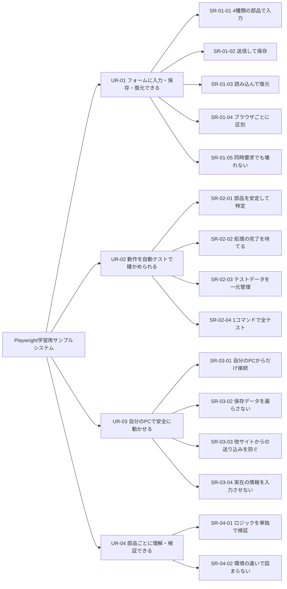

# システム要求仕様書（USDM形式・学習用サンプル）

| 項目 | 内容 |
|---|---|
| 対象システム | Playwright学習用サンプルシステム（サンプルフォームアプリ＋自動テスト群） |
| 作成方法 | 実装からのリバースエンジニアリング。要求・理由は類推（[README](README.md)参照） |
| 作成日 | 2026-09-24 |
| 版 | 1.0 |

## 1. システムの目的と利用者

**目的**: ブラウザ操作の自動テストツール（Playwright）の使い方を、実際に動く小さなWebアプリを題材にして学べるようにする。

| 利用者 | このシステムでやりたいこと |
|---|---|
| 学習者 | サンプルアプリを自分のPCで動かし、画面を操作して動きを理解する |
| テスト作成者 | サンプルアプリに対する自動テストを書き、読み、書き足す（学習者が兼ねる） |
| テスト実行者 | 自動テストを実行し、結果を確かめる（学習者が兼ねる） |

## 2. 前提・制約

要求ではなく、設計の自由度をあらかじめ狭める条件です。USDMでは要求の外側に分けて書きます。

| 番号 | 前提・制約 | 理由 |
|---|---|---|
| 前提1 | 学習者1人が自分のWindows 11 PCだけで動かす | 学習用であり、サーバー公開や複数人運用を想定しない |
| 前提2 | 入力するのはダミーの値だけである | 認証・暗号化を持たない構成で、実在の情報を守る手段がないため |
| 制約1 | バックエンドはC#（.NET 10）、画面はHTML・CSS・フレームワークを使わないJavaScriptで作る | テストと同じ言語でサーバーも読めるようにし、画面の仕組みを隠さないため |
| 制約2 | 自動テストはPlaywright for .NET（NUnit）で書く | サーバーと同じC#で学べるようにするため |
| 制約3 | 認証・認可の仕組みは持たない | 学習の焦点をテストに絞るため（代わりに要求UR-03で安全側に倒す） |

## 3. 要求の全体像

表の読み方: 「区分」列が`要求`・`理由`・`説明`・`仕様`のどれかを示します。仕様の`<…>`はグループ名です。「根拠」列は、その仕様を読み取った実装箇所です（パスは`src/`・`tests/`からの相対）。

---

## UR-01 学習者は、いろいろな種類の入力部品を持つフォームに値を入力し、保存・復元できる

| 区分 | 内容 |
|---|---|
| 要求 | 学習者は、いろいろな種類の入力部品を持つフォームに値を入力し、保存・復元できる |
| 理由 | 自動テストの題材として、「入力→保存→読み込み→画面が元に戻る」という、確かめがいのある一連の流れが必要だから |

### SR-01-01 学習者は、4種類の入力部品を使って値を入力できる

| 区分 | ID | 内容 | 根拠 |
|---|---|---|---|
| 要求 | SR-01-01 | 学習者は、4種類の入力部品を使って値を入力できる | |
| 理由 | | Playwrightの代表的な操作（文字入力・値の設定・選択肢の選択・チェック）を一通り練習できるようにするため | |
| 説明 | | 項目名は「ニックネーム」「満足度」「好きな果物」「好きな色」とし、個人情報を連想させない内容にする | |
| 仕様 <テキスト> | SP-01-01-01 | 1行のテキストボックスを1つ設けること | `wwwroot/index.html` |
| 仕様 <スライダー> | SP-01-01-02 | 最小0・最大100・刻み1・初期値50のスライダーを1つ設けること | `wwwroot/index.html` |
| 仕様 <プルダウン> | SP-01-01-03 | 値`apple`・`banana`・`cherry`（表示名: りんご・バナナ・さくらんぼ）の3択のプルダウンを設けること | `wwwroot/index.html` |
| 仕様 <ラジオボタン> | SP-01-01-04 | 値`red`・`green`・`blue`（表示名: 赤・緑・青）の3択のラジオボタンを設け、初期状態は未選択とすること | `wwwroot/index.html` |
| 仕様 <ボタン> | SP-01-01-05 | 「送信」ボタンと「読み込み」ボタンを設けること | `wwwroot/index.html` |

### SR-01-02 学習者は、送信ボタンで入力内容をサーバーに保存できる

| 区分 | ID | 内容 | 根拠 |
|---|---|---|---|
| 要求 | SR-01-02 | 学習者は、送信ボタンで入力内容をサーバーに保存できる | |
| 理由 | | 画面の外（サーバー）に状態が残る仕組みがあると、画面操作とサーバー処理をまたいだテストを学べるから | |
| 説明 | | 保存は利用者（SR-01-04）ごとに最新の1件だけを持ち、送信のたびに上書きする。入力値の検証はサーバー側で行う | |
| 仕様 <送信内容> | SP-01-02-01 | 送信ボタンを押したとき、4項目（text・slider・select・radio）をJSONにまとめ、`POST /api/form-data`で送ること。ラジオが未選択のときradioは`null`とすること | `wwwroot/app.js` collectFormValues, postFormValues |
| 仕様 <入力検証> | SP-01-02-02 | textが存在しない場合、または1000文字を超える場合は保存しないこと（空文字は保存してよい） | `Logic/FormDataStore.cs` ValidateFormData |
| 仕様 <入力検証> | SP-01-02-03 | sliderが有限の数値でない場合は保存しないこと | 同上 |
| 仕様 <入力検証> | SP-01-02-04 | selectが空または存在しない場合、200文字を超える場合は保存しないこと | 同上 |
| 仕様 <入力検証> | SP-01-02-05 | radioは`null`を許し、200文字を超える場合は保存しないこと | 同上 |
| 仕様 <入力検証> | SP-01-02-06 | JSONとして読めない場合、text・slider・selectのいずれかの項目自体がない場合は保存しないこと | `Logic/FormDataModels.cs`, `Server/FormDataApi.cs` HandlePostFormData |
| 仕様 <保存> | SP-01-02-07 | 検証に通った内容を、利用者ごとの1つのJSONファイルへ上書き保存すること | `Logic/FormDataStore.cs` SaveFormData |
| 仕様 <応答> | SP-01-02-08 | 保存できたらHTTP 200、検証で拒否したらHTTP 400、サーバー内部の異常ではHTTP 500を返すこと | `Server/FormDataApi.cs` HandlePostFormData |
| 仕様 <結果表示> | SP-01-02-09 | 保存できたら「保存しました。」を成功の種別で表示すること | `wwwroot/app.js` handleSubmitButtonClick |
| 仕様 <結果表示> | SP-01-02-10 | 保存できなかったら、HTTPステータスを含む「保存できませんでした。入力内容を確認してください。（HTTP nnn）」をエラーの種別で表示すること | 同上 |
| 仕様 <結果表示> | SP-01-02-11 | 通信自体に失敗したら「保存中にエラーが発生しました。」をエラーの種別で表示すること | 同上 |

### SR-01-03 学習者は、読み込みボタンで保存した内容を画面に復元できる

| 区分 | ID | 内容 | 根拠 |
|---|---|---|---|
| 要求 | SR-01-03 | 学習者は、読み込みボタンで保存した内容を画面に復元できる | |
| 理由 | | 「保存した値が正しく戻ってくるか」は、入力値と期待値の組み合わせを試すテストの題材に向いているから | |
| 説明 | | 復元とは、保存時の4項目の状態（未選択を含む）を画面に再現することを指す | |
| 仕様 <取得> | SP-01-03-01 | 読み込みボタンを押したとき、`GET /api/form-data`で自分の保存内容を取得すること | `wwwroot/app.js` fetchFormValues |
| 仕様 <応答> | SP-01-03-02 | 保存内容があればHTTP 200とJSON、なければHTTP 404、サーバー内部の異常ではHTTP 500を返すこと | `Server/FormDataApi.cs` HandleGetFormData |
| 仕様 <復元> | SP-01-03-03 | 取得した値をテキストボックス・スライダー・プルダウン・ラジオボタンに反映し、表示中のメッセージを消すこと | `wwwroot/app.js` applyFormValues, handleLoadButtonClick |
| 仕様 <復元> | SP-01-03-04 | radioが`null`の場合は、すべてのラジオボタンの選択を解除すること | `wwwroot/app.js` applyFormValues |
| 仕様 <復元> | SP-01-03-05 | selectの値がプルダウンの選択肢にない場合は、プルダウンの選択状態を変えないこと。radioの値が選択肢にない場合も同様とすること | 同上 |
| 仕様 <結果表示> | SP-01-03-06 | 保存内容がない場合（HTTP 404）は「保存されたデータがありません。」を情報の種別で表示すること | `wwwroot/app.js` handleLoadButtonClick |
| 仕様 <結果表示> | SP-01-03-07 | それ以外の失敗（想定外のステータス、通信失敗、JSONの解析失敗）では「読み込み中にエラーが発生しました。」をエラーの種別で表示すること | 同上 |

### SR-01-04 システムは、ブラウザごとに利用者を区別し、保存内容を分けて扱う

| 区分 | ID | 内容 | 根拠 |
|---|---|---|---|
| 要求 | SR-01-04 | システムは、ブラウザごとに利用者を区別し、保存内容を分けて扱う | |
| 理由 | | ログイン機能を作らずに「利用者ごとのデータ」を扱え、テストでもブラウザの状態（Cookie）を分けることの意味を学べるから | |
| 説明 | | 区別は本人確認ではない。Cookieを消すと別の利用者として扱われ、以前の保存内容は読めなくなる | |
| 仕様 <識別子の発行> | SP-01-04-01 | 識別用Cookie`lp_user_id`を持たない要求を受けたら、ランダムな識別子（GUID、32桁の16進数）を発行すること。送信・読み込みのどちらの要求でも発行すること | `Server/FormDataApi.cs` GetOrIssueUserId |
| 仕様 <Cookieの属性> | SP-01-04-02 | Cookieは、スクリプトから読めない設定（HttpOnly）、サイト全体（Path=/）、有効期間1年（31,536,000秒）、SameSite=Laxで発行すること | `Server/FormDataApi.cs` IssueUserIdCookie, CreateSetCookieFn |
| 仕様 <保存の単位> | SP-01-04-03 | 保存内容は識別子ごとに別のファイルに分けること | `Logic/FormDataStore.cs` MapUserIdToFilePath |

### SR-01-05 システムは、同じ利用者から同時に要求を受けても、保存内容を壊さない

| 区分 | ID | 内容 | 根拠 |
|---|---|---|---|
| 要求 | SR-01-05 | システムは、同じ利用者から同時に要求を受けても、保存内容を壊さない | |
| 理由 | | テストが送信と読み込みを素早く続けて行っても、書きかけのファイルを読んでしまう等の不安定な結果を出さないため | |
| 説明 | | 1台のサーバープロセスの中での同時実行を対象とする。複数のサーバープロセスを同時に動かす使い方は想定しない | |
| 仕様 <排他> | SP-01-05-01 | 同じ識別子に対する保存と読み込みは、1件ずつ順番に処理すること | `Server/FormDataApi.cs` AcquireUserLock, ReleaseUserLock |
| 仕様 <排他> | SP-01-05-02 | 異なる識別子どうしの処理は、互いに待たせないこと | 同上 |
| 仕様 <排他> | SP-01-05-03 | 処理の途中で異常が起きても、順番待ちの鍵は必ず解放すること | `Server/FormDataApi.cs` HandlePostFormData, HandleGetFormData（try/finally） |

---

## UR-02 テスト作成者は、サンプルアプリの動作を自動テストで確かめられる

| 区分 | 内容 |
|---|---|
| 要求 | テスト作成者は、サンプルアプリの動作を自動テストで確かめられる |
| 理由 | このシステムの本来の目的は、Playwrightによるテスト自動化を学ぶことだから |

### SR-02-01 テスト作成者は、画面の部品を、見た目の変更に左右されずに特定できる

| 区分 | ID | 内容 | 根拠 |
|---|---|---|---|
| 要求 | SR-02-01 | テスト作成者は、画面の部品を、見た目の変更に左右されずに特定できる | |
| 理由 | | 文言やレイアウトが変わるたびにテストが壊れると、学習者がテストの正しい書き方を誤解するから | |
| 仕様 <テスト用の目印> | SP-02-01-01 | 操作・確認の対象となる部品に`data-testid`属性を付けること。値は`text-input`・`slider`・`select`・`radio-option`（3つ共通）・`submit-button`・`load-button`・`message-area`・`notice`・`form`とすること | `wwwroot/index.html` |
| 仕様 <メッセージ種別> | SP-02-01-02 | メッセージの種別（成功・エラー・情報）を、CSSクラス`message--success`・`message--error`・`message--info`のうち1つだけで表すこと | `wwwroot/app.js` displayMessage |
| 仕様 <テスト側の定義> | SP-02-01-03 | テストコードでは、`data-testid`の値を1か所の定数定義にまとめ、各テストで文字列を直接書かないこと | `Tests/TestData/FormTestData.cs` FormTestIds |

### SR-02-02 テスト作成者は、非同期の処理が終わったことを確実に待てる

| 区分 | ID | 内容 | 根拠 |
|---|---|---|---|
| 要求 | SR-02-02 | テスト作成者は、非同期の処理が終わったことを確実に待てる | |
| 理由 | | 固定時間の待機に頼ると、遅いPCでは失敗し速いPCでは無駄に待つ、不安定なテストになるから | |
| 説明 | | 同じメッセージが続けて表示される場合（2回続けて保存する等）でも、完了を区別できる必要がある | |
| 仕様 <完了の目印> | SP-02-02-01 | 送信・読み込みの処理が（成功・失敗を問わず）終わるたびに、フォームの`data-request-count`属性の値を1増やすこと。初期値は0とすること | `wwwroot/app.js` markRequestCompleted, `wwwroot/index.html` |
| 仕様 <ヘルパー> | SP-02-02-02 | テスト側のボタン操作用の補助処理は、クリックした後に`data-request-count`が増えるまで待ってから戻ること | `Tests/TestData/FormPageHelpers.cs` |

### SR-02-03 テスト作成者は、入力値と期待値の組をデータとして一元管理し、テストケースを追加できる

| 区分 | ID | 内容 | 根拠 |
|---|---|---|---|
| 要求 | SR-02-03 | テスト作成者は、入力値と期待値の組をデータとして一元管理し、テストケースを追加できる | |
| 理由 | | 組み合わせを増やすたびにテストメソッドを書き足す方法では、重複が増えて読みにくくなるから | |
| 仕様 <データ構造> | SP-02-03-01 | 1件のテストケースを、ケースID・分類・入力値（4項目）・送信が成功するかの期待・復元後の期待値（保存の拒否を期待する場合はなし）の組として型で表すこと | `Tests/TestData/FormTestData.cs` FormValuesTestCase |
| 仕様 <データ構造> | SP-02-03-05 | 「入力どおりに復元される」ケースと「保存が拒否される」ケースを、それぞれ専用の作成手段で作れること | `Tests/TestData/FormTestData.cs` RoundTrip, ExpectedRejection |
| 仕様 <一覧> | SP-02-03-02 | テストケースの一覧を1か所で定義し、テストメソッドはNUnitの`TestCaseSource`で一覧を受け取ること | `Tests/TestData/FormTestData.cs` FormValuesTestCases, `Tests/Scenarios/FormDataScenarioTests.cs` |
| 仕様 <境界値> | SP-02-03-03 | 一覧には、スライダーの最小・最大（0・100）、テキストの上限ちょうど（1000文字、保存される）と上限超え（1001文字、拒否される）など、境界の値を含めること | `Tests/TestData/FormTestData.cs` |
| 仕様 <操作の部品化> | SP-02-03-04 | 部品ごとの値の設定・読み取りを補助処理にまとめ、テストメソッドから画面の細かい操作を隠すこと | `Tests/TestData/FormPageHelpers.cs` |

### SR-02-04 テスト実行者は、1つのコマンドで全テストを実行できる

| 区分 | ID | 内容 | 根拠 |
|---|---|---|---|
| 要求 | SR-02-04 | テスト実行者は、1つのコマンドで全テストを実行できる | |
| 理由 | | 事前にサーバーを手で起動する等の準備が要ると、手順を忘れたときに原因の分かりにくい失敗が起きるから | |
| 仕様 <実行コマンド> | SP-02-04-01 | リポジトリのルートで`dotnet test`を実行すると、単体テストとE2Eテストの全件が実行されること | リポジトリルートの`.slnx` |
| 仕様 <サーバーの自動起動> | SP-02-04-02 | E2Eテストは、開始時にサンプルアプリを別プロセスで起動し、全テストの終了時に停止すること | `Tests/Scenarios/FormDataScenarioTests.cs` OneTimeSetUp, OneTimeTearDown |
| 仕様 <保存先の分離> | SP-02-04-03 | E2Eテスト中の保存先は、実行ごとに作る一時フォルダとし、終了時に削除すること | 同上 |
| 仕様 <誤接続の防止> | SP-02-04-04 | 起動前にポート5080が使用中なら、既存のサーバーに誤って接続しないよう、テストを失敗させること | 同上 |
| 仕様 <テストの独立性> | SP-02-04-05 | 各テストは新しいブラウザコンテキスト（Cookieを共有しない状態）で始めること | `Tests/Scenarios/FormDataScenarioTests.cs` SetUp |
| 仕様 <画面の表示> | SP-02-04-06 | 通常は画面を表示せずに実行し、環境変数の指定でブラウザ画面を表示して実行できること | `Tests/Scenarios/FormDataScenarioTests.cs` ServerConfig.Headed |

---

## UR-03 学習者は、自分のPCでシステムを安全に動かせる

| 区分 | 内容 |
|---|---|
| 要求 | 学習者は、自分のPCでシステムを安全に動かせる |
| 理由 | 認証の仕組みを持たないシステム（制約3）を、日常的に使っているPCで動かすため、外部からの接続や情報の漏れを構造的に防ぐ必要があるから |

### SR-03-01 システムは、同じPCの中からの接続だけを受け付ける

| 区分 | ID | 内容 | 根拠 |
|---|---|---|---|
| 要求 | SR-03-01 | システムは、同じPCの中からの接続だけを受け付ける | |
| 理由 | | 認証がないため、ネットワーク上の他の機器から接続できると、誰でもデータを読み書きできてしまうから | |
| 仕様 <待ち受け先> | SP-03-01-01 | 待ち受けURLの指定がない場合は、`http://localhost:5080`で待ち受けること | `Server/Program.cs` |
| 仕様 <起動時の確認> | SP-03-01-02 | 起動した直後に実際の待ち受けアドレスを記録し、ループバック（localhost・127.0.0.1・::1）以外が1つでも含まれる場合は、直ちにサーバーを停止すること | `Server/Program.cs`, `Server/LoopbackBindingCheck.cs` |

### SR-03-02 システムは、保存データを意図しない場所に書いたり、外部に出したりしない

| 区分 | ID | 内容 | 根拠 |
|---|---|---|---|
| 要求 | SR-03-02 | システムは、保存データを意図しない場所に書いたり、外部に出したりしない | |
| 理由 | | ソースコードを公開リポジトリで管理しているため、保存データが誤ってコミットされる危険があるから。また、識別子を細工されて保存先の外に書き込まれることを防ぐため | |
| 仕様 <保存先> | SP-03-02-01 | 既定の保存先はサーバーのプロジェクトフォルダ内の`App_Data`とし、Gitの管理対象から除外すること | `Server/Program.cs`, `.gitignore` |
| 仕様 <ファイル名> | SP-03-02-02 | ファイル名には識別子をそのまま使わず、識別子のSHA-256ハッシュ値（16進数64文字）に`.json`を付けたものとすること | `Logic/FormDataStore.cs` MapUserIdToFilePath |
| 仕様 <ファイル名> | SP-03-02-03 | 組み立てたファイルのパスが保存先フォルダの外を指す場合は、処理を中止すること | 同上 |

### SR-03-03 システムは、他のWebサイトから保存要求を送り込まれない

| 区分 | ID | 内容 | 根拠 |
|---|---|---|---|
| 要求 | SR-03-03 | システムは、他のWebサイトから保存要求を送り込まれない | |
| 理由 | | 学習者が同じブラウザで開いた別のサイトが、知らないうちにこのアプリへ要求を送り、ゴミのデータを書き込む攻撃（クロスサイトリクエストフォージェリ）を防ぐため | |
| 説明 | | ブラウザは、JSON形式の要求を他のサイトから送る場合に事前確認（プリフライト）を必要とする。この性質を利用して防ぐ | |
| 仕様 <形式の制限> | SP-03-03-01 | 保存要求の`Content-Type`がJSON（`application/json`）でない場合は、HTTP 415で拒否すること | `Server/FormDataApi.cs` MapFormDataEndpoints |
| 仕様 <大きさの制限> | SP-03-03-02 | 保存要求の本文が64×1024文字を超える場合は、HTTP 413で拒否すること | `Server/FormDataApi.cs` ReadBodyWithLimitAsync |
| 仕様 <Cookie> | SP-03-03-03 | 識別用CookieにSameSite=Laxを付け、他のサイトからの保存要求に付いて送られないようにすること | `Server/FormDataApi.cs` CreateSetCookieFn |

### SR-03-04 システムは、学習者が実在の個人情報を入力しないように促す

| 区分 | ID | 内容 | 根拠 |
|---|---|---|---|
| 要求 | SR-03-04 | システムは、学習者が実在の個人情報を入力しないように促す | |
| 理由 | | 保存データは暗号化されない平文のファイルであり、前提2（ダミーの値だけを入力する）を画面でも伝える必要があるから | |
| 仕様 <注意書き> | SP-03-04-01 | フォームの上に、入力内容がファイルに保存されること、実在の個人情報・機微情報を入力しないことを示す注意書きを常に表示すること | `wwwroot/index.html` |
| 仕様 <項目名> | SP-03-04-02 | テキストボックスの項目名に「ダミー値」と明記すること | `wwwroot/index.html` |

---

## UR-04 学習者は、システムを部品ごとに理解し、検証できる

| 区分 | 内容 |
|---|---|
| 要求 | 学習者は、システムを部品ごとに理解し、検証できる |
| 理由 | テストの学習では、「どこを・どの粒度で確かめるか」を考える練習が必要で、そのためには部品の境目がはっきりしている必要があるから |

### SR-04-01 テスト作成者は、入力検証や保存の処理を、画面や通信と切り離して検証できる

| 区分 | ID | 内容 | 根拠 |
|---|---|---|---|
| 要求 | SR-04-01 | テスト作成者は、入力検証や保存の処理を、画面や通信と切り離して検証できる | |
| 理由 | | ブラウザやサーバーを起動しないと確かめられない構造だと、テストが遅く壊れやすくなり、単体テストとE2Eテストの役割の違いも学べないから | |
| 仕様 <層の分離> | SP-04-01-01 | 入力検証・JSON変換・ファイルの読み書きは、Webの仕組み（ASP.NET Core）に依存しない独立したプロジェクトにまとめること | `Logic/`（`LearnPlaywright.Logic`） |
| 仕様 <分離の確認> | SP-04-01-02 | 上記のプロジェクトがWebの仕組みに依存していないことを、自動テストで確かめること | `UnitTests/ProjectConstraintTests.cs` |
| 仕様 <HTTP層の単純化> | SP-04-01-03 | HTTP処理は、識別子の扱い・応答コードの決定・ロジックへの委譲だけを行い、保存・読み込みの処理本体は差し替えられる形で受け取ること | `Server/FormDataApi.cs` PostDeps, GetDeps |
| 仕様 <画面処理> | SP-04-01-04 | 画面制御スクリプトの各関数は、画面部品や通信関数を引数で受け取り、単独で呼び出して確かめられる形にすること | `wwwroot/app.js` |

### SR-04-02 学習者は、PC環境の違いによって詰まらずにシステムを動かせる

| 区分 | ID | 内容 | 根拠 |
|---|---|---|---|
| 要求 | SR-04-02 | 学習者は、PC環境の違いによって詰まらずにシステムを動かせる | |
| 理由 | | 学習の最初の段階で環境構築につまずくと、本題のテストに進めないから | |
| 仕様 <SDK> | SP-04-02-01 | 使う.NET SDKを10.0系（10.0.100以上の、導入済みの最新の10.0系）に固定すること | リポジトリルートの`global.json` |
| 仕様 <追加ツール> | SP-04-02-02 | Node.js等、.NET SDKとPlaywright用ブラウザ以外のツールを必要としないこと | `wwwroot/`（ビルド工程なし） |

---

## 4. 要求と仕様の点検結果

リバースエンジニアリングの最後の手順（README「5. リバースエンジニアリングで書くときの作法」）として、次を確かめました。

| 観点 | 結果 |
|---|---|
| 仕様が1つもない下位要求はないか | なし（全15件の下位要求に仕様あり） |
| どの要求にも属さない実装上の振る舞いはないか | 次の2点は、あえて要求に含めていない。①サーバーの一部の設定（`DataDirectory`）で保存先を変えられること → テストの都合（SP-02-04-03）の手段として扱い、独立した要求にしない。②識別子ごとの順番待ちの鍵が削除されず増え続けること → 既知の限界（02のアーキテクチャ資料 8章） |
| 前提・制約と矛盾する要求はないか | なし。制約3（認証なし）の穴を、UR-03の各要求で補う構成になっている |
