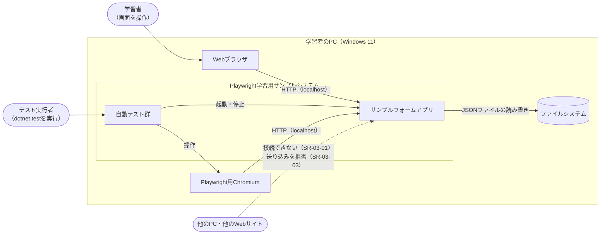
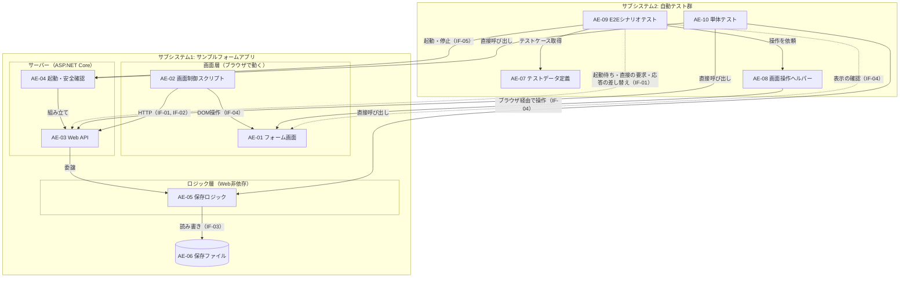
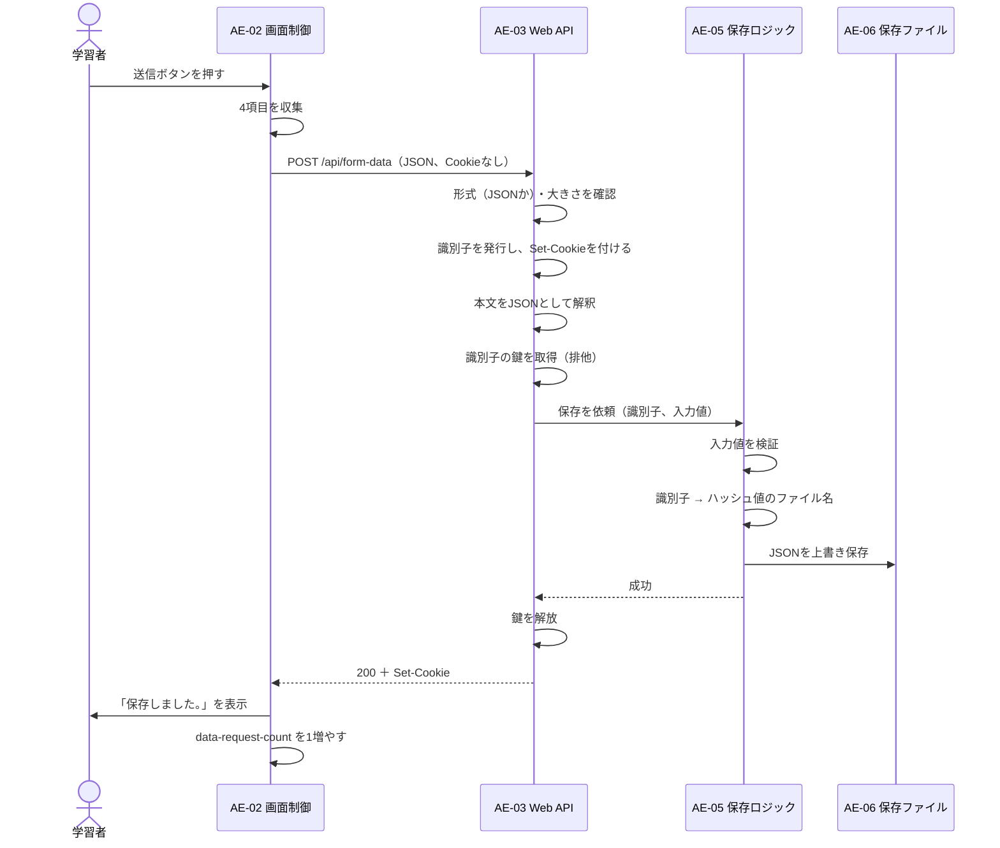
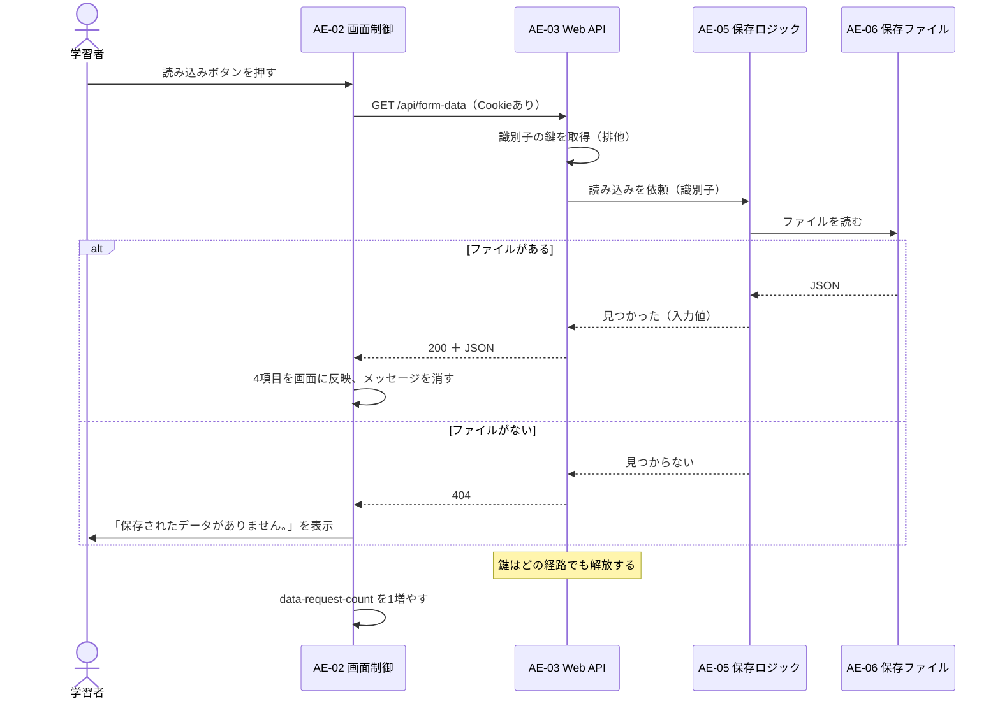
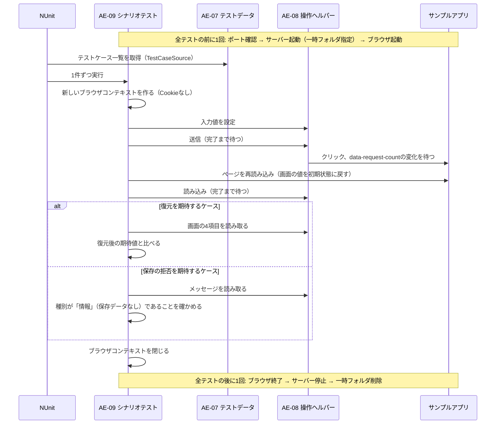
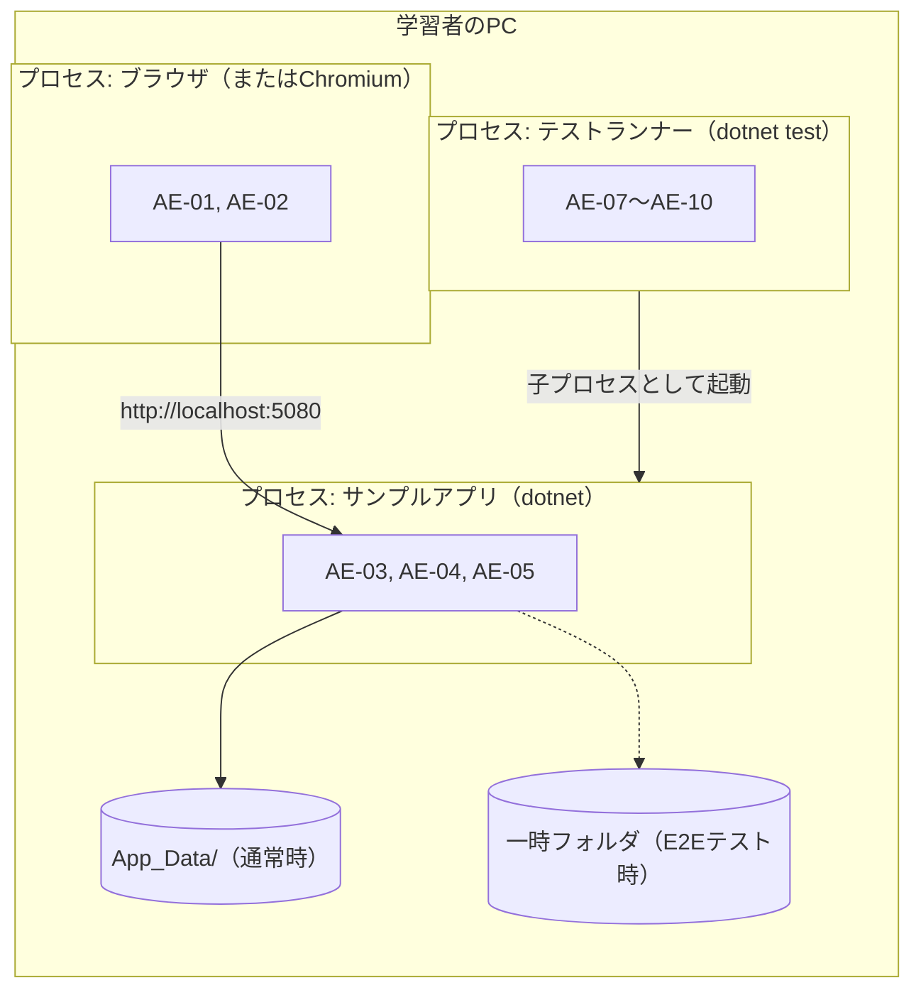

# システムアーキテクチャ設計書（学習用サンプル）

| 項目 | 内容 |
|---|---|
| 対象システム | Playwright学習用サンプルシステム |
| 入力となる要求 | [01_system_requirements_usdm.md](01_system_requirements_usdm.md)（UR/SR/SP） |
| 作成方法 | 実装からのリバースエンジニアリング（[README](README.md)参照） |
| 作成日 | 2026-09-24 |
| 版 | 1.1（独立レビューの指摘を反映。01の要求の階層見直し〈UR-05・SR-03-05の追加〉に追随） |

## 1. この資料の役割

システム要求（01）は「何が求められているか」を表しました。この資料は、それを**どのような部品に分け、部品どうしをどうつなぎ、なぜその形にしたか**を表します。次の順で読むと理解しやすくなります。

| 章 | 見方（ビュー） | 答える問い |
|---|---|---|
| 2 | コンテキスト | システムの外側に何があり、何とやり取りするか |
| 3 | アーキテクチャ方針 | どの要求が構造を大きく左右したか |
| 4 | 論理構成 | システムをどんな部品に分けたか |
| 5 | インタフェース | 部品どうしは何を約束してやり取りするか |
| 6 | 振る舞い | 主な処理で、部品がどの順に動くか |
| 7 | 配置 | どのプロセス・どの場所で動くか |
| 8 | 設計判断と既知の限界 | なぜその形にしたか、何を割り切ったか |
| 9 | 要求の割り当て | 各要求を、どの部品が実現しているか |

## 2. システムコンテキスト

システムの境界と、外部とのやり取りを示します。



| 外部の存在 | システムとの関係 |
|---|---|
| 学習者・Webブラウザ | 画面を表示し、フォームを操作する |
| テスト実行者 | `dotnet test`で自動テスト群を動かす |
| Playwright用Chromium | 自動テスト群が操作するブラウザ。システムの外で別途導入する |
| ファイルシステム | 保存データ（JSONファイル）の置き場所 |
| 他のPC・他のWebサイト | 接続・要求を受け付けない相手 |

## 3. アーキテクチャ方針

要求のうち、部品の分け方を大きく左右したもの（アーキテクチャ上重要な要求）と、そこから決めた方針です。

| 方針 | 決め手となった要求 | 内容 |
|---|---|---|
| 方針1: 3層に分ける | SR-04-01 | 画面（表示と操作）・HTTP（通信の受け口）・ロジック（検証と保存）を別の部品にする。ロジックはWebの仕組みに依存させない |
| 方針2: 閉じた環境で動かす | SR-03-01, SR-03-02, SR-03-03, SR-03-05, 制約3 | 認証を持たない代わりに、待ち受けをループバックに限り、外から届く経路そのものを減らす |
| 方針3: テストのための目印を仕様に含める | SR-02-01, SR-02-02 | `data-testid`と`data-request-count`を、画面の正式な取り決め（インタフェース）として扱う |
| 方針4: テストもシステムの一部として設計する | SR-02-03, SR-02-04 | テストデータ・操作の補助・サーバー管理を、テストメソッドから分けた部品にする |

## 4. 論理構成

### 4.1 構成図

システムは2つのサブシステムと、10個の部品（アーキテクチャ要素、AE）からなります。



### 4.2 部品一覧

| ID | 部品 | 責務 | 実装 |
|---|---|---|---|
| AE-01 | フォーム画面 | 入力部品・ボタン・注意書き・メッセージ欄を表示する。テスト用の目印（`data-testid`等）を持つ | `src/LearnPlaywright.Server/wwwroot/index.html`, `style.css` |
| AE-02 | 画面制御スクリプト | 入力値の収集と復元、APIの呼び出し、メッセージの表示、処理完了の目印の更新 | `src/LearnPlaywright.Server/wwwroot/app.js` |
| AE-03 | Web API | 識別子（Cookie）の発行、要求の形式・大きさの確認、要求本文と応答のJSON変換、利用者単位の排他、応答コードの決定。入力検証と保存・読み込みの処理本体はAE-05へ委譲する | `src/LearnPlaywright.Server/FormDataApi.cs` |
| AE-04 | 起動・安全確認 | 待ち受けURL・保存先の決定、静的ファイルの配信、起動後のループバック確認 | `src/LearnPlaywright.Server/Program.cs`, `LoopbackBindingCheck.cs` |
| AE-05 | 保存ロジック | 入力値の検証、保存ファイル用のJSONとの相互変換、識別子からファイル名への変換、ファイルの読み書き | `src/LearnPlaywright.Logic/` |
| AE-06 | 保存ファイル | 利用者ごとの最新の入力値1件（JSON） | 既定は`src/LearnPlaywright.Server/App_Data/`（Git管理外） |
| AE-07 | テストデータ定義 | テストケース（入力値と期待値の組）の型と一覧、部品の目印・上限値の定数 | `tests/LearnPlaywright.Tests/TestData/FormTestData.cs` |
| AE-08 | 画面操作ヘルパー | 部品ごとの値の設定・読み取り、ボタン操作と処理完了の待機 | `tests/LearnPlaywright.Tests/TestData/FormPageHelpers.cs` |
| AE-09 | E2Eシナリオテスト | サーバーとブラウザの起動・停止、テストごとのブラウザ状態の分離、シナリオの実行と確認。入力・クリック・値の読み取りといった普段の操作はAE-08に任せる。AE-08が扱わない確認（部品の表示、Cookieの属性、API応答を差し替えたときの画面の反応、APIへの直接の要求）は、Playwrightの機能で自分で行う | `tests/LearnPlaywright.Tests/Scenarios/FormDataScenarioTests.cs` |
| AE-10 | 単体テスト | AE-03・AE-04（ループバック判定）・AE-05の関数を直接呼んで確かめる。AE-05のプロジェクトがASP.NET Coreを参照していないことも確かめる | `tests/LearnPlaywright.UnitTests/` |

### 4.3 依存のルール

- 依存の向きは「画面 → HTTP → ロジック → ファイル」の一方向とし、逆向きの依存は作らない。
- AE-05は.NETの標準ライブラリだけに依存する。このうち「ASP.NET Coreのフレームワークを参照していないこと」は、AE-10のプロジェクト構成テストで自動的に確かめる（それ以外のライブラリを追加していないことは、プロジェクトファイルを読んで確かめる）。
- 自動テスト群（SS2）は、サンプルアプリ（SS1）の内部を直接使わず、公開された取り決め（IF-01〜05）だけを使う。例外は単体テスト（AE-10）で、確かめる対象の部品を直接呼ぶ。

## 5. インタフェース

部品どうし・外部との「約束ごと」です。ここが変わると、両側の部品を同時に直す必要があります。

### IF-01 保存データAPI（AE-02・AE-09 ⇔ AE-03）

通常の利用者はAE-02です。AE-09も、サーバーの起動待ち・JSON以外の形式を拒否することの確認で直接要求を送り、異常時の画面の反応を確かめるためにブラウザ上で応答を差し替えます。

| 操作 | 要求 | 応答 |
|---|---|---|
| 保存 | `POST /api/form-data`、`Content-Type: application/json`、本文は保存データ（IF-03と同じ形） | 200: 保存した／400: JSONとして読めない・必須項目なし・検証で拒否／413: 本文が64×1024文字超／415: JSON以外の形式／500: サーバー内部の異常 |
| 読み込み | `GET /api/form-data` | 200: 本文に保存データ（JSON）／404: 保存データなし／500: サーバー内部の異常 |

### IF-02 利用者識別Cookie（ブラウザ ⇔ AE-03）

AE-09は、初回の要求でこのCookieが発行されることと、その属性を、ブラウザの状態から直接確かめます。

| 項目 | 取り決め |
|---|---|
| 名前 | `lp_user_id` |
| 値 | 発行時は32桁の16進数（GUID）。受け取り時は、空でなければ形式を問わずそのまま識別子として使う（安全性はIF-03のファイル名の決め方で確保） |
| 属性 | HttpOnly、Path=/、Max-Age=31536000（1年）、SameSite=Lax |
| 発行する条件 | 要求にこのCookieがないとき（保存・読み込みのどちらでも。ただし415・413で拒否した保存要求では発行しない） |

### IF-03 保存データ形式（AE-03 ⇔ AE-05 ⇔ AE-06）

```json
{ "text": "ダミー太郎", "slider": 42, "select": "banana", "radio": "green" }
```

| 項目 | 型 | 必須 | 条件 |
|---|---|---|---|
| text | 文字列 | 必須（`null`不可） | 1000文字以内。空文字は可 |
| slider | 数値 | 必須 | 有限の数値 |
| select | 文字列 | 必須（空不可） | 200文字以内 |
| radio | 文字列または`null` | 省略可（省略時は`null`） | 200文字以内 |

- 項目名は小文字始まり（camelCase）。読み込み時は大文字・小文字を区別しない。未知の項目は無視する。
- ファイル名は識別子のSHA-256ハッシュ値（16進数64文字）＋`.json`。文字コードはUTF-8（BOMなし）。

### IF-04 画面の取り決め（AE-01 ⇔ AE-02・AE-08・AE-09）

AE-09は、入力・クリック・値の読み取りをAE-08に任せ、部品が表示されていることの確認だけを直接行います。

| 目印 | 対象 |
|---|---|
| `data-testid` | `text-input`・`slider`・`select`・`radio-option`（3つ）・`submit-button`・`load-button`・`message-area`・`notice`・`form` |
| `data-request-count`（`form`の属性） | 送信・読み込みの処理が終わるたびに1増える整数。初期値0 |
| メッセージ欄のクラス | `message--success`・`message--error`・`message--info`のいずれか1つ（未表示時はなし） |

### IF-05 テスト用のサーバー起動（AE-09 ⇔ AE-04）

| 項目 | 取り決め |
|---|---|
| 起動方法 | `dotnet run --project <サーバーのプロジェクト> --no-build --no-launch-profile --urls http://localhost:5080` |
| 保存先の指定 | 設定キー`DataDirectory`（環境変数で渡す）。テストでは一時フォルダを指定する |
| 起動の確認 | `GET /api/form-data`が200または404を返すまで待つ（途中でサーバーが終了したら失敗） |
| 起動前の確認 | ポート5080が使用中ならテストを失敗させる |

## 6. 振る舞い

### 6.1 保存（初めて使うブラウザの場合）



検証で拒否された場合は、AE-05が「失敗」を返し、AE-03は400を返します。鍵は、処理本体で例外が起きても必ず解放します（SP-01-05-03）。

### 6.2 読み込み



### 6.3 E2Eテスト1件の流れ（保存→復元の確認）



## 7. 配置



| 使い方 | 起動するもの | 保存先 |
|---|---|---|
| 学習者が画面を触る | `dotnet run --project src/LearnPlaywright.Server`で起動し、ブラウザで`http://localhost:5080/`を開く | `App_Data/` |
| 自動テストを動かす | `dotnet test`だけ。サーバーはテストが子プロセスとして起動する | 実行ごとの一時フォルダ |

2つの使い方は同じポートを使うため、同時には動かせません（IF-05の起動前の確認で検出）。

## 8. 設計判断と既知の限界

### 8.1 設計判断

選ばなかった案（代替案）も書くことで、後から「なぜこうなっているのか」を追えるようにします。

| ID | 判断 | 代替案 | 選んだ理由 | 関係する要求 |
|---|---|---|---|---|
| AD-01 | ロジックを、Webの仕組みに依存しない別プロジェクトにする | サーバーのプロジェクト内にまとめて書く | 単体テストをサーバーなしで速く動かせる。依存しないことを自動テストで守れる | SR-04-01 |
| AD-02 | 利用者の区別に、ランダムな識別子のCookieを使う | ログイン機能を作る／区別しない | 学習の焦点をテストに絞れる。区別しないと、テスト同士が保存データを取り合ってしまう | SR-01-04, 制約3 |
| AD-03 | ファイル名を識別子のハッシュ値にする | 識別子をそのままファイル名にする | Cookieの値は利用者が書き換えられるため、`../`等を含む値で保存先の外に書かれる危険を、仕組みの上でなくせる | SR-03-02 |
| AD-04 | 排他を利用者の単位で行う | サーバー全体で1つの鍵を使う | 別の利用者（並行して動くテスト等）を待たせずに済む | SR-01-05 |
| AD-05 | 他サイトからの送り込みを、「JSON以外は拒否」（主な防御）とSameSite=Lax（補助）で防ぐ | 要求ごとの確認用の値（CSRFトークン）を使う | 学習用の小さなシステムでは、トークンの管理よりも仕組みが単純で、ブラウザの標準の性質（別オリジンへのJSON送信には事前確認が要る）だけで防げる | SR-03-03 |
| AD-06 | 処理完了を`data-request-count`の変化で知らせる | 通信の応答を待つ／メッセージ表示を待つ／固定時間待つ | 応答を受けた後の画面更新まで含めて「完了」を表せる。同じメッセージが続く場合も区別できる | SR-02-02 |
| AD-07 | E2Eテストでは、サンプルアプリを別プロセスとして実際のポートで起動する | テストのプロセス内でサーバーを動かす | ブラウザ（Chromium）は別プロセスで動くため、実際のポートで待ち受けるサーバーが必要。学習者が手で動かすときと同じ形で確かめられる | SR-02-04 |
| AD-08 | 待ち受けがループバックかどうかを、起動後に実際のアドレスで確かめる | 設定値の文字列だけを確かめる | 設定の与え方（コマンドライン・環境変数・設定ファイル）に関係なく、実際の状態で判断できる | SR-03-01 |

### 8.2 既知の限界

| 限界 | 影響 | 割り切った理由 |
|---|---|---|
| ループバックの確認は、待ち受けを始めた後に行う | 誤った設定のとき、停止までのごく短い間は外から接続できる可能性がある | ASP.NET Coreでは待ち受け前に実際のアドレスを確定できない。停止までの時間は短い |
| 利用者ごとの鍵を削除しない | Cookieを持たない要求のたびに、サーバーのメモリ上の鍵が増える | ローカルで学習者1人が使う前提（前提1）では、増える量が問題にならない |
| 排他は1つのサーバープロセスの中でだけ有効 | 複数のサーバーを同じ保存先で動かすと、保存内容が壊れる可能性がある | 同じポートを使うため、通常は同時に起動できない |
| 保存データは暗号化しない | ファイルを直接開けば中身が読める | 前提2（ダミーの値だけを入力する）と、注意書き（SR-03-04）で補う |

## 9. 要求の割り当て

各下位要求（SR）を、主にどの部品（AE）で実現しているかを示します。「○」は実現に関わる部品です。

| 下位要求 | AE-01 | AE-02 | AE-03 | AE-04 | AE-05 | AE-06 | AE-07 | AE-08 | AE-09 | AE-10 |
|---|---|---|---|---|---|---|---|---|---|---|
| SR-01-01 4種類の部品で入力 | ○ | | | | | | | | | |
| SR-01-02 送信して保存 | | ○ | ○ | | ○ | ○ | | | | |
| SR-01-03 読み込んで復元 | | ○ | ○ | | ○ | ○ | | | | |
| SR-01-04 ブラウザごとに区別 | | | ○ | | ○ | | | | | |
| SR-01-05 同時要求でも壊れない | | | ○ | | | | | | | |
| SR-02-01 部品を安定して特定 | ○ | ○ | | | | | ○ | ○ | | |
| SR-02-02 処理の完了を待てる | ○ | ○ | | | | | | ○ | | |
| SR-02-03 テストデータを一元管理 | | | | | | | ○ | ○ | ○ | |
| SR-02-04 1コマンドで全テスト | | | | ○ | | | | | ○ | ○ |
| SR-03-01 自分のPCからだけ接続 | | | | ○ | | | | | | |
| SR-03-02 保存データを漏らさない | | | | ○ | ○ | ○ | | | | |
| SR-03-03 他サイトからの送り込みを防ぐ | | | ○ | | | | | | | |
| SR-03-04 実在の情報を入力しないよう促す | ○ | | | | | | | | | |
| SR-03-05 巨大な要求で動作が損なわれない | | | ○ | | | | | | | |
| SR-04-01 ロジックを単独で検証 | | ○ | ○ | | ○ | | | | | ○ |
| SR-05-01 環境の違いで詰まらない | | | | | | | | | | |

注:

- SR-05-01は、部品ではなくリポジトリ全体の設定（`global.json`でのSDKの固定、ビルド工程のない画面）で実現しているため、どの部品にも割り当てていません。
- テストの部品（AE-07〜AE-10）は、その要求の仕様に「テストで〜すること」が含まれる場合だけ○を付けています。たとえばAE-10はループバック判定（SR-03-01）も確かめていますが、SR-03-01の仕様はテストでの確認を定めていないため、○を付けていません。

### 点検結果

| 観点 | 結果 |
|---|---|
| どの部品にも割り当てのない要求はないか | SR-05-01のみ（上の注の理由による） |
| どの要求にも関わらない部品はないか | なし（AE-01〜AE-10のすべてに1つ以上の要求がある） |
